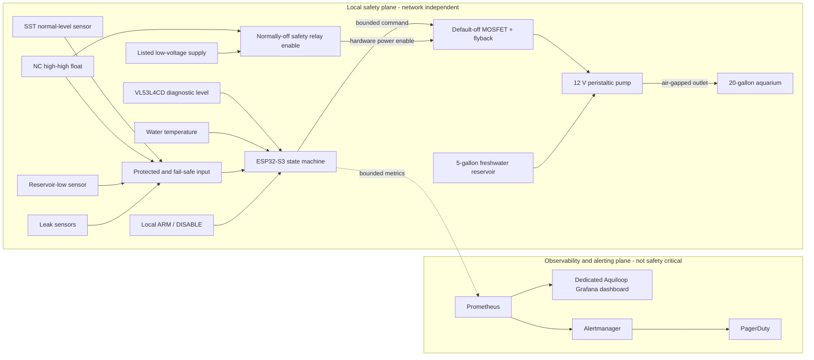

# Aquarium Auto-Top-Off System Design

**Status:** Initial design; no implementation is included.
**Target:** A 20-gallon garage aquarium supplied from a five-gallon freshwater
reservoir.
**Safety posture:** Phase 1 is **supervised experimental use only**. Unattended
operation is not considered until the Phase 2 exit criteria are met.

## 1. Problem statement

Evaporation lowers the aquarium level and concentrates dissolved solids. The
system must recognize a low waterline and move a bounded amount of freshwater
from a reservoir to the aquarium without creating a credible path for an
uncontrolled fill, siphon, electrical hazard, or network-dependent safety
failure. A garage adds heat, humidity, contamination, and temperature
variation. The design therefore starts small and supervised, then adds
independent containment, source and leak protection, and diagnostic sensing in
measurable phases.

## 2. Goals, assumptions, and non-goals

### Goals

- Restore the normal waterline with calibrated, short pump pulses.
- Make the pump default off on boot, reset, uncertain or contradictory input,
  watchdog expiry, controller failure, and loss of control power.
- Bound every attempt and cumulative delivery even in the minimal prototype.
- Add diverse, independent layers before permitting unattended use.
- Keep safety decisions local while exporting bounded telemetry for operations.
- Make every structural printed part reproducible from parametric OpenSCAD.

### Assumptions to validate on the installation

- The aquarium is nominally 20 US gallons and the source reservoir holds no
  more than five US gallons; usable safe delivery is determined by measured
  freeboard, not either label.
- Freshwater is appropriate top-off water. This system does not dose salt,
  medication, fertilizer, or food.
- The reservoir can normally sit below aquarium water level. The measured
  vertical lift and tubing losses will be recorded before pump selection.
- A fixed bracket can reach a calm normal-level location and a separate higher
  location. Garage temperature and humidity ranges remain open measurements.
- Mains power terminates at an external, listed low-voltage supply; only
  protected low voltage enters the wet-area assembly.

### Non-goals

- Water changes, aquarium draining, continuous dosing, or precise depth control.
- Remote or scheduled unrestricted pump-on control.
- Using Wi-Fi, Kubernetes, Prometheus, Grafana, Alertmanager, or PagerDuty in a
  local shutdown path.
- Firmware, schematics, CAD, meshes, dashboards, manifests, or cluster resources
  in this initial documentation change.
- A motorized sensor dipper or any other moving normal-level sensor.

## 3. Terminology

| Term | Meaning |
| --- | --- |
| **Normal level** | Desired waterline, detected by the fixed SST optical point sensor. |
| **Low/dry** | Debounced SST state that may request a bounded dispense attempt. |
| **High-high** | Abnormal upper level detected independently by the Phase 2 float/reed switch. |
| **Safety plane** | Local sensing, state machine, hardwired cutoff, driver, and plumbing that prevent delivery. |
| **Observability plane** | Metrics, dashboards, alerts, and notifications; diagnostic only and never required to stop the pump. |
| **Attempt** | One bounded sequence of dispense pulses and settling observations. |
| **Daily budget** | Rolling 24-hour maximum commanded runtime and calibrated volume. |
| **Latched fault** | Persistent pump-inhibiting state requiring local inspection and manual reset. |
| **ARM/DISABLE** | Local maintained control that permits automatic attempts or positively inhibits them. ARM is permission, not a pump command. |

## 4. System context and safety-plane separation



The ESP32-S3 directly controls the pump because a microcontroller provides a
small, deterministic local control surface and hardware watchdog support. A
Raspberry Pi SBC would add an operating system, storage, and boot dependencies
without improving the primary safety path. Either Arduino-ESP32 or ESP-IDF is
acceptable after a Phase 1 spike, provided the same state-machine tests,
persistence semantics, and watchdog invariants are met.

Telemetry is one-way from the safety plane in normal operation. Configuration
changes must be bounded, validated, and preferably applied locally; no network
API exposes an unrestricted pump-on operation. Loss, delay, or compromise of
the observability plane cannot energize the driver or bypass any budget.

## 5. Core physical, electrical, and wet-environment design

### 5.1 Normal-level sensor

Phase 1 uses a SparkFun SST optical liquid point-level sensor fixed
**horizontally at the desired waterline** in a guarded holder on a top-rim
bracket. It is a binary wet/dry point switch, not a continuous depth sensor.
The mount is manually height-adjustable, then mechanically secured. It does not
point downward and does not dip: retained droplets can keep an optical tip
falsely wet after withdrawal, concealing a low level. Motorized dipping adds
motion, cable, alignment, and software failure modes without fixing that
retained-droplet ambiguity.

The SST requires **4.5-15.4 V** and has a push-pull output. It must never connect
directly to a 3.3 V ESP32 GPIO. The hardware design must choose and document one
qualified interface: for example, a resistor divider with input protection and
worst-case tolerance analysis, a 3.3 V logic buffer rated for the input voltage,
or an optocoupler. A pull resistor on the ESP32 side establishes the configured
fault/inactive state for an open wire or unpowered sensor. Firmware treats an
out-of-range/unstable input as uncertainty and inhibits filling. Phase 2 adds a
separately wired, independently powered-down-safe high-high layer.

### 5.2 Pump, driver, and fluid path

- Select a 12 V peristaltic pump only after measuring reservoir-bottom-to-rim
  lift and routing losses. Its rated suction lift/head must exceed the measured
  worst case with margin, using the manufacturer's continuous/intermittent duty
  rating and compatible tubing.
- Drive it with a logic-level, default-off MOSFET stage. Use gate pulldown,
  current-appropriate wiring/connectors and fuse, and flyback protection at the
  inductive load. A hardware enable is added in Phase 2.
- Use an external listed low-voltage AC/DC supply sized for pump startup and
  electronics conversion. Fuse the low-voltage branches and never place exposed
  mains wiring in the project enclosure.
- Keep the reservoir below the aquarium where practical. Secure the outlet tube
  above the maximum waterline with a visible air gap so neither direction can
  siphon. Do not submerge or loosely drape the outlet.
- Use GFCI-protected mains, drip loops on every cable/tube approaching powered
  equipment, strain relief, splash-resistant separation, and labeled DISABLE.
  Secondary containment becomes mandatory as the system matures.

### 5.3 Invariants

1. De-energized, booting, resetting, watchdog-expired, or failed control means
   pump off; GPIO defaults and gate pulldown must enforce this before firmware.
2. Missing, unstable, stale, impossible, or contradictory safety input means
   pump off and, after the allowed debounce, a latched fault.
3. A fill requires local ARM, healthy inputs, budget remaining, successful boot
   self-test, and (Phase 2+) a physically closed high-high enable loop.
4. Every pulse, attempt, retry series, and rolling 24-hour delivery is bounded
   by both runtime and calibrated volume. No integer rollover or reboot resets a
   consumed budget.
5. The last pump state is never restored after reboot. A persistent fault and
   conservative delivery ledger are restored and checked first.
6. Only a deliberate local/manual action after inspection clears a latch.
7. Software cannot override the high-high hardware cutoff.
8. Network commands cannot produce unbounded or direct continuous pumping.

## 6. Firmware behavior

### 6.1 State-machine outline

| State | Entry/action | Allowed transition |
| --- | --- | --- |
| **Boot self-test** | Force output off; verify configuration CRC/ranges, persistent fault and delivery ledger, reset cause, GPIO plausibility, sensors, watchdog, and ARM state. | `Idle` only when healthy and explicitly armed; otherwise `Maintenance` or `Latched fault`. |
| **Idle** | Pump off; sample sensors; account rolling budget. A wet SST is normal. | Sustained dry samples to `Low debounce`; DISABLE to `Maintenance`; anomaly to fault. |
| **Low debounce** | Pump off; require a configurable run of readings over a minimum duration, rejecting chatter. | Confirmed low to `Filling`; wet back to `Idle`; uncertainty/time limit to fault. |
| **Filling** | Command one calibrated short pulse while watchdog, cutoff, input health, per-pulse runtime and volume limits remain valid. | Always to `Settling` when pulse ends; any invariant breach to fault. |
| **Settling** | Pump off; wait for wave/ripple and sensor response, then debounce. | Wet to `Idle`; still dry to next bounded retry; retry/attempt/budget limit or contradiction to fault. |
| **Maintenance** | Pump positively inhibited; allow local diagnostics and calibration steps, never unrestricted remote run. | Local ARM plus self-test to `Idle`; anomaly to fault. |
| **Latched fault** | Pump off; persist reason, counters, and timestamp/monotonic context; indicate locally and export telemetry. | Local reset only after DISABLE, inspection, healthy self-test, and documented acknowledgement. |

Exact constants are calibration outputs, not guesses. Configuration has hard
compile-time ceilings. Representative starting constraints for bench validation
are pulses of no more than 5 seconds, no more than 3 pulses per attempt, and a
mandatory settling interval of at least 10 seconds; installation calibration
must lower these where needed and establish safe volume limits from aquarium
freeboard. The task watchdog must be serviced only by a healthy control loop,
not blindly by a timer callback.

### 6.2 Persistence and reset behavior

Use checksum/versioned nonvolatile records and wear-aware periodic commits. A
latched fault persists across power cycles. The rolling ledger conservatively
records a pulse before energizing it; an interrupted pulse is charged at its
maximum possible delivery. Missing/corrupt state inhibits ARM. Reset-cause and
boot-count telemetry help detect loops, but do not relax local behavior.

## 7. Sensor rationale and rejected alternatives

| Choice | Decision and rationale |
| --- | --- |
| Fixed SST optical point sensor | Phase 1 normal-level switch: compact and no moving parts. Fixed horizontal placement permits repeatable wet/dry behavior and inspection. Fouling, bubbles, film, wiring, and retained droplets remain credible failures. |
| NC polypropylene float/reed switch | Phase 2 high-high cutoff. Normally closed below high-high lets an open wire or loss of power remove relay enable. Its buoyancy/mechanical failure modes differ from the optical sensor. |
| Two identical SST sensors | Rejected as the only redundancy: shared fouling, optical, mounting, supply, and interpretation failures can affect both. Diverse optical plus mechanical sensing improves failure independence. |
| Capacitive through-glass high sensor | A no-moving-sensor alternative when glass and geometry validate it. It avoids wetted moving parts, but shares sensitivity to wall thickness, condensation, deposits, nearby water, calibration drift, and electronics/common power; therefore its failure independence is weaker than a separately wired mechanical float. |
| Pressure/depth sensor | Deferred: wetted compatibility, drift, vent/reference handling, and extra penetrations are unnecessary for point control. |
| VL53L4CD time of flight | Phase 4 diagnostic continuous trend only. It does not replace discrete authoritative switches or the physical cutoff. |
| Motorized SST dipping/downward SST | Rejected unless future controlled evidence resolves retained-droplet false-wet behavior. Motion also adds jams, wear, cable fatigue, and timing assumptions. |
| Raspberry Pi direct controller | Rejected for primary control; its OS and storage expand failure and maintenance surfaces. It may host unrelated infrastructure, never the pump safety loop. |

## 8. Phased implementation plan

Costs are planning ranges in 2026 USD before shipping/tax, not quotations.

### 8.1 Phase 1 - supervised minimal prototype

**Classification: SUPERVISED EXPERIMENTAL USE ONLY; NOT FOR UNATTENDED
OPERATION.** It lacks an independent high-water cutoff, reservoir-low detection,
and leak detection. A person capable of pressing DISABLE and disconnecting
power remains present throughout every armed test. During testing, fill the
reservoir with no more water than measured aquarium freeboard can safely accept,
even if that amount is far below five gallons.

#### Included hardware/software

- ESP32-S3 development board; 12 V SST; protected level-shifting input; 12 V
  peristaltic pump selected from measured lift; default-off fused MOSFET/flyback
  driver; listed supply and 12-to-5/3.3 V conversion as required.
- Local maintained ARM/DISABLE control and simple local status (power/armed,
  pump, and fault LEDs or similarly unambiguous indicators).
- Fixed, manually height-adjustable top-rim bracket and horizontal SST guard;
  no motors or moving sensors.
- State machine, debounce, calibrated pulses, settling, bounded retries,
  per-attempt runtime/volume, rolling daily budget, watchdog, persistent latch,
  and conservative reboot behavior described above.
- GFCI, drip loops, fused low voltage, air-gapped secured outlet, strain relief,
  and reservoir below tank where practical.

#### Phase 1 printed-part inventory and exact planned source

Every structural component is printed in **PLA** in this phase. Each row is a
required editable source; optional STL output is never the sole CAD artifact.

| Component | Planned parametric source | Purpose |
| --- | --- | --- |
| Electronics enclosure body/lid | `tools/auto_top_off/enclosure.scad` | Splash-resistant separated housing, ventilation strategy, fasteners, strain relief. |
| Aquarium rim bracket/clamp | `tools/auto_top_off/rim_bracket.scad` | Manual height adjustment and secure top-rim attachment. |
| SST holder and optical-tip guard | `tools/auto_top_off/sst_sensor_holder.scad` | Fixed horizontal alignment; shields bumps without trapping water at the tip. |
| Pump mount and vibration feet | `tools/auto_top_off/pump_mount.scad` | Secures the selected pump above containment where possible. |
| Air-gap outlet-tube clip | `tools/auto_top_off/outlet_tube_clip.scad` | Locks tubing above maximum waterline and prevents submersion. |
| Reservoir lid insert/grommet | `tools/auto_top_off/reservoir_lid_insert.scad` | Routes suction tube without sealing the vent or weakening the bucket. |
| Cable/tube clips and labels | `tools/auto_top_off/cable_management.scad` | Drip-loop routing, strain relief, and identification. |
| Shared dimensions/material values | `tools/auto_top_off/parameters.scad` | Tank rim, tubing, fastener, clearance, and print-shrink parameters. |
| Reusable geometry | `tools/auto_top_off/lib/common.scad` | Rounded mounts, captive-nut features, clips, and validation helpers. |
| Assembly/part selector | `tools/auto_top_off/auto_top_off.scad` | Preview and select reproducible part outputs. |

PLA is a deliberate prototype constraint, not a durability claim. Garage heat
can approach PLA's softening range; sustained clamp loads cause creep; humidity,
splashes, cleaning chemistry, and cyclic stress can change fit or promote
cracking. Keep printed parts away from heaters and electrical hot spots. Inspect
before every supervised session for softness, whitening, cracks, warping, loose
fasteners, delamination, water traps, biofilm, and loss of outlet air gap.
Replace immediately on any change; otherwise replace load-bearing/wet-adjacent
prototype parts after three months or 100 pump cycles, whichever comes first,
until evidence supports a shorter interval. Never use a printed part as the
only barrier against overflow or electric shock.

#### Failure modes addressed

Ordinary evaporation; short SST chatter; stuck
firmware task; reboot during a fill; accidental long command; limited pump/tube
movement; some outlet siphon risk.

#### Remaining limitations

Common-controller and sensor failures; optical
fouling/false wet; stuck MOSFET; no physical high cutoff; empty reservoir; leak,
blocked/kinked tubing, calibration drift, structural creep, or remote alarm.

#### BOM delta

Approximately $105-$265: ESP32-S3 (1, $10-$25), SST (1,
$25-$55), pump (1, $20-$60), driver/protection/converter parts (1 set,
$10-$30), listed supply (1, $15-$35), ARM control/indicators/connectors/fuse
(1 set, $10-$20), tubing/check-compatible fittings without relying on a check
valve for safety (1 set, $5-$15), and PLA/fasteners (1 set, $10-$25).

#### Validation tests

1. Measure maximum lift and verify pump startup/flow at that lift; collect timed
   pulse samples at low/mid/high reservoir levels and bound worst-case volume.
2. With pump disconnected, exercise dry/wet/chatter/open/short/unpowered sensor,
   boot, brownout, reset, corrupt persistence, watchdog, budget, and local latch.
3. With the safely limited reservoir and an observer, verify pulse/settle/retry,
   manual DISABLE, freeboard, air gap, outlet retention, and power removal.
4. Soak and splash-test unpowered printed fixtures; inspect clamp creep over the
   expected garage temperature range. Never intentionally wet energized parts.
5. Review source-to-part mapping and render every `.scad` in CI once implemented.

#### Objective exit criteria

100 consecutive supervised demand cycles without
an invariant breach; all injected faults keep the pump off or stop it within one
bounded pulse; worst-case daily budget is below measured safe freeboard with
margin; power-cycle/latch persistence passes 20 consecutive trials; mount and
air gap remain secure; calibration and test records are reviewed. Passing Phase
1 does **not** authorize unattended use.

### 8.2 Phase 2 - redundant sensing and hardware cutoff

#### Included hardware/software

- Add an independent, aquarium-compatible polypropylene normally-closed
  high-high float/reed sensor above the normal SST setpoint on its own fixed
  bracket channel.
- Wire the closed-below-high loop into a low-current, normally-off safety-relay
  enable circuit. Relay de-energization physically removes pump power outside
  firmware. High water, a broken float wire, connector removal, or lost enable
  power opens the loop. Select a force-guided/safety-rated architecture where
  practicable and verify contact ratings; the relay enables the pump power path
  rather than switching motor current through the sensor.
- Also monitor isolated auxiliary state at the ESP32 for disagreement. Any
  normal-low/high-high combination, stale input, or relay feedback mismatch
  latches a fault. Reset is explicit and local/manual after inspection.
- Optionally evaluate a fixed capacitive through-glass sensor, but only after
  fault-independence analysis; it is not the preferred hardware cutoff.
- Export bounded metrics to Prometheus; add a dedicated Aquiloop Grafana
  dashboard, Prometheus controller-down detection, Alertmanager routing to
  PagerDuty, and a response runbook. PagerDuty credentials live only in a
  cluster Secret/integration, never on the ESP32 or in Git.

#### Failure modes addressed

Single optical false state; broken high-high wire;
lost controller/enable power; firmware unable to stop a commanded driver;
sensor disagreement; lack of remote awareness.

#### Remaining limitations

Relay/contact/MOSFET common power-path faults,
reservoir-empty dry running, tubing blockage/disconnection, spills below the
sensors, no source inventory, and network alert delay/outage.

#### BOM delta

$35-$115: NC polypropylene float (1, $10-$30), normally-off
relay/contactor and socket plus feedback/interface parts (1, $15-$45), separate
fusing/connectors/bracket material (1 set, $5-$20), and optional through-glass
capacitive evaluation sensor (1, $5-$20). Cluster resources are existing
infrastructure or separately budgeted.

#### Validation tests

- Raise the high-high float during a pulse; measure physical pump-power removal
  without firmware cooperation. Repeat for cut/shorted wires as the circuit
  fault analysis dictates, unplugged ESP32, frozen task, and lost relay power.
- Prove that each SST/float truth-table disagreement latches, persists across
  reboot, and requires DISABLE-inspect-local-reset.
- Confirm high-high placement remains below overflow but above normal ripple;
  independently measure the maximum post-cutoff delivery from tube/pump inertia.
- Drop Wi-Fi, Prometheus, Grafana, Alertmanager, DNS, and cluster power while
  filling: local cutoff must remain unchanged. Separately verify controller-down
  and safety alerts reach a PagerDuty test service with no credential on device.
- Perform continuous soak, EMI/load switching, power-cycle, and accelerated
  sensor fouling tests; inspect both diverse sensors after each run.

#### Objective exit criteria before unattended operation is considered

The
hardwired cutoff passes at least 100 induced trips and all wire/power fault
cases; 30 days of supervised operation stay within calibrated budgets with no
unexplained disagreement; maximum single-fault delivered volume stays below
safe freeboard; alarms and runbook drills pass; electrical, plumbing, mount,
GFCI, air-gap, containment plan, and maintenance records receive a documented
human review. “Considered” is not blanket approval: the specific installation
requires a risk review, and Phase 3 protections are strongly preferred.

### 8.3 Phase 3 - source-water and leak protection

#### Included hardware/software

- Add reservoir-low detection, preferably a calibrated capacitive sensor outside
  the HDPE bucket, or a chemically compatible independent float where wall and
  condensation tests make capacitance unreliable.
- Put independent leak sensors beneath the pump/enclosure and in the reservoir's
  secondary containment. Any wet leak sensor inhibits and latches immediately.
- Detect empty source, suspected blockage (pump command without expected SST or
  optional weight response), implausible top-off frequency, and excessive daily
  delivery. Never infer “blocked” by increasing runtime beyond bounds.
- Optionally add a rated load cell and amplifier beneath a rigid reservoir
  platform as a cross-check of remaining and delivered mass. It is diagnostic
  unless separately justified and calibrated.
- Expand panels, alerts, runbook, cleaning, tubing replacement, containment
  inspection, and scheduled deliberate failure drills.

#### Failure modes addressed

Pump running against empty source; reservoir leak,
disconnected outlet/suction leak captured by pads, enclosure-area leak;
unexpected usage pattern; many tubing blockage and calibration-drift cases.

#### Remaining limitations

Leaks outside sensor/containment coverage, load-cell
creep and side load, reservoir-low sensor wall/condensation effects, undetected
slow seepage, continuous-depth ambiguity, and garage environment effects.

#### BOM delta

$45-$160: external capacitive or independent float source sensor
(1, $8-$30), leak probes/controllers (2 zones, $15-$50), secondary containment
(2 trays or one suitably arranged system, $15-$40), and optional load cell,
amplifier, rigid platform hardware (1 set, $15-$60).

#### Validation tests

Empty/reservoir-low at idle and mid-attempt; water applied
to each unpowered test pad; tubing pinched, disconnected into containment, and
flow degraded; implausible repeated demand; daily threshold boundary and clock
discontinuity; load-cell known weights, off-center loads, tubing side force, and
temperature drift. Verify each required condition inhibits, latches, identifies
the correct zone, alerts, and follows the runbook without exceeding one pulse.

#### Objective exit criteria

Every source/leak fault injection passes on three
scheduled quarterly-style drills; containment holds the bounded maximum credible
spill; 60 days of trend data show stable source calibration; commanded-versus-
observed delivery agrees within the documented tolerance; tubing and cleaning
intervals are recorded; no unexplained excessive-frequency event remains open.

### 8.4 Phase 4 - continuous and environmental sensing

#### Included hardware/software

- Add a fixed, top-mounted VL53L4CD over a calm, baffled target area for trends,
  rate-of-change diagnostics, pulse-response confirmation, and early anomaly
  detection. Discrete point sensors and the independent hardware cutoff remain
  authoritative for pump safety.
- Calibrate empty/normal/high reference distances in the actual mount. Validate
  field of view against rim, brace, plants, and baffle; respect the module's
  characterized minimum standoff. Characterize ripple, bubbles, specular return,
  condensation/droplets on the cover window, ambient light, temperature, and
  near/far nonlinearity. Reject low-signal/out-of-range samples rather than
  converting them into pump permission.
- Add water temperature, such as an aquarium-suitable waterproof DS18B20 probe,
  with a fail-safe pull-up, waterproof connector, and validated encapsulation.
- After empirical heat/humidity/creep/chemical testing, allow a documented
  migration from PLA to PETG, ASA, or another justified material. Retain the
  same editable parametric `.scad` sources and record print/material parameters.

#### Failure modes addressed

Slow drift, abnormal evaporation/delivery trends,
some blockage or sensor-fouling diagnosis, and unobserved water-temperature or
garage-related changes.

#### Remaining limitations

ToF optical occlusion/condensation and geometry
errors; temperature probe seal/drift; correlated power/bus faults; environmental
measurements are diagnostic and cannot replace discrete shutdown layers.
Motorized SST dipping remains rejected absent new retained-droplet evidence.

#### BOM delta

$25-$90: VL53L4CD breakout/module and protective fixed mount (1,
$15-$40), waterproof DS18B20 assembly/interface (1, $8-$25), baffle and revised
printed parts (1 set, $5-$25), plus optional material migration ($5-$20 delta).

#### Validation tests

Gauge-block/ruler distance sweep across the installed
range; controlled fill/drain correlation; ripple, bubbles, plants, ambient light,
condensation, dirty-window and blocked-view trials; known-temperature bath
comparison; bus stuck/open/short simulations; cross-check each continuous trend
against both point sensors. All invalid continuous readings must leave pump
permission unchanged and raise only bounded diagnostic faults as specified.

#### Objective exit criteria

Documented level residuals and valid-sample rate
meet installation-specific acceptance bands across the tested environment;
induced ToF/temperature faults never defeat discrete safety; 90 days of trends
support stable anomaly thresholds; any material change passes equal or better
fit, creep, splash, temperature, and 100-cycle mounting tests.

## 9. Preliminary cumulative BOM

| Phase | Main additions | Approx. phase cost | Approx. cumulative cost |
| --- | --- | ---: | ---: |
| 1 | ESP32-S3, SST interface, 12 V pump/driver, listed supply, controls, tubing, PLA fixtures | $105-$265 | $105-$265 |
| 2 | NC high-high float, normally-off hardware enable/feedback, observability integration | $35-$115 | $140-$380 |
| 3 | Reservoir-low, two leak zones, containment, optional load cell | $45-$160 | $185-$540 |
| 4 | VL53L4CD, waterproof temperature probe, baffle/material validation | $25-$90 | $210-$630 |

Quantities and ranges are preliminary. Before purchase, the BOM must identify
manufacturer part number, voltage/current/contact ratings, wetted materials,
temperature range, tubing life, listed supply certification, fuse values, wire
gauge, connector ingress strategy, and whether optional items are included.

## 10. Planned repository structure

These are **future paths**, not files added by this design change:

```text
docs/
  design/aquarium-auto-top-off.md        # this authoritative design
  hardware/auto_top_off/
    electrical.md                        # reviewed wiring, ratings, cutoff analysis
    assembly.md                          # wet-area installation and printed-part map
  calibration/auto_top_off/
    pump-flow.md                         # lift/flow/pulse and budget procedure
    sensors.md                           # setpoint and sensor characterization
  runbooks/auto_top_off.md               # alarms, DISABLE, inspection, reset
firmware/auto_top_off/
  platformio.ini                         # if Arduino-ESP32 is selected
  CMakeLists.txt                         # instead, if ESP-IDF is selected
  src/                                   # state machine and hardware adapters
  include/                               # bounded configuration and interfaces
  test/                                  # host state-machine and persistence tests
hardware/auto_top_off/
  bom.csv                                # rated, sourced component inventory
  wiring/                                # human-readable source, exports derived
tools/auto_top_off/
  auto_top_off.scad
  parameters.scad
  enclosure.scad
  rim_bracket.scad
  sst_sensor_holder.scad
  pump_mount.scad
  outlet_tube_clip.scad
  reservoir_lid_insert.scad
  cable_management.scad
  lib/common.scad
scripts/
  render_auto_top_off.sh                 # deterministic OpenSCAD CLI outputs
tests/auto_top_off/
  fault_matrix.md                        # deliberate fault cases and evidence format
  state_machine/                         # host/model tests where framework permits
observability/auto_top_off/
  README.md                              # deployment prerequisites, no secrets
  prometheus-rules.yaml                  # alerts only, added in Phase 2
  grafana-dashboard.json                 # dedicated dashboard, Phase 2
  alertmanager-route.example.yaml        # credential-free routing example
```

In particular, the operational response document's exact path will be
`docs/runbooks/auto_top_off.md`; the indentation above shows that path relative
to `docs/`.

The firmware framework decision will choose only the applicable build file, not
both. Hardware wiring source must be editable and reviewed; generated exports
are optional. Kubernetes and dashboard resources begin only in their named
phase, and secrets never enter the repository.

### CAD-source and derived-mesh policy

Every printed component, including small clips, guards, lid pieces, spacers,
labels, and material-revision parts, must have an editable parametric `.scad`
file committed under `tools/auto_top_off/`. Shared interfaces live in
`parameters.scad`; reusable geometry lives in `lib/common.scad`. A mesh may be a
CI artifact or ignored local output, never the only design source. The future
render script will document and run commands equivalent to:

```sh
openscad --check-parameters true \
  -o stl/auto_top_off/rim_bracket.stl \
  tools/auto_top_off/rim_bracket.scad

openscad --check-parameters true \
  -D 'part="outlet_tube_clip"' \
  -o stl/auto_top_off/outlet_tube_clip.stl \
  tools/auto_top_off/auto_top_off.scad
```

The script must render each inventory row, fail on warnings where supported,
and keep generated `stl/` ignored, consistent with the existing repository.

## 11. Observability and alert design

Metrics must be low-cardinality, bounded, and free of aquarium names, IPs,
credentials, free-form fault text, and unbounded timestamps as labels. Example
names (subject to the repository's eventual naming review):

| Metric | Type / bounded labels | Use |
| --- | --- | --- |
| `aquiloop_controller_info{firmware_version}` | gauge; one bounded version label | Deployment identity. |
| `aquiloop_uptime_seconds` | gauge | Controller-down/reboot context. |
| `aquiloop_state{state}` | one-hot gauge; fixed state enum | Current state. |
| `aquiloop_armed` | gauge 0/1 | Local ARM status. |
| `aquiloop_sensor_wet{sensor}` | gauge 0/1; fixed `normal`, `high_high`, `reservoir_low`, `leak_pump`, `leak_reservoir` | Discrete inputs. |
| `aquiloop_sensor_valid{sensor}` | gauge 0/1; same fixed enum | Wiring/sample health. |
| `aquiloop_pump_commanded` | gauge 0/1 | Bounded pulse status. |
| `aquiloop_pump_runtime_seconds_total` | counter | Runtime accounting. |
| `aquiloop_dispense_attempts_total{result}` | counter; fixed result enum | Success/fault/budget behavior. |
| `aquiloop_delivery_milliliters_total` | counter | Calibrated estimate, explicitly not a meter. |
| `aquiloop_rolling_24h_delivery_milliliters` | gauge | Local daily-budget consumption. |
| `aquiloop_fault_latched{reason}` | one-hot gauge; fixed reason enum | Actionable local latch. |
| `aquiloop_level_distance_millimeters` | gauge | Phase 4 diagnostic ToF value. |
| `aquiloop_water_temperature_celsius` | gauge | Phase 4 temperature. |

Representative Phase 2+ alert conditions, with final thresholds taken from
calibration, include:

- **Critical, immediate:** high-high open/tripped; any leak; pump commanded
  while not armed or safety enable absent; latched fault; rolling delivery at
  100% of local budget. Local hardware/firmware has already stopped delivery.
- **Critical controller-down:** Prometheus `up == 0` for a short, noise-tolerant
  interval, and absent expected controller heartbeat/recent samples. Alerting is
  awareness; a dead controller is already default off.
- **Warning:** sensor disagreement, reservoir low, repeated failed attempts,
  top-off frequency above calibrated baseline, delivery at 75% of budget,
  repeated resets, or stale calibration/maintenance date.
- **Phase 4 warning:** invalid ToF sample ratio, unexpected continuous level
  slope, or temperature outside aquarium-specific bands.

Grafana gets a dedicated Aquiloop dashboard with state/ARM/fault, discrete sensor
timeline, attempts and pulse duration, estimated daily/cumulative delivery,
budget, controller reachability/reboots, Phase 3 source/leaks/weight, and Phase 4
level/temperature trends. Alertmanager routes by severity to a PagerDuty service
using credentials stored in the cluster. The runbook always begins with local
DISABLE, electrical isolation if wet, and inspection; it never recommends a
remote “pump on” recovery.

## 12. Calibration, maintenance, and deliberate failure testing

### Calibration and commissioning

1. With power isolated, measure aquarium freeboard volume in small increments;
   define safe single-attempt and rolling-day limits with a documented margin.
2. Measure lift for lowest allowed reservoir level and final tube route. At low,
   middle, and high reservoir levels, collect at least ten volumes for each
   candidate pulse duration. Use the conservative upper delivery confidence
   bound for budgets and the low bound for blocked-flow diagnosis.
3. Set the horizontal SST at the desired waterline in calm water. Record wet/dry
   transition repeatability during slow fill/drain, ripple, bubbles, fouling film,
   power transitions, and connector faults; then lock and witness-mark height.
4. In Phase 2, independently position high-high with space for ripple but below
   unsafe freeboard. Measure volume delivered after the contact opens.
5. Calibrate reservoir-low against the actual HDPE wall/content and load cell
   with traceable known masses if fitted. Calibrate ToF only in its final baffle
   and mount; temperature-check against a reference instrument.
6. Version, date, and sign calibration records. Any pump, tube, supply, mount,
   reservoir, sensor, firmware constant, or aquarium geometry change invalidates
   the affected calibration.

### Routine cleaning and inspection

- **Before every Phase 1 session / weekly later:** test DISABLE and indicators;
  inspect air gap, tubing retention/kinks, connectors, drip loops, GFCI status,
  float movement, sensor faces, containment, leaks, and printed parts.
- **Monthly:** clean SST and float with aquarium-safe methods from their
  manufacturers; never scratch optics or leave cleaner residue. Exercise the
  high-high cutoff and each leak zone, review budgets/alerts, and inspect pump
  tubing for flattening, cracks, hardening, or leaks.
- **Quarterly or manufacturer interval, whichever is shorter:** repeat measured
  pump delivery and sensor transition checks; deliberately run the fault matrix;
  inspect fuse/terminal torque with power isolated; test PagerDuty routing.
- **On condition:** replace peristaltic tubing, sensors, seals, connectors, or
  printed parts immediately after wear, contamination, dimensional change, or
  failed testing. Follow the conservative Phase 1 PLA replacement interval
  until material-specific evidence supersedes it.

### Fault-injection procedure

Use freshwater, an empty test vessel/limited reservoir, GFCI, an observer, and
DISABLE within reach. Never create exposed mains faults or intentionally spill
on powered equipment. For each applicable phase, record expected/actual state,
pump stop latency and delivered volume, latch persistence, local indication,
metric, alert, and reset steps for:

- sensor wet/dry chatter, stuck state, open connector, short simulation through
  safe test fixtures, contradiction, and fouling/occlusion;
- boot during demand, reset/brownout, watchdog stall, corrupt/stale persistence,
  exhausted per-attempt/retry/daily budget, and rapid reset loop;
- high-high actuation, broken enable wire, lost relay power, welded-contact
  analysis/test substitute, and controller/network/cluster outage;
- reservoir empty/low, pump stall or safely pinched tube, disconnected tubing
  into containment, each leak zone, abnormal repeated demand, and load-cell
  drift/side load;
- ToF condensation/blocked view/out-of-range and temperature probe/bus failure.

A failed invariant keeps the system disabled until corrected and the complete
affected test subset passes. Do not clear a latch merely to continue filling.

## 13. Risks and open questions

- What are measured freeboard, evaporation distribution, garage extremes, rim
  geometry, and maximum lift/tube length at the actual site?
- Which exact pump, duty cycle, tubing material, supply, fuse, MOSFET, protected
  input, relay architecture, and float have documented compatible ratings?
- What SST output polarity is observed in the final wiring, and how will open,
  short-to-ground, and short-to-supply faults be distinguished or contained?
- Can high-high placement tolerate waves, maintenance, snails, and bracket
  movement while retaining enough freeboard for post-cutoff delivery?
- What maximum credible spill defines containment capacity and leak-pad layout?
- How will garage Wi-Fi loss and controller clock uncertainty affect only
  telemetry while the local rolling ledger remains conservative?
- Do PLA tests support the provisional inspection/replacement interval, and what
  evidence justifies any later PETG/ASA material, enclosure, or print settings?
- What quantitative validation threshold will govern optional capacitive,
  load-cell, ToF, and temperature diagnostics at this installation?

## 14. Authoritative references

- [SparkFun SST liquid-level sensor product page](https://www.sparkfun.com/sst-liquid-level-sensor.html)
- [SST LLC200D3SH sensor data sheet](https://cdn.sparkfun.com/datasheets/Sensors/Infrared/DS0141rev1_LLDigital-LLC200D3SH-LLPK1.pdf)
- [SST liquid-level installation, operation, and compatibility guide](https://assets.dwyeromega.com/manuals-do/ST_LiquidLevelInstallationOperationAndCompatibilityGuide_AN-0041rev8.pdf)
- [Arduino-ESP32 getting started](https://docs.espressif.com/projects/arduino-esp32/en/latest/getting_started.html)
- [Espressif hardware design FAQ](https://docs.espressif.com/projects/esp-faq/en/latest/hardware-related/hardware-design.html)
- [Tunze Osmolator operating instructions and safety precedent](https://tunze.com/fileadmin/gebrauchsanleitungen/x3151.8888.pdf)
- [DFRobot non-contact liquid-level sensor SEN0204](https://wiki.dfrobot.com/sen0204/)
- [ST application note AN5851: liquid-level monitoring with VL53L4CD](https://www.st.com/resource/en/application_note/an5851-water-and-liquid-level-monitoring-using-vl53l4cd-timeofflight-high-accuracy-proximity-sensor-stmicroelectronics.pdf)
- [Prometheus Alertmanager documentation](https://prometheus.io/docs/alerting/latest/alertmanager/)
- [Prometheus Operator `ScrapeConfig` documentation](https://prometheus-operator.dev/docs/developer/scrapeconfig/)

These references inform component constraints and later implementation work;
the selected parts' current manufacturer data sheets and the completed local
hazard analysis remain controlling for construction.
