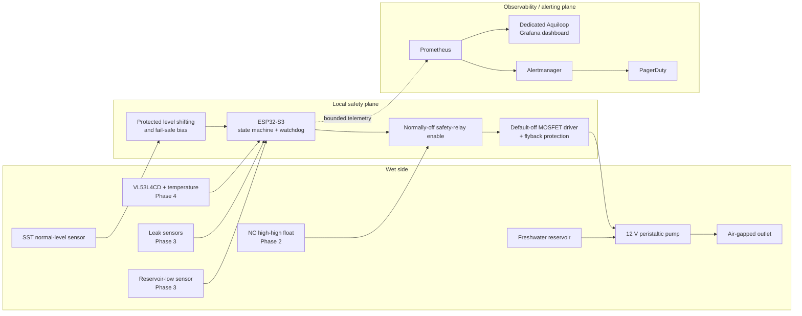

# Phased Aquarium Auto-Top-Off Design

Status: initial authoritative design; no implementation is included.

Target: a 20-gallon garage aquarium supplied from a five-gallon freshwater
reservoir.

## Problem statement

Evaporation changes aquarium level and salinity. The system must detect a low
water level and transfer a small, bounded quantity of freshwater from a
reservoir without turning a sensor, firmware, electrical, plumbing, or network
failure into an uncontrolled fill. A garage adds temperature, humidity, splash,
condensation, and unattended-equipment risks.

This design starts with a deliberately supervised experiment and adds diverse
sensing, physical power interruption, source/leak protection, and diagnostics
in separately testable phases. It is a design for risk reduction, not a claim
that an aquarium top-off can be made failure-proof.

## Goals

- Maintain the normal waterline with repeatable, calibrated, small doses.
- Put direct pump control on an ESP32-S3, not a Raspberry Pi or other SBC.
- Make every hazardous action locally bounded and default-off, independent of
  Wi-Fi, Prometheus, Grafana, Kubernetes, Alertmanager, or PagerDuty.
- Progressively contain overfill, dry-run, siphon, leak, and sensor failures.
- Keep printed structures reproducible from editable, parametric OpenSCAD.
- Make faults visible locally first and remotely as a secondary capability.

## Assumptions

- The aquarium is nominally 20 US gallons and the source is a nominally
  five-gallon, freshwater HDPE container below the aquarium waterline whenever
  practical.
- Actual vertical lift, tubing route, safe freeboard, evaporation rate, and
  pump flow at that lift will be measured on site rather than inferred from
  pump labels.
- The outlet can be rigidly clipped above the maximum waterline with a visible
  air gap. It is never submerged.
- A listed external low-voltage supply is plugged into a GFCI-protected outlet;
  mains wiring is not part of this project.
- Top-off water is appropriate for the livestock. This design does not dose
  medication, salt, fertilizer, or untreated tap water.

## Non-goals

- Water changes, dosing, aquarium circulation, or maintaining reservoir quality.
- Remotely callable unrestricted pump-on control.
- A safety decision that depends on a server, dashboard, cluster, or Internet
  connection.
- Firmware, schematics, CAD models, meshes, dashboards, or Kubernetes resources
  in this initial documentation change.
- Certification for unattended use; the owner remains responsible for risk
  assessment, installation, inspection, and validation.

## Terminology

| Term | Meaning |
| --- | --- |
| **Normal level** | Desired waterline at the fixed SST optical point sensor. |
| **Low/dry** | SST state requesting evaluation for a bounded top-off; not a depth measurement. |
| **High-high** | Abnormal level above normal that opens the independent Phase 2 cutoff. |
| **Attempt** | One or more calibrated short pulses, capped by runtime and estimated volume, followed by evaluation. |
| **Daily budget** | Rolling 24-hour maximum commanded runtime and estimated delivered volume. |
| **ARM/DISABLE** | Local maintained control; DISABLE removes permission to pump. ARM does not force pumping. |
| **Latched fault** | Persistent pump-inhibiting state retained across reset/power loss until a local, deliberate reset succeeds. |
| **Safety plane** | Sensors, local controller limits, default-off drive, and independent cutoff that stop delivery locally. |
| **Observability plane** | Bounded telemetry, dashboards, and notifications; never a prerequisite for shutdown. |

## System context and architecture



The diagram shows the mature system. In Phase 1 the MCU directly permits the
driver because the high-high cutoff is not yet installed; that omission is why
Phase 1 is supervised-only. In Phase 2 the normally-closed (NC) high-high loop
and normally-off relay enable are outside firmware. High water, a broken loop,
or loss of relay power removes pump power. Network arrows are dashed because
telemetry loss has no effect on the local pump-off path. PagerDuty integration
and its credentials live in the cluster, never on the ESP32.

## Safety architecture and invariants

### Local control and firmware state machine

Either Arduino-ESP32 or ESP-IDF is acceptable after a small hardware-abstraction
spike. The implementation must use the hardware watchdog, brownout-safe output
initialization, nonvolatile fault storage with wear-conscious updates, and a
monotonic clock for active bounds. It must not expose a general `pump_on`
endpoint. A future maintenance action may request one locally initiated,
pre-bounded calibration pulse while a person is present.

```text
BOOT SELF-TEST --valid configuration, inputs stable, locally armed--> IDLE
       | any uncertainty, reset reason requiring review, or failed test
       +------------------------------------------------------------> LATCHED FAULT

IDLE --stable dry throughout low debounce--> LOW DEBOUNCE --still dry--> FILLING
 ^              | wet/uncertain                  | uncertain              |
 |              +-------------------------------+------------------------+
 |                                                                       |
 +--stable wet after settling and budgets OK-- SETTLING <--pulse ends----+
                                             | still dry, retry available
                                             +--------------------------> FILLING
                                             | bound/retry/budget exceeded
                                             +--------------------------> LATCHED FAULT

Any state --local DISABLE--> MAINTENANCE
MAINTENANCE --local ARM + checks + no fault--> BOOT SELF-TEST
Any state --contradiction, watchdog/reset, cutoff trip, leak, or invariant breach-->
LATCHED FAULT --local manual reset + cause removed + self-test--> IDLE
```

`LOW DEBOUNCE` requires consistent samples over a configured interval; an
unknown or toggling input never becomes permission. `FILLING` emits calibrated
short pulses only. Each pulse is followed by a pump-off `SETTLING` interval so
waves and delayed delivery decay. Attempts have maximum pulse count, cumulative
runtime, and estimated volume; retries are bounded. A rolling 24-hour runtime
and volume budget survives restart. Reaching any bound latches a fault rather
than optimistically retrying. The exact numbers are commissioning outputs, but
firmware must reject absent or zero/unlimited bounds.

### Electrical and wet-environment invariants

1. Pump power is off during boot, reset, flashing, watchdog timeout, brownout,
   uncertain/contradictory sensing, latched fault, or controller failure.
2. The 12 V pump has rated suction/head greater than the **measured**
   reservoir-to-rim lift at the installed tubing route. Flow is calibrated at
   that lift.
3. A logic-level, default-off MOSFET driver uses a gate pulldown, suitably rated
   wiring/connectors and fuse, and flyback protection selected for the pump.
   The external low-voltage supply is listed and has suitable voltage/current
   ratings; no exposed mains enters the enclosure.
4. The SparkFun SST needs 4.5--15.4 V and has a push-pull output. It must **not**
   connect directly to a 3.3 V ESP32 GPIO. The future schematic must select and
   validate a resistor divider plus input protection, a rated buffer, or an
   optocoupler. A fail-safe bias must make disconnection, loss of sensor power,
   and startup resolve to unknown/fault, never a fill request.
5. Logic interpretation is tested at power-up and the sensor supply/output
   worst cases are checked against ESP32 absolute maximum and logic thresholds.
6. The reservoir stays below aquarium water level when practical. The secured
   outlet terminates above maximum water with an air gap to prevent backsiphon;
   routing cannot fall into the tank.
7. GFCI protection, drip loops on every cable/tube, strain relief, separated wet
   and electrical paths, fusing near the supply, and splash-resistant placement
   are mandatory. Secondary containment becomes mandatory in Phase 3 and is
   strongly recommended earlier.
8. ARM is local and maintained; DISABLE is the safe control position. A status
   LED/buzzer cannot itself authorize pumping.
9. In Phase 2 and later, high-high loop continuity is energized-to-run at low
   current: high water, cut/disconnected wire, lost power, or relay failure to
   de-energized removes pump supply outside firmware.

## Sensor selection and alternatives

The initial [SparkFun SST liquid level sensor](#references) is a robust optical
point-level device with no moving parts. It is a binary switch at the normal
waterline, **not** a continuous depth sensor. Its fixed holder mounts it
horizontally through/from a manually height-adjustable top-rim bracket, with the
sensing tip at the desired setpoint and guarded from animals and impact.
Installation must follow the sensor maker's material/chemical compatibility and
mounting guidance.

The sensor is not pointed downward and is not dipped by a motor: a retained
droplet can remain optically "wet" after the water recedes. Motorizing it adds
jam, homing, cable-flex, and false-wet failure modes without improving the
authoritative point decision. Motorized dipping remains rejected in Phase 4
unless future controlled evidence resolves retained droplets and those added
failures.

Phase 2 pairs optical sensing with an NC polypropylene float/reed switch. The
mechanical device has different physics, electronics, and likely failure modes;
this diversity is more useful than two identical optical sensors sharing
fouling, condensation, supply, and interpretation failures. A fixed capacitive
through-glass sensor is a no-moving-sensor alternative where tank geometry
allows it. It avoids wetted moving parts but has weaker failure independence
from the SST because condensation, deposits, nearby water, glass thickness,
calibration drift, and electronics/common power may affect both electronic
techniques. It does not replace the preferred hardwired NC high-high float
without equivalent independent validation.

Phase 4 adds a fixed, top-mounted VL53L4CD aimed at a calm, baffled surface for
trends. It never displaces the point sensors or hard cutoff. Commissioning must
characterize minimum standoff, field of view and obstructions, target geometry,
ripple/bubbles, condensation, ambient light, cover-glass effects, and
distance-to-volume nonlinearity across the operating range. Invalid or implausible
ranges are diagnostic faults, not fill permission.

## Implementation phases

### Phase 1 — supervised minimal prototype

> **Classification: supervised experimental use only; never unattended.** It
> lacks an independent high-water cutoff, reservoir-low detection, and leak
> detection. During testing the reservoir must contain no more water than the
> measured aquarium freeboard can safely accept if all of it transfers.

**Included hardware/software.** One ESP32-S3 development board, one fixed
horizontal SST sensor and protected interface, one suitably rated 12 V
peristaltic pump, default-off protected MOSFET driver, listed supply and fused
conversion/distribution, local maintained ARM/DISABLE control, and simple local
status LED/buzzer. Firmware implements the complete bounded state-machine core:
debounce, calibrated pulses, settling, bounded retries, per-attempt runtime and
volume, rolling daily budget, watchdog, reset-safe output, and persistent
latched faults. The rim mount adjusts manually and then locks; it has no motor.

Every structural component is printed in PLA in Phase 1, and every print has an
editable parametric source (paths are planned, not created by this design):

| Required printable component | Exact future OpenSCAD source |
| --- | --- |
| Ventilated electronics enclosure, lid, and strain relief features | `tools/auto_top_off/electronics_enclosure.scad` |
| Aquarium top-rim bracket with manual height adjustment and lock | `tools/auto_top_off/rim_bracket.scad` |
| Horizontal SST holder and animal/impact guard | `tools/auto_top_off/sst_sensor_holder_guard.scad` |
| Pump vibration/retention mount (required if the selected pump lacks a safe commercial mount) | `tools/auto_top_off/pump_mount.scad` |
| Above-waterline outlet-tube clip with air-gap geometry | `tools/auto_top_off/outlet_tube_clip.scad` |
| Reservoir-lid insert for tube routing (non-airtight) | `tools/auto_top_off/reservoir_lid_insert.scad` |
| Cable/tube-management and drip-loop clips | `tools/auto_top_off/cable_management_clips.scad` |
| Shared measured dimensions, tolerances, and PLA defaults | `tools/auto_top_off/ato_parameters.scad` |
| Shared reusable primitives | `tools/auto_top_off/lib/ato_primitives.scad` |

**Failure modes addressed.** Peristaltic tubing limits passive flow; air gap and
low reservoir resist siphoning; default-off drive, watchdog, bounds, and local
disable limit ordinary software failures; fixed guarded mounting avoids moving
sensor failures.

**Remaining limitations.** A falsely dry SST or welded MOSFET can overfill; an
empty reservoir can dry-run the pump; leaks are unseen; calibrated volume is
only inferred; no independent shutdown exists. PLA softens/creeps under heat and
clamp load, absorbs some moisture, and can lose strength or dimensional accuracy
with humidity, UV, cleaning agents, and long service. Keep it away from supply
and motor heat, inspect before each supervised session for cracks, layer
separation, creep, loose fasteners, guard movement, and tube-clip loss, and
replace on any change. During evaluation, record monthly dimensional/retention
checks and impose a conservative six-month replacement interval unless tests
justify a shorter one. PLA is not a certified waterproof electrical barrier.

**BOM delta.** Phase 1 rows in the [preliminary BOM](#preliminary-bom), including
all prints and consumables.

**Validation tests.** Measure lift and flow; calibrate each pulse at installed
head with repeated collections; wet/dry and droplet-test the horizontal SST;
disconnect/short the signal as safely defined by the interface; cycle sensor and
controller power; reset during a pulse; stall firmware to trip the watchdog;
hold the sensor dry to hit every attempt/daily bound; toggle around the waterline;
verify DISABLE; verify outlet retention/air gap and no siphon; inspect GFCI,
fuse, drip loops, temperature rise, and every PLA part under load. Use water and
a safe catch basin, not a stocked aquarium, for destructive tests.

**Objective exit criteria.** All pump-off cases and bounds pass repeatedly;
calibration uncertainty and safe maximum test reservoir volume are documented;
prints retain position through soak/thermal tests; no unbounded interface
exists; a human directly observes every aquarium run. This exits prototype
construction, **not** supervised-only status or approval for unattended use.

### Phase 2 — redundant sensing and hardware cutoff

**Included hardware/software.** Add an independent NC polypropylene high-high
float/reed sensor above normal, low-current energized-to-run safety relay/enable
circuit, protected wiring, and explicit disagreement logic. A local/manual reset
clears a fault only after stable self-tests; remote reset is prohibited. Add
bounded metrics, Prometheus scrape integration, a dedicated Aquiloop Grafana
dashboard, Alertmanager-to-PagerDuty cluster routing, controller-down detection,
and a runbook. PagerDuty credentials remain cluster-side.

**Failure modes addressed.** High water, float-loop wire break, lost cutoff
power, and a non-commanding controller physically remove pump power. Diverse
optical/mechanical comparison detects stuck, fouled, or displaced sensors.
Controller/network silence and abnormal behavior become visible remotely.

**Remaining limitations.** Relay contacts or a poorly designed common supply
can fail; reservoir-empty, leaks, blocked/disconnected tubing, and volume-model
error remain. Alert delivery can fail and is never treated as containment.

**BOM delta.** Phase 2 high-high float, safety relay/driver, connectors/fuse,
mounting pieces, and optional metrics bridge/server resources in the BOM.

**Validation tests.** Raise water to trip high-high during a commanded pulse;
open/short the loop according to the documented test fixture; remove relay and
controller power; simulate welded command output; force each sensor combination;
verify disagreement latch/local-only reset; disconnect Wi-Fi, Prometheus,
Alertmanager, and Internet while confirming local shutdown; verify bounded
labels, dashboard, alert route, and controller-absent alert without secrets in
device storage.

**Objective exit criteria.** An electrical review confirms the cutoff is outside
firmware and fail-open for all specified cases. Repeated wet tests demonstrate
physical pump-power removal and no siphon. A soak test spanning at least 30 days
and representative evaporation has zero unexplained fills, all induced faults
latch locally, calibration/budgets cover worst-case uncertainty, the runbook is
exercised, maintenance is current, and a documented household risk review finds
the aquarium can safely accept the maximum single bounded delivery. Only then
may unattended operation be *considered*, initially with restricted reservoir
volume and frequent inspection; it is not automatically approved.

### Phase 3 — source-water and leak protection

**Included hardware/software.** Add reservoir-low detection, preferably a
capacitive sensor outside the HDPE bucket or a suitable independent float; leak
sensors beneath the pump/enclosure and in reservoir secondary containment; and
mandatory secondary containment. Optionally add a load cell and ADC beneath the
reservoir as a cross-check of remaining and delivered mass. Add empty-source,
leak, blocked-tube/no-response, implausible-frequency, and excessive-daily-
delivery logic plus dashboard panels, alerts, maintenance, and scheduled fault
tests.

**Failure modes addressed.** Reservoir-low inhibits dry-running; leak inputs
immediately de-energize and latch; no level response after bounded delivery
indicates blockage/disconnection; delivery mass can cross-check estimated flow;
frequency and daily-volume models expose slow leaks or sensor drift.

**Remaining limitations.** A leak outside sensor coverage, capacitive drift,
load-cell creep, simultaneous/common wiring failure, or containment overflow can
escape detection. The system does not assess freshwater quality.

**BOM delta.** Phase 3 source sensor, two or more leak probes/controllers,
containment trays, and optional load cell/load-cell ADC and frame.

**Validation tests.** Empty/refill the reservoir across temperature; disconnect
and wet each leak channel; place controlled leaks at coverage edges; pinch and
disconnect tubing; perturb calibration and top-off frequency; exceed attempt and
daily budgets; test containment capacity; load/unload and temperature-cycle the
optional scale. Confirm every case pumps off locally before checking alerts.

**Objective exit criteria.** Every source/leak channel is mapped and fail-safe
behavior documented; containment holds the maximum credible spill; empty,
leak, blockage, frequency, and daily-budget injections latch correctly; alerts
and maintenance instructions are exercised; deliberate failure testing has a
recorded recurring schedule.

### Phase 4 — continuous and environmental sensing

**Included hardware/software.** Add a fixed top-mounted VL53L4CD over a calm,
baffled area for continuous level trend/diagnostics and a suitable waterproof
DS18B20 water-temperature probe with correct bus pull-up and waterproofing.
Retain discrete point sensors and the independent cutoff as authoritative.
After empirical heat, humidity, creep, chemical, and UV tests, individual
structures may migrate from PLA to PETG, ASA, or another documented material;
their parametric `.scad` sources remain authoritative.

**Failure modes addressed.** Trends can reveal slow level drift, abnormal dose
response, sensor disagreement, evaporation changes, and temperature-related
conditions. Temperature helps interpret flow, sensor, and material behavior.

**Remaining limitations.** ToF can be invalid from minimum standoff, field of
view, ripples, bubbles, condensation, deposits, ambient conditions, or nonlinear
tank geometry. Probe seals and one-wire buses fail. Neither sensor authorizes a
fill when point safety inputs disagree.

**BOM delta.** Phase 4 VL53L4CD carrier and protected cable, baffle/mount, sealed
DS18B20 assembly, and any validated replacement-material prints.

**Validation tests.** Map ToF readings against manually measured level over the
full range and multiple fill/drain cycles; test standoff, target/FOV, ripple,
bubbles, condensation, light, deposits, and baffle configurations; derive
residual/nonlinearity limits and invalid-reading behavior. Compare temperature
against a traceable reference, test cable/probe faults, and repeat material
coupons/loaded-part exposure tests. Reconfirm that invalid continuous data
cannot energize the pump.

**Objective exit criteria.** A versioned calibration quantifies ToF error and
valid range under representative disturbances; invalid data reliably degrades
to discrete safety control; temperature accuracy and fault behavior meet the
documented requirement; any material migration has recorded evidence and an
inspection interval. Motorized SST dipping remains rejected absent new evidence
resolving retained droplets and motion failures.

## Preliminary BOM

Costs are planning ranges in USD, excluding tax/shipping and server/cluster
ownership. Exact part numbers require lift, flow, compatibility, electrical,
and availability review; prices are not procurement quotes.

| Phase | Item | Approx. qty. | Planning range |
| --- | --- | ---: | ---: |
| 1 | ESP32-S3 development board | 1 | $10--25 |
| 1 | SparkFun SST optical point-level sensor | 1 | $30--60 |
| 1 | 12 V peristaltic pump rated above measured lift | 1 | $20--60 |
| 1 | MOSFET driver parts, flyback protection, gate bias | 1 set | $5--15 |
| 1 | Listed 12 V supply, DC conversion/distribution, fuses | 1 set | $25--60 |
| 1 | SST divider/buffer/optocoupler interface and protection | 1 set | $3--15 |
| 1 | Local ARM/DISABLE, LED/buzzer, connectors, enclosure hardware | 1 set | $15--40 |
| 1 | Aquarium-safe tubing, check/retention fittings as justified | 1 set | $10--30 |
| 1 | PLA for every listed structural print | ~0.5--1 kg | $12--30 |
| 2 | NC polypropylene high-high float/reed switch | 1 | $10--30 |
| 2 | Normally-off safety relay/enable parts, protection, fuse | 1 set | $15--45 |
| 2 | Additional mount/wiring/connector parts | 1 set | $5--20 |
| 2 | Prometheus/Grafana/Alertmanager hosting | existing or 1 | $0--variable |
| 3 | External capacitive reservoir sensor or independent float | 1 | $10--30 |
| 3 | Leak sensing channels/probes | 2+ | $20--60 |
| 3 | Secondary-containment trays | 2 | $20--60 |
| 3 optional | Load cell, ADC, and support frame | 1 set | $20--60 |
| 4 | VL53L4CD carrier, cable, baffle/mount | 1 set | $15--40 |
| 4 | Waterproof DS18B20 probe and interface parts | 1 | $8--20 |
| 4 optional | Validated PETG/ASA/other material | ~1 kg | $20--45 |

Phase 1 estimated total is **$130--335**. Nonoptional later additions total
approximately **$103--305**; the optional scale and replacement material add
**$40--105**. These figures exclude compute, replacement tools, and labor.
Safety components are not to be selected on cost alone.

## Planned repository structure

These exact future paths define organization, not implementation in this task:

```text
docs/design/aquarium-auto-top-off.md       # this authoritative design
docs/hardware/auto_top_off/
  electrical.md                           # schematics, ratings, interfaces
  wiring-and-installation.md              # wet-side routing and cutoff wiring
docs/calibration/auto_top_off/
  pump.md
  sensors.md
docs/runbooks/auto_top_off.md
firmware/auto_top_off/                     # ESP32-S3 Arduino-ESP32 or ESP-IDF app
hardware/auto_top_off/                     # editable schematic/PCB source, if added
tools/auto_top_off/
  ato_parameters.scad
  electronics_enclosure.scad
  rim_bracket.scad
  sst_sensor_holder_guard.scad
  pump_mount.scad
  outlet_tube_clip.scad
  reservoir_lid_insert.scad
  cable_management_clips.scad
  lib/ato_primitives.scad
scripts/render_auto_top_off.sh
stl/auto_top_off/                          # ignored, optional derived meshes
tests/auto_top_off/
  firmware/                                # host/state-machine tests
  hardware/                                # test plans and recorded fixtures
  cad/                                     # OpenSCAD render/geometry smoke tests
observability/auto_top_off/
  prometheus/                              # bounded scrape/rule resources
  grafana/                                 # dedicated dashboard source
  alertmanager/                            # routing template, no secret
```

Firmware tests will cover every transition, debounce/settling timing, wraparound,
restart persistence, budgets, contradictory inputs, and property tests asserting
that no unpermitted state drives the pump. Hardware documentation owns the
interface and cutoff calculations; calibration documents own versioned measured
values so they are not silently copied into source.

### CAD-source policy

Every printed component, including small adapters, guards, lid pieces, and cable
clips, must have a human-editable parametric `.scad` source committed under
`tools/auto_top_off/`. Shared dimensions belong in `ato_parameters.scad` and
reusable geometry in `lib/ato_primitives.scad`; component files remain directly
renderable. An STL is an optional, ignored derived artifact and may never be the
only CAD source. Source comments document material, orientation, tolerances,
fasteners, revision, and safety-critical dimensions.

The future render script must pin/document the supported OpenSCAD version and
produce all meshes deterministically. Expected commands are:

```sh
scripts/render_auto_top_off.sh
# or, for one documented component:
openscad -o stl/auto_top_off/rim_bracket.stl tools/auto_top_off/rim_bracket.scad
```

CI should render every source and reject missing/empty output; it should not
commit generated meshes.

## Observability and alerting

Metrics appear in Phase 2. The ESP32 should expose or push through a constrained
gateway only low-cardinality, bounded names/labels; aquarium identity comes from
scrape configuration, not arbitrary device input. Never export Wi-Fi or
PagerDuty secrets. Representative metrics are:

| Metric | Type / bounded labels | Purpose |
| --- | --- | --- |
| `aquiloop_up` | scrape health | Controller-down detection (normally Prometheus `up`). |
| `aquiloop_state` | gauge, `state` from fixed enum | Exactly one current state. |
| `aquiloop_sensor_wet` | gauge, `sensor={normal,high_high,reservoir_low,leak_pump,leak_reservoir}` | `0`, `1`, or omit/set separate validity when unknown. Fixed labels only. |
| `aquiloop_sensor_valid` | gauge, same fixed sensor enum | Distinguishes dry from unavailable. |
| `aquiloop_pump_runtime_seconds_total` | counter | Commanded cumulative runtime. |
| `aquiloop_delivery_milliliters_total` | counter | Calibrated estimate, explicitly not direct flow. |
| `aquiloop_topoff_attempts_total` | counter, `result={completed,fault,disabled}` | Bounded outcomes. |
| `aquiloop_daily_budget_fraction` | gauge | Rolling budget consumption, 0 through 1 (may exceed 1 only as fault evidence). |
| `aquiloop_fault_latched` | gauge, `reason` fixed enum | Local persistent fault. |
| `aquiloop_level_distance_millimeters` | gauge | Phase 4 valid ToF trend only. |
| `aquiloop_water_temperature_celsius` | gauge | Phase 4 environmental trend. |

Do not label by error text, boot ID, IP address, measurement value, or timestamp.
The dedicated dashboard shows current state/validity, last successful scrape,
fault and cutoff status, pump attempts/runtime/delivery versus budgets, sensor
disagreement, top-off frequency, Phase 3 reservoir/leaks/optional mass, and Phase
4 distance/temperature trends.

Representative alert conditions (final thresholds follow baselines) include:

- **Critical:** any latched fault, high-high trip, leak, pump activity while not
  in `FILLING`, or delivery/daily budget at its limit.
- **High:** reservoir low, normal/high-high disagreement persisting beyond local
  settling/debounce, or commanded delivery without expected level/mass response.
- **Warning:** top-off frequency or volume exceeds a calibrated rolling baseline;
  ToF/temperature is invalid or implausible; maintenance is overdue.
- **Controller down:** Prometheus `up == 0` for a short evaluated interval, with
  a longer escalation. This tells an operator to inspect; the default-off local
  design remains the containment.

Alertmanager groups/deduplicates and routes Aquiloop alerts to PagerDuty using a
cluster-managed secret. Full manifests and dashboard JSON belong only in the
future paths above. The runbook starts with physical observation, DISABLE,
unplugging the low-voltage pump supply if unsafe, containing water, protecting
livestock, and only then diagnostics. Alerts never offer remote unrestricted
pumping or remote fault reset.

## Calibration, cleaning, maintenance, and fault injection

### Commissioning and calibration

1. Measure reservoir minimum-to-rim vertical lift and the installed tubing
   length/bends. Select a pump with margin above that head/suction requirement.
2. Into a graduated vessel on a safe bench, collect at least ten short pulses at
   actual lift and supply voltage after priming. Record mean, spread, startup
   delay, temperature, tubing age, and worst credible over-delivery. Choose pulse,
   attempt, and daily limits from safe aquarium freeboard, not evaporation alone.
3. Set the horizontal SST height with a manual reference measurement. Exercise
   wet, dry, ripple, bubbles, films, ambient light, and retained droplets; choose
   debounce/settling periods from the worst observed stable time.
4. Phase 2: independently set high-high below the safe maximum and above normal
   ripple; prove physical cutoff before enabling firmware. Phase 3: calibrate
   reservoir and optional mass thresholds. Phase 4: keep versioned distance and
   temperature calibration data with uncertainty and validity ranges.
5. Record configuration version/checksum. Invalid, absent, unbounded, or stale
   calibration prevents arming.

### Routine care

- Before each Phase 1 supervised use, inspect level/outlet position, air gap,
  tubing, rollers, connectors, fuse, drip loops, enclosure dryness, PLA parts,
  reservoir volume, and DISABLE operation.
- Weekly at first (then only relax from evidence), compare delivered volume and
  waterline, inspect for salt/mineral/biofilm buildup and leaks, and test local
  indicators and cutoff. Clean sensors with manufacturer-compatible methods;
  never scrape the optical tip or use an unverified solvent.
- Monthly inspect pump tube fatigue/flattening, fastener torque without
  overtightening PLA, cable strain, containment, GFCI test function, and sensor
  mounts. Recalibrate after tubing/pump/supply/routing changes.
- Follow pump/sensor makers' replacement intervals; otherwise establish a
  conservative recorded interval from inspection and calibration drift. Replace
  Phase 1 PLA by six months or earlier as described above until evidence supports
  a revised interval.

### Deliberate failure testing

On a safe water rig with catch capacity, quarterly and after relevant changes:
disconnect each sensor/loop, simulate wet/dry/contradictory states, remove power,
reset and watchdog the controller mid-pulse, disable networking/monitoring,
block/disconnect tubing, exhaust every software budget, trip high-high, empty the
reservoir, and wet each leak sensor. Confirm pump-off electrically and
hydraulically before confirming the latch, local indication, metric, alert, and
runbook response. Never bypass the cutoff on a stocked tank. Record date,
configuration, expected/actual result, delivered volume, and corrective action.

## Risks and open questions

- What are the measured lift, freeboard-to-safe-volume curve, seasonal
  evaporation, garage temperature/humidity extremes, and acceptable single/daily
  delivery limits?
- Which exact pump, tubing material/size, supply, SST interface, MOSFET, flyback
  device, fuse, relay topology, and high-high float meet worst-case ratings and
  aquarium compatibility? These require documented engineering review.
- Does the rim/cover geometry permit guarded horizontal SST and independent
  high-high placement without livestock, maintenance, condensation, or wave
  interference?
- What failure indication does the selected SST interface provide for signal
  shorts as well as opens, and is diagnostic pulse/current supervision needed?
- Can secondary containment hold the credible reservoir/pump leak while keeping
  electrical equipment dry, and should reservoir test volume remain restricted
  after Phase 2?
- Is direct Prometheus scraping supportable on the chosen framework, or should a
  constrained local gateway translate telemetry without entering the safety
  path?
- What evidence and authority will approve unattended operation? Phase exit
  criteria reduce risk but cannot prove absence of common-cause failures.

## References

Accessed 2026-08-06. Component selection and installation must use the current
manufacturer documentation at implementation time.

1. SparkFun, [SST Liquid Level Sensor](https://www.sparkfun.com/sst-liquid-level-sensor.html).
2. SST Sensing, [LLC200D3SH digital liquid-level sensor data sheet](https://cdn.sparkfun.com/datasheets/Sensors/Infrared/DS0141rev1_LLDigital-LLC200D3SH-LLPK1.pdf).
3. SST Sensing, [Liquid-level installation, operation, and compatibility guide](https://assets.dwyeromega.com/manuals-do/ST_LiquidLevelInstallationOperationAndCompatibilityGuide_AN-0041rev8.pdf).
4. Espressif, [Arduino-ESP32 getting started](https://docs.espressif.com/projects/arduino-esp32/en/latest/getting_started.html).
5. Espressif, [ESP hardware design FAQ](https://docs.espressif.com/projects/esp-faq/en/latest/hardware-related/hardware-design.html).
6. Tunze, [Osmolator operating instructions](https://tunze.com/fileadmin/gebrauchsanleitungen/x3151.8888.pdf) (commercial ATO safety and operating context).
7. DFRobot, [SEN0204 non-contact liquid-level sensor](https://wiki.dfrobot.com/sen0204/) (capacitive through-wall alternative).
8. STMicroelectronics, [Water and liquid-level monitoring with VL53L4CD](https://www.st.com/resource/en/application_note/an5851-water-and-liquid-level-monitoring-using-vl53l4cd-timeofflight-high-accuracy-proximity-sensor-stmicroelectronics.pdf).
9. Prometheus, [Alertmanager documentation](https://prometheus.io/docs/alerting/latest/alertmanager/).
10. Prometheus Operator, [ScrapeConfig documentation](https://prometheus-operator.dev/docs/developer/scrapeconfig/).
