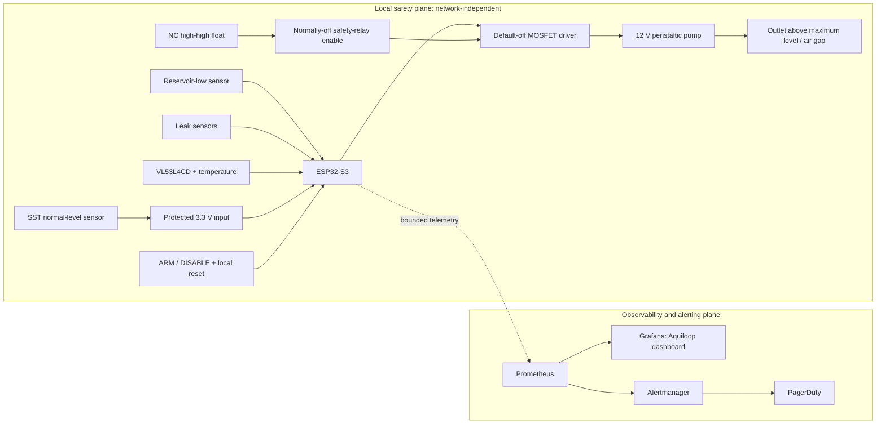

# Aquarium Auto-Top-Off System Design

Status: initial design; no implementation is present. Costs are rough 2026 USD
retail estimates and must be confirmed before purchase.

## Problem statement

Evaporation from a 20-gallon garage aquarium must be replaced without allowing a
stuck sensor, crashed controller, siphon, plumbing fault, or lost network to
overfill the aquarium. Freshwater is pumped from a nominal five-gallon reservoir
below the aquarium to the rim. Because water and mains-powered equipment share the
space, preventing harm locally is more important than remote convenience.

## Goals, assumptions, and non-goals

### Goals

- Replace evaporation in small, measured increments while keeping salinity and
  water level stable.
- Make every unsafe or uncertain state default to pump off, with independent
  containment added before unattended use.
- Progressively improve sensing reliability, failure containment, observability,
  leak/source-water protection, and environmental diagnostics.
- Keep printed structures reproducible from editable, parametric OpenSCAD source.

### Assumptions

- The aquarium is approximately 20 US gallons and the freshwater reservoir is an
  HDPE bucket of at most five gallons. The actual safe acceptance volume, daily
  evaporation, vertical lift, pump flow, rim geometry, and glass/acrylic material
  will be measured during commissioning.
- The reservoir can normally sit below aquarium water level. The return terminates
  above the aquarium's maximum waterline with a visible air gap.
- A listed external low-voltage supply feeds all aquarium-side electronics; mains
  wiring is not placed in a printed enclosure.
- “Wet” at the normal point sensor means the setpoint is satisfied. Exact output
  polarity is verified on the selected SST part and checked at boot, rather than
  assumed from wire color alone.

### Non-goals

- Automatic water changes, dosing, remote manual pumping, aquarium life-support
  control, or a certified commercial appliance.
- Firmware, schematics, CAD, meshes, dashboards, Kubernetes resources, or secrets
  in this initial documentation change.
- Inferring continuous depth from the binary SST point switch.

### Terminology

- **ATO:** automatic top-off. **SST:** the SparkFun-stocked solid-state optical
  point-level sensor. **Normal:** desired operating waterline.
- **High-high:** independent emergency level above normal. **Dry/wet:** optical
  tip state, not a depth measurement. **Attempt:** one bounded sequence of one or
  more short pulses followed by evaluation.
- **Local safety plane:** sensors, hardwired cutoff, ESP32-S3, driver, watchdog,
  and physical controls that can stop delivery without a network.
- **Observability plane:** telemetry collection, visualization, and paging; it may
  report faults but never grants pump power.

## System context and architecture

An ESP32-S3 is preferable to a Raspberry Pi SBC for direct control: it has
deterministic embedded I/O, hardware watchdog facilities, fast boot, lower power,
and fewer operating-system failure modes. Either Arduino-ESP32 or ESP-IDF is
acceptable after a prototype evaluation. Pump safety behavior and tests must be
equivalent in either framework.



Solid arrows show control or physical enable paths; dotted telemetry cannot enable
the pump. Wi-Fi loss, Prometheus/Grafana/Kubernetes outages, Alertmanager failure,
and PagerDuty failure cannot prevent a local shutdown. PagerDuty credentials live
only in a cluster Secret consumed by Alertmanager, never on the ESP32.

## Safety invariants

### Electrical and control

1. Pump power is off during boot, reset, firmware update, watchdog reset,
   controller failure, sensor uncertainty or contradiction, DISABLE, and any
   latched fault. GPIO reset states cannot turn it on.
2. The 12 V pump uses a logic-compatible, default-off MOSFET stage with gate
   pulldown, flyback diode sized for the motor, appropriate connector/current
   rating, and branch fuse. A listed, current-limited low-voltage power supply and
   fused distribution feed the pump and a regulator feeds the ESP32.
3. The SST requires 4.5–15.4 V and has a push-pull output. It **must not** connect
   directly to a 3.3 V ESP32 GPIO. The hardware design will use a calculated
   divider plus clamp/protection, a voltage-tolerant buffer, or an optocoupler.
   Open, shorted, and unpowered-input behavior is evaluated; fail-safe bias makes
   an open/unpowered path read unsafe rather than low-water demand.
4. A pump may run only when locally armed, all required sensors are valid, no
   fault is latched, budgets allow it, and (from Phase 2) the hardwired relay path
   is closed. There is no remotely callable unrestricted `pump_on` operation.
   Remote configuration is bounded and cannot exceed compiled absolute limits.
5. Every fill uses debounced samples, calibrated short pulses, pump-off settling
   intervals, bounded retries, per-attempt runtime and volume limits, a rolling
   24-hour delivery budget, a hardware/task watchdog, monotonic timing, and a
   persistent latched fault surviving reset/power loss. Volume is initially a
   conservative flow-times-runtime estimate.

### Wet environment and mechanics

1. Measure reservoir-to-rim lift with final tubing routing; the selected 12 V
   peristaltic pump's rated suction/head must exceed it with margin. Secure tubing
   against disconnection, kinking, abrasion, and fish interference.
2. Keep the reservoir below aquarium water level where practical. Rigidly clip the
   outlet above maximum waterline with an air gap: it is never submerged, so it
   cannot back-siphon. A peristaltic pump is not the sole anti-siphon device.
3. Use GFCI/RCD protection, drip loops on every cable, strain relief, fused
   low-voltage branches, covered connectors, splash separation, and labeled manual
   disconnects. From Phase 3, use reservoir and equipment secondary containment.
4. Electronics enclosures are splash-resistant, vent/condensation-aware, and
   mounted above potential water paths; they are not claimed waterproof. No
   printed component carries mains voltage or is a primary aquarium wall.

## Sensor and actuator decisions

### Normal point level

Phase 1 uses one fixed SparkFun SST optical sensor, mounted **horizontally** at the
desired waterline in a guarded holder on a top-rim bracket. The bracket is manually
height-adjustable and then positively locked. The sensor is a binary point switch,
not a continuous-depth instrument. Horizontal mounting follows the installation
guidance and lets liquid drain from the optical tip. Pointing it downward or
motorizing a dipping mechanism is rejected: retained droplets can produce a
false-wet result that suppresses needed top-off. Motion also adds seals, cable
fatigue, jams, position uncertainty, and new software states without adding an
independent measurement principle.

Optical readings can be affected by fouling, films, bubbles, condensation, ambient
conditions, installation geometry, or wiring faults. A guard prevents livestock
contact without trapping water or bubbles, and cleaning/inspection remains
mandatory.

### Diverse high-high cutoff and alternatives

Phase 2 adds a polypropylene normally-closed float/reed switch above normal. Its
low-current loop energizes a normally-off safety-relay enable only while healthy;
high water opens the switch, and a broken wire or lost loop power also removes pump
power outside firmware. The relay's contacts/semiconductor disconnect the pump
enable/power at its rated load; the float never switches motor current. A local
manual action is required to clear disagreement and re-enable after diagnosis.

Optical and mechanical sensors have different dominant failure modes—fouling and
optics versus a stuck float or reed—so diverse redundancy reduces common-cause
risk compared with two identical SSTs. A fixed capacitive through-glass sensor
(for example DFRobot SEN0204 where tank material and calibration permit) is a
no-moving-sensor alternative. It avoids a wetted moving part but shares dependence
on wall condition, deposits, moisture, threshold electronics, and power; therefore
it has weaker failure independence and is not the preferred high-high cutoff.

Phase 4 adds a top-mounted VL53L4CD aimed at a calm, baffled water patch for trends
only. It needs installation-specific offset/crosstalk and distance-to-level
calibration. Field of view must exclude rims, braces, plants, tubing, and baffle
edges; minimum standoff and useful range must be proven. Ripple, bubbles,
condensation, cover-glass reflections, target reflectance, and nonlinear vessel
geometry can bias distance. Discrete sensors and the hardware cutoff remain
authoritative. A waterproof DS18B20-class probe adds temperature diagnostics.

## Firmware safety model

All transitions first evaluate global interlocks; failure goes to `LATCHED_FAULT`
with pump output cleared. Suggested states are:

| State | Behavior and permitted transition |
| --- | --- |
| `BOOT_SELF_TEST` | Force output off; verify persisted fault, reset cause, watchdog, configuration CRC/ranges, controls, and plausible/stable sensor states. Only a clean, locally armed system enters `IDLE`; otherwise maintenance or fault. |
| `IDLE` | Pump off; sample sensors and budgets. Stable dry indication starts `LOW_DEBOUNCE`. Wet stays idle. |
| `LOW_DEBOUNCE` | Require dry across a defined sample count and minimum duration; wet returns to idle, uncertainty faults, confirmed dry enters filling. |
| `FILLING` | Apply one calibrated short pulse while enforcing hard runtime/estimated-volume limits and watchdog. Any interlock opens immediately. Then force off and settle. |
| `SETTLING` | Pump off long enough for ripples and sensor wetting to stabilize; stable wet returns idle, stable dry retries only within bounds, ambiguity faults. |
| `MAINTENANCE` | Pump forced off for cleaning/calibration. A local guarded momentary test may request one compile-time-bounded pulse with continuous hold and all interlocks; it cannot bypass limits. |
| `LATCHED_FAULT` | Pump off; persist reason/counters and indicate locally. Recovery requires fault removal plus explicit local/manual reset and a new boot/self-test; network commands cannot clear it. |

Threshold values are not guessed in this document. Calibration records establish
pulse duration, settling time, flow confidence bounds, retries, attempt maximum,
and daily budget. Compiled absolute ceilings bound configurable values. Brownout,
timer wrap, counter persistence wear, and interrupted writes require tests.

## Phased implementation

Each phase is additive and may advance only after its objective exit criteria pass.

### Phase 1 — supervised minimal prototype

**Classification: supervised experimental use only; never unattended.** It lacks
an independent high-water cutoff, reservoir-low detection, and leak detection.
During tests, the reservoir contains no more water than the measured freeboard and
safe operating level show the aquarium can accept without harm if all of it were
delivered (and less where livestock displacement or drainage paths demand).

**Included hardware/software.** ESP32-S3 development board; one horizontally
mounted SST; protected level input; 12 V peristaltic pump; default-off MOSFET,
flyback protection and fuse; listed supply and DC conversion; tubing and
above-water outlet; maintained DISABLE plus deliberate ARM control; local
status/fault LED or buzzer; and the bounded state machine. The rim mount is fixed
during operation and manually height-adjustable—there are no motorized parts.

Every structural component is printed in PLA in this phase, from these planned
editable sources:

| Required printable component | Exact future `.scad` source |
| --- | --- |
| Electronics enclosure, lid, standoffs, strain relief | `tools/auto_top_off/enclosure.scad` |
| Rim bracket and manual height lock | `tools/auto_top_off/rim_bracket.scad` |
| SST holder and free-draining livestock guard | `tools/auto_top_off/sst_sensor_holder.scad` |
| Pump mount (if the selected pump is not panel-mounted) | `tools/auto_top_off/pump_mount.scad` |
| Outlet-tube air-gap clip | `tools/auto_top_off/outlet_tube_clip.scad` |
| Reservoir lid insert, tube/cable pass-throughs | `tools/auto_top_off/reservoir_lid.scad` |
| Cable clips and drip-loop guides | `tools/auto_top_off/cable_management.scad` |

All import shared dimensions from `tools/auto_top_off/parameters.scad` and reusable
geometry from `tools/auto_top_off/lib/common.scad`; each part remains independently
renderable. Separate printed spacers/clamps discovered during fit-up require their
own named module/source (or an explicit selectable module in the closest source),
not an undocumented STL.

PLA is easy to prototype but softens in a hot garage, creeps under constant clamp
load, absorbs some moisture, can warp or crack with thermal cycling, and is not
assumed durable under splash, humidity, cleaners, or long-term UV/heat. Inspect
before every supervised session and at least monthly for creep, whitening, cracks,
loose fasteners, trapped water, and changed sensor/outlet height. Reprint at the
first damage or dimensional change and replace proactively at six months unless
recorded environmental tests justify a shorter/longer interval. Metal fasteners
and tubing are functional hardware, not printed structural components.

**Failure modes addressed.** Direct-drive voltage damage, pump inductive kick,
controller reset-on output, brief wave-induced low readings, unlimited runtime,
software hang, repeated delivery, and outlet siphon are addressed by interfaces,
mechanics, watchdogs, and bounds.

**Remaining limitations.** A false-dry SST or single electronics/driver fault can
overfill; a false-wet state can allow low water; no independent cutoff detects high
water; empty source, leak, tubing blockage/disconnection, calibration drift, and
network-independent component defects may be undetected. Human supervision and
limited source volume are the containment barriers.

**BOM delta.** Phase 1 rows in the preliminary BOM below.

**Validation tests.** Measure lift and flow at minimum/maximum reservoir levels;
calibrate many pulse volumes; confirm settling/debounce with waves and bubbles;
power-cycle and reset in every state; unplug/short the sensor under controlled
conditions; stall/disconnect tubing; hold ARM/DISABLE; force watchdog and corrupted
configuration; exhaust attempt/daily budgets; verify persistent latch; siphon-test
with pump off; splash-test only unpowered; load/heat-cycle all PLA parts; and
perform a supervised maximum-safe-volume dry run with livestock protected.

**Exit criteria.** Documented measurements show pump head margin; 30 supervised
days and at least 100 correctly bounded top-off attempts have no unexplained
delivery; every injected uncertainty stops the pump; all reset/fault/budget tests
pass; outlet air gap and GFCI/drip-loop/fuse review pass; PLA dimensions remain in
tolerance. Passing Phase 1 does **not** authorize unattended operation.

### Phase 2 — redundant sensing and hardware cutoff

**Included hardware/software.** Add the NC polypropylene high-high float, guarded
mount, monitored fail-safe loop, low-current normally-off safety relay/contactor,
feedback where practical, sensor-disagreement logic, persistent reason codes, and
explicit local reset. Add bounded Prometheus export, dedicated Aquiloop Grafana
dashboard, Prometheus controller-down rule, Alertmanager-to-PagerDuty routing, and
`docs/runbooks/auto-top-off.md`. Cluster-owned credentials never reach the ESP32.

**Failure modes addressed.** High water, severed high-high wire, loss of cutoff
power, optical/mechanical disagreement, and many single firmware/output-command
failures physically remove pump power. Telemetry detects controller silence and
pages on actionable persistent faults.

**Remaining limitations.** Common mounting damage, welded/mis-sized relay paths,
float obstruction, leaks, empty reservoir, blocked/disconnected tubing, and source
volume errors remain. Observability may be unavailable and is never a safety path.

**BOM delta.** NC polypropylene float, relay/contactor and interface, fuse/terminal
hardware, mount/guard, and optional telemetry gateway infrastructure.

**Validation tests.** Raise water to high-high while filling; cut/short each loop
wire; remove relay power; command/stick the MOSFET control high; obstruct each
sensor separately; induce disagreement; reboot with a latched fault; attempt remote
reset/control; disconnect Wi-Fi/Prometheus/Alertmanager; verify dashboard, bounded
labels, down alert, PagerDuty test routing, and runbook steps. Inspect relay contact
rating and test feedback or scheduled replacement assumptions.

**Exit criteria before unattended consideration.** A reviewed failure-mode test
record demonstrates high-high, broken wire, lost cutoff power, watchdog/reset, and
sensor disagreement remove pump power; 60 supervised days and 250 cycles complete
without unsafe/unexplained delivery; bounds remain below measured safe freeboard;
local reset cannot bypass an active fault; a 24-hour network outage changes no
safety behavior; paging and runbook drills pass. A human risk review must still
explicitly approve the installation and its limited reservoir volume.

### Phase 3 — source-water and leak protection

**Included hardware/software.** Add reservoir-low detection, preferably a fixed
capacitive sensor outside the HDPE bucket after wall/condensation testing, or a
suitable independent float. Add leak sensors under the pump/enclosure and inside
reservoir secondary containment. Extend local interlocks for empty source, leak,
blocked tubing (using delivered-level response and optional pressure/flow evidence),
implausible top-off frequency, and excessive daily delivery. An optional sealed,
properly ranged load cell and ADC beneath the reservoir cross-check remaining mass
and delivered water. Expand panels, alerts, maintenance records, and deliberate
failure schedules.

**Failure modes addressed.** Dry pumping, many reservoir spills/tube leaks,
delivery with no plausible level response, abnormal cycling, and excessive total
delivery now latch locally. Secondary containment limits escaped water.

**Remaining limitations.** Leak strips have blind spots; external capacitive
sensors depend on bucket geometry/moisture; load cells drift; an outlet-side leak
outside containment or common power/mechanical damage may evade detection.

**BOM delta.** One reservoir-low sensor, two or more leak sensors/interfaces,
secondary trays, optional load cell/ADC/platform, connectors, and test consumables.

**Validation tests.** Empty and refill source across thresholds; wet each leak
sensor with a measured sample and verify drying/replacement behavior; disconnect,
kink, and block tubing; simulate frequency/daily-budget excess; spill into each
containment zone without energizing exposed equipment; load/unload and temperature-
cycle the optional scale; exercise every alert and runbook branch quarterly.

**Exit criteria.** Each local fault stops delivery and persists until local reset;
no planned leak path escapes verified containment volume; source-low works across
bucket position and humidity trials; blocked-tube and abnormal-use tests meet
documented detection bounds; three monthly deliberate-failure drills and 90 days
of operation produce no missed or nuisance safety event.

### Phase 4 — continuous and environmental sensing

**Included hardware/software.** Add a fixed top-mounted VL53L4CD over a calm,
baffled region and a suitable waterproof DS18B20 temperature probe. Record trends,
diagnostics, confidence, and calibration health. Permit migration from PLA to PETG,
ASA, or another justified material only after empirical heat, humidity, chemical,
creep, print, and aquarium-safety testing; retain and parameterize the same `.scad`
sources, including a `material_profile` where dimensions/tolerances differ.

**Failure modes addressed.** Continuous trends expose slow drift, unexpected rate
changes, stuck point sensors, waves, and calibration degradation; temperature
helps interpret sensor and evaporation changes. These diagnostics never overrule a
wet point switch or open cutoff.

**Remaining limitations.** ToF is non-authoritative and vulnerable to field-of-
view obstructions, condensation, ripples, bubbles, reflectance, standoff, and
nonlinear calibration. Temperature probes can drift or leak. Material migration
does not certify the appliance. Motorized SST dipping remains rejected unless new
evidence and independent testing resolve retained-droplet false-wet behavior.

**BOM delta.** VL53L4CD carrier, baffled mount/window strategy, waterproof
temperature probe and interface/pull-up, revised printed parts, and environmental
test coupons.

**Validation tests.** Map ToF raw distance and confidence against a traceable level
reference across the operating range and temperatures; test minimum standoff,
offset/crosstalk, full field of view, baffle geometries, ripple, bubbles,
condensation, deposits, and obstructions; compare point transitions without using
ToF for control. Ice/ambient bath-check the temperature probe. Heat/humidity/load-
cycle material coupons and assemblies before migration.

**Exit criteria.** A versioned calibration bounds ToF error and invalid-data rules
over the installed range; 90 days of trends show no safety-plane influence or
unclassified excursions; point sensors safely operate with ToF disconnected or
misreporting; temperature accuracy meets its recorded requirement; any new
material passes dimensional, creep, and wet-environment acceptance tests.

## Preliminary BOM

Ranges exclude tax/shipping, tools, compute cluster, and printer. Exact parts need
engineering review for voltage, current, materials compatibility, head, accuracy,
and agency listing.

| Phase | Item | Qty. | Approx. cost (USD) |
| --- | --- | ---: | ---: |
| 1 | ESP32-S3 development board | 1 | $12–25 |
| 1 | SparkFun SST optical point sensor | 1 | $25–45 |
| 1 | 12 V peristaltic pump with verified head margin | 1 | $20–60 |
| 1 | MOSFET driver parts, flyback diode, fuse/holder, terminals | 1 set | $10–25 |
| 1 | Listed 12 V supply and 12-to-5/3.3 V conversion | 1 each | $25–60 |
| 1 | ARM/DISABLE controls and local indicators | 1 set | $8–20 |
| 1 | Tubing, air-gap fittings, clamps, wiring, connectors | 1 set | $20–50 |
| 1 | PLA for all structural parts and fasteners/inserts | 1 set | $10–30 |
|  | **Phase 1 estimated total** |  | **$130–315** |
| 2 | NC polypropylene high-high float and mount | 1 | $15–40 |
| 2 | Normally-off safety relay/contactor, interface, terminals | 1 | $20–60 |
| 2 | Observability integration (existing cluster assumed) | 1 | $0–30 |
| 3 | Reservoir-low sensor | 1 | $10–30 |
| 3 | Leak sensors and interfaces | 2–3 | $20–75 |
| 3 | Secondary containment trays | 2 | $20–60 |
| 3 | Optional load cell, ADC, and platform | 1 | $20–60 |
| 4 | VL53L4CD carrier and mount materials | 1 | $15–35 |
| 4 | Waterproof DS18B20-class probe/interface | 1 | $8–20 |
| 4 | Alternate filament and test coupons | 1 set | $20–50 |
|  | **Later-phase additions estimated total** |  | **$148–460** |

## Observability and alerting contract

Telemetry uses bounded label sets: `device`, `sensor` from a compile-time enum,
`state`, and `reason`; never level values, timestamps, or arbitrary error strings as
labels. Representative metrics are:

- `aquiloop_up`, `aquiloop_build_info`, and monotonic
  `aquiloop_controller_boots_total`;
- `aquiloop_state{state=...}` (one-hot), `aquiloop_armed`, and
  `aquiloop_fault_latched{reason=...}`;
- `aquiloop_sensor_state{sensor=...,state="wet|dry|unknown"}` and
  `aquiloop_sensor_disagreements_total`;
- `aquiloop_pump_running`, `aquiloop_pump_runtime_seconds_total`,
  `aquiloop_fill_attempts_total{result=...}`, and
  `aquiloop_estimated_delivery_milliliters_total`;
- `aquiloop_delivery_budget_remaining_milliliters`,
  `aquiloop_reservoir_remaining_milliliters` (when measured),
  `aquiloop_level_distance_millimeters`, and
  `aquiloop_water_temperature_celsius`.

Dashboard panels show state/arm/fault, sensor agreement, attempts and delivery
rates, rolling budget, controller freshness/restarts, reservoir/leaks, ToF trend,
and temperature. Alert rules, expressed later rather than embedded here, include:

- immediate critical page for high-high trip, leak, pump running without all
  enables, latched safety fault, or exhausted daily budget;
- warning then critical for persistent sensor disagreement, reservoir low,
  implausible attempt frequency, repeated no-level-response fills, or abnormal
  delivery rate;
- controller-down based on Prometheus `up == 0`/absence after a short `for` period,
  routed as loss of observability—not proof of unsafe operation;
- maintenance tickets for calibration/cleaning due and sensor/relay test overdue.

Alerts use conservative persistence to suppress wave noise but never delay a local
interlock. Alertmanager owns grouping, inhibition, and PagerDuty routing. A future
Prometheus Operator `ScrapeConfig` or equivalent discovers the controller through
a tightly scoped network path; the ESP32 holds no PagerDuty credential.

## Calibration, maintenance, and fault injection

### Commissioning and calibration

1. Record tank freeboard versus volume using small measured additions without
   livestock risk. Establish maximum safe delivered volume below the worst-case
   overflow/harm threshold.
2. Measure actual lift and tubing route. At low, middle, and high reservoir levels,
   collect at least 20 timed pump samples into a graduated vessel; use the lowest
   credible flow for expected response and highest for safety-volume bounds.
3. Select short pulse, settling, retry, per-attempt, and rolling-day limits from
   the conservative confidence bounds. Version the record at
   `docs/calibration/auto-top-off/pump-flow.md` and re-run after pump/tube/supply or
   routing changes.
4. Map SST wet/dry repeatability at the locked height with waves, bubbles, fouling
   checks, and supply extremes. Measure high-high actuation/de-actuation volume and
   physical separation. Later calibrate reservoir and ToF sensors independently.

### Routine care

- Weekly: inspect waterline, air gap, tubing seating/wear, reservoir limit, leaks,
  indicator state, and sensor/guard cleanliness; wipe the optical tip with a
  compatible soft method—no abrasive or unverified chemical.
- Monthly: inspect PLA as specified above, GFCI test per manufacturer, drip loops,
  fuse/connectors, enclosure condensation, cable strain, float freedom, leak
  sensors, and compare logged versus measured delivery.
- At least quarterly: measure pump flow, exercise DISABLE/high-high/leak/source-low
  paths, test notifications/runbook, inspect peristaltic tube, and restore a known
  clean/dry sensor state. Follow shorter component manufacturer intervals.
- After any maintenance, relocation, firmware/configuration, tubing/pump/sensor,
  reservoir, or geometry change: locally disable, repeat affected calibration and
  fault tests, document results, then explicitly re-arm.

### Deliberate fault injection

With livestock isolated where needed, reservoir volume minimized, a person at the
disconnect, and exposed circuits de-energized before rewiring: simulate dry/wet/
unknown and contradictory readings; sever/unpower the high-high loop; trigger each
leak/source sensor; kink, block, disconnect, and lift tubing; force limits and
watchdog reset; interrupt power in every state; corrupt a test configuration;
disconnect all network services; and validate persistent faults plus local reset.
Record expected/actual pump power, latency, alarm, and recovery in
`tests/auto_top_off/fault-injection/`. Never bypass GFCI, fuses, or the air gap.

## Planned repository structure and CAD-source policy

Future implementation should use this exact organization unless a reviewed design
change updates this document first:

```text
docs/design/aquarium-auto-top-off.md       # this authority
docs/hardware/auto-top-off/                # wiring, interfaces, assembly, FMEA
docs/calibration/auto-top-off/             # pump, level, ToF, temperature records
docs/runbooks/auto-top-off.md               # operations and alert response
firmware/auto_top_off/                      # ESP32-S3 source and build config
hardware/auto_top_off/                      # future editable schematic/PCB sources
tools/auto_top_off/parameters.scad
tools/auto_top_off/lib/common.scad
tools/auto_top_off/enclosure.scad
tools/auto_top_off/rim_bracket.scad
tools/auto_top_off/sst_sensor_holder.scad
tools/auto_top_off/pump_mount.scad
tools/auto_top_off/outlet_tube_clip.scad
tools/auto_top_off/reservoir_lid.scad
tools/auto_top_off/cable_management.scad
scripts/render_auto_top_off.sh
stl/auto_top_off/                          # optional ignored/derived meshes
tests/auto_top_off/unit/
tests/auto_top_off/hardware-in-loop/
tests/auto_top_off/fault-injection/
observability/auto_top_off/prometheus/      # scrape/rule resources
observability/auto_top_off/grafana/         # dedicated dashboard source
observability/auto_top_off/alertmanager/    # routing templates, no secrets
```

Every printed component—including small brackets, guards, clips, lid inserts,
spacers, and revisions—must have committed editable parametric `.scad` source.
An STL is an optional derived artifact and is never the only CAD source. Dimensions,
clearances, material compensation, selected hardware, and render targets are named
parameters; common values are shared rather than copied. Sources render without
manual GUI edits and carry no generated mesh imports.

The future renderer will document and wrap commands equivalent to:

```sh
openscad -o stl/auto_top_off/enclosure.stl tools/auto_top_off/enclosure.scad
openscad -D 'part="lid"' -o stl/auto_top_off/enclosure_lid.stl tools/auto_top_off/enclosure.scad
```

CI should render every target and optionally run `openscad --check-parameters
true --check-parameter-ranges true`; exact flags must match the supported OpenSCAD
version. Generated meshes remain out of source control unless a later repository
policy explicitly chooses reproducible release artifacts.

## Risks and open questions

- What are the measured safe freeboard volume, seasonal evaporation distribution,
  garage temperature/humidity extremes, and maximum acceptable top-off rate?
- Which exact SST ordering code/output polarity, pump curve/tube material, float,
  relay architecture, power supply, fuse values, and input protection pass bench
  verification and materials review?
- Can the high-high mount survive rim movement and livestock/snail obstruction
  without sharing a common bracket failure with the normal sensor?
- What nuisance/response balance should debounce and alert persistence use after
  collecting real wave and maintenance data?
- Does the HDPE reservoir permit reliable external capacitive sensing in humid
  conditions, and is a load cell worth its mechanical and drift complexity?
- Which garage-safe material eventually outperforms PLA without unacceptable
  aquarium chemical exposure, print risk, or creep?
- Network threat modeling, authenticated updates, telemetry transport, time sync,
  and cluster ownership need decisions before Phase 2. None may weaken local bounds.

## References

- [SparkFun SST Liquid Level Sensor product page](https://www.sparkfun.com/sst-liquid-level-sensor.html)
- [SST LLC200D3SH / LLPK1 datasheet (DS0141 rev. 1)](https://cdn.sparkfun.com/datasheets/Sensors/Infrared/DS0141rev1_LLDigital-LLC200D3SH-LLPK1.pdf)
- [SST liquid-level installation, operation, and compatibility guide (AN-0041)](https://assets.dwyeromega.com/manuals-do/ST_LiquidLevelInstallationOperationAndCompatibilityGuide_AN-0041rev8.pdf)
- [Arduino-ESP32 getting started](https://docs.espressif.com/projects/arduino-esp32/en/latest/getting_started.html)
- [Espressif hardware design FAQ](https://docs.espressif.com/projects/esp-faq/en/latest/hardware-related/hardware-design.html)
- [Tunze Osmolator operating instructions (comparison and safety precedent)](https://tunze.com/fileadmin/gebrauchsanleitungen/x3151.8888.pdf)
- [DFRobot SEN0204 non-contact liquid-level sensor](https://wiki.dfrobot.com/sen0204/)
- [ST AN5851: liquid-level monitoring with VL53L4CD](https://www.st.com/resource/en/application_note/an5851-water-and-liquid-level-monitoring-using-vl53l4cd-timeofflight-high-accuracy-proximity-sensor-stmicroelectronics.pdf)
- [Prometheus Alertmanager documentation](https://prometheus.io/docs/alerting/latest/alertmanager/)
- [Prometheus Operator `ScrapeConfig` documentation](https://prometheus-operator.dev/docs/developer/scrapeconfig/)

Manufacturer documents inform component selection but do not certify this assembled
system. Confirm current revisions, exact part variants, ratings, and local electrical
requirements during each implementation review.
