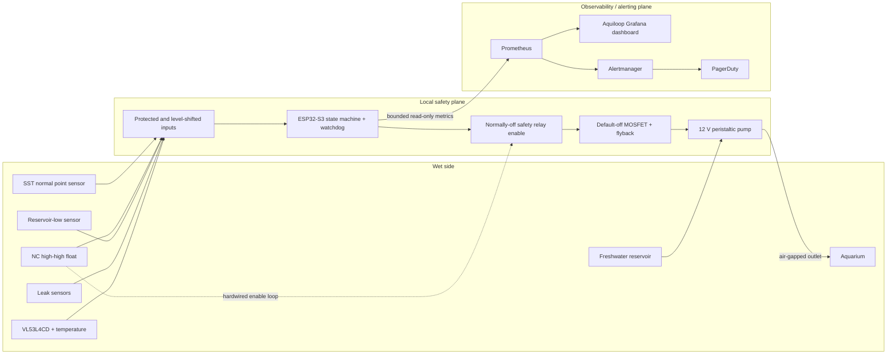

# Aquarium Auto-Top-Off System Design

Status: initial design; no implementation is included in this repository yet.

## Problem statement

Evaporation changes the water level and salinity of a 20-gallon aquarium in a garage. The
system must transfer freshwater from a five-gallon reservoir to the aquarium without turning
a single bad reading, software defect, plumbing mistake, or network outage into a flood. A
small, calibrated peristaltic pump makes delivery measurable and keeps source water out of the
pump mechanism, but it does not remove the need for independent limits and wet-environment
safeguards.

Phase 1 is **supervised experimental use only, never unattended operation**. It lacks an
independent high-water cutoff, reservoir-low detection, and leak detection. During Phase 1,
the reservoir must contain no more water than the aquarium can safely accept if every other
control fails; determine that amount with a measured fill test before arming.

## Goals, assumptions, and non-goals

### Goals

- Restore the normal waterline with small, bounded doses while keeping all safety decisions
  local to an ESP32-S3.
- Progressively add diverse sensing, physical power interruption, source/leak protection,
  useful telemetry, and environmental diagnostics.
- Make boot, reset, ambiguous input, contradictory input, and controller failure default to
  pump off, with faults persistent across resets.
- Keep every structural part reproducible from editable, parametric OpenSCAD source.

### Assumptions

- The aquarium is approximately 20 US gallons and the source is an HDPE bucket holding at
  most five gallons; actual safe acceptance volume, evaporation rate, lift, rim geometry,
  pump flow, and mains arrangement will be measured on site.
- Freshwater is appropriate for this aquarium. Top-off is not a water-change or dosing system.
- The reservoir can normally remain below aquarium water level and close enough that a
  selected 12 V pump's rated suction/head comfortably exceeds the measured vertical lift
  from the lowest usable reservoir level to the outlet at the rim.
- A listed, externally enclosed low-voltage supply powers the system. Mains wiring is not
  exposed or fabricated as part of the project.

### Non-goals

- Continuous depth measurement from the SST, water changes, nutrient dosing, mains switching,
  remote manual filling, and a guarantee against all water damage.
- Firmware, schematics, CAD, meshes, dashboards, Kubernetes resources, or fabrication in this
  design-only change.
- A motorized or downward-facing SST mechanism.

## Terminology

- **ATO:** automatic top-off.
- **Normal:** desired aquarium waterline, sensed by the SST optical point-level switch.
- **Low:** the normal sensor is stably dry after debounce; it is a request to evaluate a dose,
  not a depth measurement.
- **High-high:** abnormal upper limit, sensed independently by a normally-closed (NC)
  polypropylene float/reed switch in Phase 2.
- **Armed / disabled:** local manual permission to fill / unconditional inhibition of filling.
- **Dose (attempt):** one calibrated, short pump pulse followed by a no-pump settling interval.
- **Latched fault:** persistent pump inhibition requiring diagnosis and explicit local/manual
  reset; a reboot or remote command cannot clear it.
- **Local safety plane:** sensor evaluation, bounds, watchdog, and physical pump-power enable.
- **Observability plane:** exported status, storage, visualization, routing, and notification;
  it can report but cannot grant permission to run the pump.

## System context and authority boundaries



The diagram shows the end-state components; each phase below states which are present. Wi-Fi,
Prometheus, Grafana, Kubernetes, Alertmanager, and PagerDuty are never in the pump-enable path.
Loss, corruption, or compromise of the entire observability plane therefore cannot start or
prolong pumping. PagerDuty credentials remain in the cluster's secret store, never on the
ESP32. The controller exposes observations only: there is no remotely callable unrestricted
`pump_on`, fault-clear, or arm operation.

## Core design

### Controller, normal sensor, and pump

Use an ESP32-S3, with either Arduino-ESP32 or ESP-IDF selected during implementation. It has
adequate local timers, nonvolatile storage, watchdog support, and networking without the boot,
filesystem, and operating-system complexity of a Raspberry Pi SBC in the direct control path.
Network services are optional outputs, not safety dependencies.

The initial normal-level sensor is the fixed SparkFun SST optical liquid-level sensor. Mount
its sensing tip **horizontally** through a guarded holder at the desired waterline on a fixed,
manually height-adjustable top-rim bracket. It is a binary wet/dry point switch, not a
continuous depth sensor. It must neither point down nor be dipped by a motor: a retained
droplet can keep the optical tip falsely wet after the surrounding level falls. A fixed mount
also removes actuators, position uncertainty, cable fatigue, and extra failure paths.

The SST requires 4.5–15.4 V and has a push-pull output. Power it from the protected low-voltage
rail specified by the eventual schematic and **never connect its output directly to a 3.3 V
ESP32 GPIO**. Phase 1 must use a calculated resistor divider plus input protection, a 3.3 V
logic buffer, or an optocoupler. The interface must meet ESP32 VIH/VIL and injection-current
limits across tolerances, and include fail-safe biasing so an unplugged or broken signal is
recognized as invalid rather than low-water permission. Startup self-test must reject an
impossible or indeterminate level.

Use a 12 V peristaltic pump only after measuring the worst reservoir-to-rim lift; rated suction
and head must exceed that measurement with margin. Drive it with a logic-level, default-off
MOSFET stage, gate pull-down, appropriately rated flyback suppression, branch fuse, and an
external listed low-voltage power supply. Firmware GPIO alone is not a power disconnect.

### Firmware state machine

All transitions that might energize the pump require local ARM, valid sensors, intact limits,
remaining attempt and daily budgets, and no latched fault.

| State | Required behavior and principal transitions |
| --- | --- |
| **Boot self-test** | Force output off before GPIO configuration; validate configuration, persisted counters/fault, reset cause, sensor plausibility, watchdog, and manual control. Go to idle only if safe and armed; otherwise disabled or latched fault. |
| **Idle** | Pump off. Sample and debounce. Stable wet remains idle; stable dry enters low debounce; uncertainty or contradiction faults. |
| **Low debounce** | Require dry continuously for a calibrated interval. Any wet/invalid sample returns to idle or faults. On success and within all bounds, start one dose. |
| **Filling** | Run one calibrated short pulse. Independently stop on high-high, leak, reservoir-low, watchdog deadline, maximum attempt runtime/estimated volume, disable, or invalid input. Never extend a pulse remotely. |
| **Settling** | Pump off long enough for waves and sensor wetting to settle. Re-sample; return idle if wet, otherwise retry only within a bounded count and rolling daily volume/runtime budget. Exhaustion faults. |
| **Maintenance** | Locally selected, pump off by default. Permit only a physically attended, dead-man-style bounded calibration pulse subject to the same hard cutoff and per-attempt maximum. It is not remotely selectable. |
| **Latched fault** | Pump and relay request off; persist reason and counters across restart. Exit only after a local/manual reset gesture while disabled, inputs are safe, and the cause has been corrected. |

Debounce durations, dose duration/volume, settling time, retries, per-attempt bounds, and rolling
24-hour budget begin conservative and are calibrated, versioned, range-checked, and persisted
with integrity protection. The rolling budget must not reset into a permissive state after a
reboot or clock/network loss. A hardware/task watchdog and a separate maximum-on deadline
de-energize the request. Brownout, bootloader, panic, reset, hung task, invalid configuration,
and controller power loss all result in pump off; Phase 2 additionally removes pump power.

## Safety invariants

### Electrical and control

1. Pump power is off unless every local permissive is currently true. Output hardware is
   default-off during reset, boot, disconnected GPIO, and unpowered controller conditions.
2. No network request can arm, clear a fault, bypass a limit, or command unbounded runtime.
3. Any unknown, stale, out-of-range, contradictory, or uncertain sensor value inhibits filling.
4. One attempt and all attempts in a rolling day have independent runtime and estimated-volume
   ceilings; bounded retries can never turn into continuous running.
5. Phase 2's NC high-high loop and normally-off relay remove driver/pump power independent of
   firmware on high water, broken wire, loose connector, or loss of enable power.
6. Pump and supply branch ratings, wire gauge, connectors, MOSFET, diode, relay, and fuses are
   selected from measured current including stall/inrush, with documented margin.

### Wet environment and plumbing

1. Use GFCI-protected mains power, tested per its manufacturer's instructions, with drip loops
   on every descending cable/tube and connectors/enclosure kept outside splash paths.
2. Keep the reservoir below aquarium water level where practical. Secure the outlet above the
   maximum waterline with a visible air gap; never submerge it, eliminating a siphon path and
   preventing tank-water backflow.
3. Use aquarium-compatible tubing and wetted materials, strain relief, guarded sensors, and a
   mechanically retained outlet. Route low-voltage wiring separately from water paths.
4. Fuse near the power source. Use a listed low-voltage supply and no exposed mains assembly.
   Add secondary containment under reservoir and equipment as the phases specify.
5. ATO water cannot compensate for a leaking tank: leak indication always disables delivery.

## Sensor rationale and rejected alternatives

The SST offers a compact fixed point at the actual normal line and no moving parts. Its optical
behavior, binary output, supply/interface requirements, fouling, condensation, bubbles, and
retained droplets are handled explicitly rather than interpreting it as a range sensor.

Phase 2 adds a **diverse** NC polypropylene float/reed high-high switch. Optical fouling or
film and mechanical sticking, magnet/reed, or hinge failures are less correlated than two
identical optical sensors. The NC wiring also reveals an open cable by removing enable. A
capacitive through-glass sensor is a no-moving-sensor alternative when geometry prevents a
float; however, films, moisture, glass thickness, nearby water, calibration drift, and shared
electrical/interpretation dependencies give it weaker failure independence than the float.

Rejected or deferred alternatives:

- **Raspberry Pi direct control:** OS and storage failure modes add no necessary capability to
  the safety loop; it may host external services, but not directly authorize the pump.
- **Downward or motorized dipping SST:** retained droplets can cause false-wet behavior, while
  movement adds position and fatigue failures. It remains rejected unless future controlled
  evidence resolves the droplet failure mode.
- **Two identical SST sensors:** useful redundancy but poor diversity against common fouling,
  mounting, supply, or interpretation faults.
- **Float as the sole normal control:** moving parts can bind; it is better used diversely as
  the hard upper limit.
- **ToF as authoritative cutoff:** geometry, condensation, surface motion, and reflectance make
  it valuable for trends but not a replacement for point limits.

## Implementation phases

Each BOM delta is additive to earlier phases. Prices are preliminary USD retail ranges,
excluding tax/shipping, and must be refreshed before purchase.

### Phase 1 — supervised minimal prototype

**Classification:** supervised experimental use only. A person capable of immediately cutting
power must remain present whenever it is armed. It is not eligible for unattended operation.

**Included hardware/software:** ESP32-S3 development board; one fixed horizontal SST normal
sensor; one qualified 12 V peristaltic pump and tubing; protected level interface; default-off
MOSFET/flyback driver; fused, listed 12 V supply and suitable 3.3/5 V conversion; local latching
ARM/DISABLE control; simple LEDs (power/armed/filling/fault); watchdog, persistent latch,
debounce, pulses, settling, retry/attempt/daily limits; and all-PLA structural parts. No
network service is required or trusted.

Every required printed component and its exact future editable source is inventoried here:

| Required PLA component | Planned parametric source |
| --- | --- |
| Electronics enclosure base and lid | `tools/auto_top_off/cad/electronics_enclosure.scad` |
| Manually height-adjustable top-rim bracket | `tools/auto_top_off/cad/rim_bracket.scad` |
| Horizontal SST holder and splash/impact guard | `tools/auto_top_off/cad/sst_sensor_holder.scad` |
| Pump vibration/retention mount (adapt or print as required by selected pump) | `tools/auto_top_off/cad/pump_mount.scad` |
| Air-gap outlet-tube rim clip | `tools/auto_top_off/cad/outlet_tube_clip.scad` |
| Reservoir lid insert/tube guide | `tools/auto_top_off/cad/reservoir_lid_insert.scad` |
| Cable/tube strain-relief clips | `tools/auto_top_off/cad/cable_management_clip.scad` |

Shared dimensions and reusable geometry will live at
`tools/auto_top_off/cad/parameters.scad` and `tools/auto_top_off/cad/lib/common.scad`.
Fasteners, tubing, seals, electronics, and the off-the-shelf bucket are non-structural purchased
parts. No printed plastic carries mains voltage.

PLA is mandatory for all Phase 1 structural prints, but it creeps under sustained clamp load,
softens in garage heat, absorbs some moisture, and may lose toughness or dimensional stability
with humidity, cleaning chemicals, UV, and time. Keep parts out of water and direct sun/heat;
inspect before every supervised session for cracks, whitening, loose clamps, distortion, layer
separation, and loss of outlet/sensor position. Record dimensions monthly and after any hot
garage event. Replace immediately on damage or movement, and provisionally every six months
even if it appears sound, shortening that interval from observations. Printed parts are not a
permanent safety barrier.

**Failure modes addressed:** small evaporation loss; noisy SST readings; stuck software request;
reset/brownout; excessive single or repeated delivery; siphon risk; loose outlet; direct
high-voltage GPIO exposure.

**Remaining limitations:** no independent high-high cutoff, reservoir-low or leak detection;
single-sensor fouling/wiring errors and MOSFET short can defeat control; no remote health
visibility; PLA aging. The deliberately limited reservoir volume is the final containment.

**BOM delta:** approximately $95–$220: controller $10–$25, SST $25–$45, pump $15–$45,
listed supply/converter/fuses/driver/interface $25–$60, tubing/air-gap fittings/manual control/
indicators/fasteners $15–$30, and PLA $5–$15.

**Validation tests:** measure lift and pump margin; calibrate volume for repeated pulses at
minimum/maximum source level; verify divider/buffer voltages and fail-safe open-wire behavior;
wet/dry debounce with waves, bubbles, and droplets; unplug/reset/brownout/watchdog tests during
each state; stuck-low input and held ARM tests; retry/attempt/daily-budget exhaustion; blocked
tube and outlet-retention checks; maximum-safe-reservoir fill test; 24-hour supervised dry run;
GFCI/drip-loop/fuse/air-gap inspection; dimensional and load testing of every print.

**Exit criteria:** all results and calibration revisions are recorded; 100 consecutive
supervised dose cycles deliver within the chosen tolerance with zero unsafe energizations;
every injected reset/invalid input/budget exhaustion turns the pump off and latches as designed;
the maximum test reservoir volume cannot overflow the tank; and no printed part moves or
deforms. Exit permits work on Phase 2, **not unattended use**.

### Phase 2 — redundant sensing and hardware cutoff

**Included hardware/software:** add a separately mounted NC polypropylene high-high float/reed
sensor above normal, wired into a low-current normally-off safety-relay enable circuit. An open
wire, high water, or lost enable power physically removes pump power outside firmware. Monitor
auxiliary relay/high-high state for disagreement, latch it, and require disabled-state local
manual reset. Add read-only bounded metrics, Prometheus scraping, a dedicated Aquiloop Grafana
dashboard, controller-down/stale-series detection, Alertmanager routing to PagerDuty, and a
runbook. Cluster-held PagerDuty credentials never reach the ESP32.

The diverse optical/mechanical rationale and capacitive through-glass alternative are described
above. Relay design must prevent a welded monitoring contact or GPIO from bypassing the NC
series safety path and should expose positive proof of de-energization where practical.

**Failure modes addressed:** SST falsely dry, firmware failing to stop, high water, open
high-high wiring, controller/power loss, sensor disagreement, and unnoticed controller outage.

**Remaining limitations:** relay contacts or float can mechanically fail; no source-empty or
floor leak detection; telemetry can be unavailable; no continuous trend. Physical air gap,
budgets, inspection, and reservoir volume remain essential.

**BOM delta:** approximately $30–$100: NC polypropylene float $8–$25, safety relay/driver/
contacts/enclosure hardware $15–$50, connectors/fusing $5–$15, and optional cluster capacity
or PagerDuty service cost $0–$10+ per month.

**Validation tests:** raise water independently to trip high-high during filling; open/short
each sensor cable; remove MCU and relay-enable power; force output high and simulate hung
firmware; verify relay interrupts the actual pump supply; stick each sensor wet/dry; create
every disagreement; confirm reboot and remote traffic cannot clear latch; disconnect Wi-Fi,
Prometheus, Grafana, Alertmanager, and the cluster while filling; verify metrics, stale/down
alerts, routing, and runbook steps without using alert delivery as shutdown.

**Exit criteria:** documented electrical review; every single injected sensor-wire, firmware,
controller-power, and network fault yields the expected safe outcome; high-high independently
cuts pump power in every run; alerts and local reset operate as documented; and a multi-week
supervised soak has no unexplained disagreement, overflow, or budget violation. Only a signed
validation record and owner risk review may classify the system for limited unattended use;
Phase 3 protections are strongly preferred first.

### Phase 3 — source-water and leak protection

**Included hardware/software:** add reservoir-low detection, preferably a capacitive sensor
outside the HDPE bucket (or an independent suitable float), plus leak sensors below the pump/
enclosure and in reservoir secondary containment. Empty source, any leak, blocked tubing,
implausible top-off frequency, and excessive rolling daily delivery inhibit pumping and latch.
Infer blockage from calibrated delivery evidence (for example optional reservoir mass change),
not motor current alone. An optional sealed-platform load cell beneath the reservoir provides
cross-checks for remaining and delivered water. Expand panels, alerts, maintenance, runbook,
secondary containment, and scheduled deliberate failure tests.

**Failure modes addressed:** dry-running/empty source, source or delivery leak, containment
water, unnoticed blockage/disconnection, abnormal cycling, gross dose estimate drift, and
excessive cumulative addition.

**Remaining limitations:** external capacitive sensing can drift with bucket wall/residue;
leak tape has blind spots; load cells drift with temperature and mechanical interference;
there is still no continuous aquarium level/temperature trend.

**BOM delta:** approximately $35–$160: reservoir sensor $8–$25, two leak probes/modules
$15–$45, containment tray $10–$40, wiring $5–$15, and optional load cell/platform plus ADC
$15–$50.

**Validation tests:** drain source below threshold and unplug/short its sensor; apply a measured
small water sample to each leak sensor; leak into each containment region; pinch, disconnect,
and misroute tubing; simulate no mass change and implausible mass change; exceed frequency and
rolling budget across reboot/time loss; verify sensor drying alone cannot clear a latch; test
dashboard/alerts; deliberately repeat each fault quarterly and after maintenance.

**Exit criteria:** every source/leak fault stops or prevents the next pulse and requires local
reset; all containment zones are detectable with a documented test volume; blockage and
frequency rules meet calibrated sensitivity without unsafe false negatives; daily accounting
survives reset; and a multi-week unattended pilot with frequent in-person inspections has no
unexplained delivery or alarm.

### Phase 4 — continuous and environmental sensing

**Included hardware/software:** add a fixed, top-mounted VL53L4CD over a calm, baffled surface
area for continuous trend and diagnostic comparison, plus a suitable waterproof DS18B20 water
temperature probe. Discrete point sensors and the independent high-high hardware cutoff remain
authoritative for pump safety. Extend metrics, dashboard, maintenance, and anomaly detection.

Calibrate ToF at multiple traceable water heights across the operating range and temperatures,
including full/low reference points. Record mounting offset and nonlinearity; mask readings
inside the device's validated minimum standoff. Mechanically control field of view so glass,
rim, tubing, livestock, and baffle edges are excluded. Characterize ripple, bubbles, surface
reflectance, condensation and droplets on the cover window, ambient light, tilt, and calm-down
time. Invalid or disagreeing ToF data provides diagnostics or an inhibit, never permission to
override a point switch.

After empirical heat, humidity, water, creep, chemical, and print testing, later structures may
migrate from PLA to PETG, ASA, or another justified material. Keep the same parametric `.scad`
source policy and record material-specific dimensions/settings. Motorized SST dipping remains
rejected unless controlled future evidence resolves retained-droplet false-wet behavior.

**Failure modes addressed:** slow drift, unusual evaporation/delivery trends, normal-sensor
movement, some blocked/disconnected outlet cases, and harmful water-temperature excursions.

**Remaining limitations:** ToF is non-authoritative and susceptible to optical/environmental
artifacts; a temperature probe can drift or leak; no sensor eliminates inspection, maintenance,
air gap, containment, or finite water inventory.

**BOM delta:** approximately $25–$90: VL53L4CD carrier/protective optical mounting $12–$35,
waterproof DS18B20/interface $8–$20, baffle/fasteners/material $5–$25, optional upgraded-print
material $5–$10 allocated per set.

**Validation tests:** multi-height ToF calibration and holdout-point error; minimum-standoff and
field-of-view obstruction tests; induced waves, bubbles, condensation, grime, ambient-light and
tilt tests; compare point switches with ToF without allowing override; temperature reference
bath checks at relevant garage/tank bounds; unplug/short probes; accelerated material coupons
and loaded-part dimensional inspections.

**Exit criteria:** trend error and invalid-reading behavior meet documented tolerances across
the tested environment; all artifacts are rejected or alarmed without defeating point safety;
temperature agrees with a traceable reference within the chosen tolerance; and any material
migration passes equal or better fit/load/environment tests with sources retained.

## Preliminary cumulative BOM

| Phase | Approx. quantity | Item group | Estimated cost (USD) |
| --- | ---: | --- | ---: |
| 1 | 1 each | ESP32-S3 board; SparkFun SST; 12 V peristaltic pump | $50–$115 |
| 1 | 1 set | Listed supply, converter, protected sensor interface, MOSFET/flyback, fuses | $25–$60 |
| 1 | 1 set | Tubing, controls, indicators, fasteners, seven PLA component types | $20–$45 |
| 2 | 1 each/set | NC float, normally-off safety relay circuit, connectors | $28–$90 |
| 2 | 1 stack | Existing Prometheus/Grafana/Alertmanager/PagerDuty integration | $0–$10+ monthly |
| 3 | 1 + 2 | Reservoir-low sensor; leak sensor modules | $23–$70 |
| 3 | 1 each | Secondary containment; optional load cell and ADC | $10–$90 |
| 4 | 1 each | VL53L4CD module/mount; waterproof DS18B20/interface | $20–$55 |
| 4 | 1 set | Baffle, hardware, optional alternative print material | $5–$35 |

Exact part numbers, current ratings, materials compatibility, fit, certifications, pump curve,
and prices must be confirmed during each phase's procurement review. Do not substitute a
normally-open float for the NC hard-enable loop merely because it is cheaper.

## Planned repository structure and CAD policy

These are exact future paths, not files created by this design task:

```text
docs/design/aquarium-auto-top-off.md             # this authoritative design
docs/hardware/auto_top_off/electrical.md          # wiring, interfaces, ratings, schematic link
docs/hardware/auto_top_off/bom.md                 # selected parts and procurement record
docs/calibration/auto_top_off.md                  # pump/sensor calibration and signed results
docs/runbooks/auto_top_off.md                     # alarms, diagnosis, local reset, escalation
src/auto_top_off/                                 # ESP32-S3 firmware source and configuration
tests/auto_top_off/unit/                          # state-machine and budget tests
tests/auto_top_off/hardware_in_loop/              # relay, sensor, reset, watchdog test harness
tools/auto_top_off/cad/parameters.scad
tools/auto_top_off/cad/lib/common.scad
tools/auto_top_off/cad/electronics_enclosure.scad
tools/auto_top_off/cad/rim_bracket.scad
tools/auto_top_off/cad/sst_sensor_holder.scad
tools/auto_top_off/cad/pump_mount.scad
tools/auto_top_off/cad/outlet_tube_clip.scad
tools/auto_top_off/cad/reservoir_lid_insert.scad
tools/auto_top_off/cad/cable_management_clip.scad
scripts/render_auto_top_off.sh
observability/auto_top_off/grafana-dashboard.json
observability/auto_top_off/prometheus-rules.yaml
observability/auto_top_off/scrape-config.yaml
observability/auto_top_off/alertmanager-route.yaml
```

Every printed component, including later sensor brackets, baffles, and material revisions, must
have editable parametric `.scad` source committed under `tools/auto_top_off/cad/`. An STL is an
optional generated artifact and can never be the only CAD source. Shared dimensions belong in
`parameters.scad`, reusable geometry in `lib/common.scad`, and each top-level file must render
one named component reproducibly. The planned renderer will document the pinned OpenSCAD
version and execute commands equivalent to:

```sh
openscad -o stl/auto_top_off/rim_bracket.stl tools/auto_top_off/cad/rim_bracket.scad
scripts/render_auto_top_off.sh
```

Generated meshes must not be hand-edited; regenerate them from reviewed `.scad` inputs. The
renderer and CI should enumerate all required sources, fail on warnings or missing meshes, and
record material/print settings separately because they are fabrication inputs, not geometry.

## Observability and representative alerts

Metrics are bounded in label cardinality: fixed `sensor`, `state`, and enumerated `reason`
values only; never use timestamps, error text, IPs, or identifiers as labels. Representative
series are:

- `aquiloop_controller_info{firmware_version}` (constant 1) and
  `aquiloop_controller_uptime_seconds`;
- `aquiloop_state{state="idle|low_debounce|filling|settling|maintenance|fault"}` (one-hot);
- `aquiloop_sensor_wet{sensor="normal|high_high|reservoir_low|leak_pump|leak_reservoir"}`;
- `aquiloop_sensor_valid{sensor=...}` and `aquiloop_safety_enable`;
- `aquiloop_fault_latched{reason="sensor_disagreement|high_high|leak|source_low|budget|timeout|watchdog|configuration|blocked"}`;
- `aquiloop_pump_on`, `aquiloop_pump_attempts_total{result}`, and
  `aquiloop_pump_runtime_seconds_total`;
- `aquiloop_topoff_estimated_milliliters_total` and
  `aquiloop_topoff_rolling_24h_milliliters`;
- later, `aquiloop_reservoir_grams`, `aquiloop_water_level_millimeters`,
  `aquiloop_water_temperature_celsius`, and corresponding validity series.

Alert conditions include controller target absent/stale beyond a locally irrelevant but
operationally useful interval; any latched fault or de-energized safety enable while armed;
high-high, leak, or source-low; sensor disagreement/invalidity; pump on longer than its maximum
sample interval; daily volume or frequency approaching its local limit; measured-vs-estimated
delivery mismatch; and abnormal temperature or level trend. Prometheus evaluation and
Alertmanager-to-PagerDuty delivery are advisory. The runbook must start with local disable and
physical inspection, explain stale telemetry, prohibit remote bypass, and require local reset.
Full manifests and credentials are intentionally deferred to the planned paths.

## Calibration, cleaning, maintenance, and fault injection

### Commissioning and calibration

1. With power isolated, measure aquarium safe freeboard/acceptance volume, normal/high-high
   separation, reservoir-to-outlet lift at lowest source level, tubing route, and air gap.
2. Collect and weigh or graduate at least ten short pulses at low, mid, and high reservoir
   levels using the installed tubing/lift. Set conservative pulse, per-attempt, retry, and daily
   bounds from the worst case, recording raw data, uncertainty, firmware/config revision, date,
   and operator in `docs/calibration/auto_top_off.md` when implemented.
3. Calibrate debounce and settling against normal waves, feeding, bubbles, and maintenance;
   safety limits must not be widened merely to hide bad mounting.
4. Verify all logic levels and protective behavior electrically before connecting the pump,
   then perform dry output tests and only then limited-water supervised tests.
5. Calibrate Phase 3 reservoir/load evidence and Phase 4 ToF/temperature against independent
   references; never use one sensor to certify itself.

### Routine care

- Before each Phase 1 use, and at least weekly later: test local disable, inspect SST/float,
  air gap, tube retention, leaks, drip loops, cable strain relief, enclosure, prints, and
  available reservoir volume. Never top up past the validated maximum inventory.
- Monthly: disable and isolate power, clean optical tips and float with aquarium-safe methods
  per manufacturer guidance, rinse/dry leak probes as specified, inspect tubing for hardening,
  verify pump delivery with a measured pulse, exercise the float/relay, inspect fuse ratings,
  and record PLA dimensions/creep.
- Quarterly and after any firmware, wiring, plumbing, sensor, pump, print, or supply change:
  repeat the phase validation matrix and deliberate faults. Replace worn tubing to the pump
  manufacturer's interval or earlier on drift. Recalibrate after tube/pump/lift changes.
- Replace damaged or shifted parts immediately. Phase 1 PLA has a provisional six-month
  replacement interval; revise only from documented environmental evidence. Never clean while
  armed, and never leave cleaning residue on a sensing surface.

### Deliberate failure matrix

With the reservoir limited, a catch tray installed, and a person at physical power disconnect,
test: each sensor wet/dry/open/short; high-high actuation; leak at each probe; empty source;
blocked, disconnected, and pinched tubing; retained droplet and fouled SST; stuck control
output; welded-relay detection where safely simulatable; MCU reset, watchdog hang, brownout,
corrupt configuration and lost clock; budget/retry exhaustion; loss of Wi-Fi and every
observability component; false/stale telemetry; ToF obstruction/condensation; and temperature
disconnect. Record expected vs. actual pump power, latch, local indication, metric, alert, reset
requirements, and corrective action. Never inject mains faults or intentionally overflow the
aquarium.

## Risks and open questions

- What are the measured safe acceptance volume, seasonal evaporation distribution, maximum
  garage temperature/humidity, and worst lift, and what margins follow from them?
- Which exact pump curve, tube material/size, stall current, duty cycle, and calibration drift
  meet the selected conservative pulse volume?
- Which SST interface topology and relay architecture best meet ESP32 thresholds, diagnostic
  coverage, isolation needs, and component tolerances? These require schematic review.
- Can the selected high-high float be mounted with adequate separation and protected from
  snails, plants, waves, and service damage while remaining testable?
- Is an external bucket capacitive sensor reliable through the actual HDPE, curvature, residue,
  humidity, and nearby objects, or is an independent float preferable?
- What quantitative validation thresholds permit limited unattended operation, and who signs
  the risk acceptance? Phase 2 criteria are the minimum; Phase 3 is the preferred baseline.
- How will authenticated, read-only metrics be reached without exposing controller control
  surfaces, and what bounded clock-independent rolling-budget representation will be used?

## Authoritative references

- [SparkFun SST Liquid Level Sensor product page](https://www.sparkfun.com/sst-liquid-level-sensor.html)
- [SST LLC200D3SH / LLPK1 digital liquid-level sensor datasheet](https://cdn.sparkfun.com/datasheets/Sensors/Infrared/DS0141rev1_LLDigital-LLC200D3SH-LLPK1.pdf)
- [SST liquid-level installation, operation, and compatibility guide](https://assets.dwyeromega.com/manuals-do/ST_LiquidLevelInstallationOperationAndCompatibilityGuide_AN-0041rev8.pdf)
- [Arduino-ESP32 getting started guide](https://docs.espressif.com/projects/arduino-esp32/en/latest/getting_started.html)
- [Espressif hardware design FAQ](https://docs.espressif.com/projects/esp-faq/en/latest/hardware-related/hardware-design.html)
- [Tunze Osmolator operating instructions (commercial ATO safety reference)](https://tunze.com/fileadmin/gebrauchsanleitungen/x3151.8888.pdf)
- [DFRobot non-contact liquid-level sensor SEN0204](https://wiki.dfrobot.com/sen0204/)
- [ST AN5851: water and liquid-level monitoring using VL53L4CD](https://www.st.com/resource/en/application_note/an5851-water-and-liquid-level-monitoring-using-vl53l4cd-timeofflight-high-accuracy-proximity-sensor-stmicroelectronics.pdf)
- [Prometheus Alertmanager documentation](https://prometheus.io/docs/alerting/latest/alertmanager/)
- [Prometheus Operator `ScrapeConfig` documentation](https://prometheus-operator.dev/docs/developer/scrapeconfig/)
