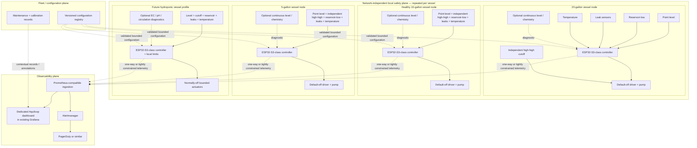

# Aquiloop platform roadmap

## Status and executive summary

**Status:** Proposed platform roadmap  
**Last reviewed:** 2026-08-11

Repository evidence shows a compiled Phase 0 sketch for an
ESP32-S3-DevKitC-1-N8R8, protected SparkFun SST input, external LED, and serial
reporting. Physical Phase 0 validation remains pending; this document claims no
wet/dry, voltage, pump, or aquarium result. The recommendation is **one vessel
first, fleet later**: complete the dry bench rig and fault injection, then use
the existing 20-gallon garage aquarium—which also contains hydroponically grown
plants—as the first supervised integration target.

The intended end state is a collection of independent vessel controllers that
share schemas, telemetry, dashboards, maintenance workflows, and optional
central coordination without sharing a safety-critical control dependency.
Aquiloop can then expand, one healthy vessel at a time, to the 5-gallon and
10-gallon aquariums and eventually to pure hydroponic systems.

The [aquarium auto-top-off design](aquarium-auto-top-off.md) remains
authoritative for detailed auto-top-off safety architecture, firmware behavior,
hardware phases, circuit constraints, calibration, and failure testing. This is
the higher-level platform and product roadmap. It references rather than
repeats that implementation design, uses **horizons** to avoid colliding with
its phase names, and applies the stricter safety requirement wherever the two
documents overlap.

## Current baseline

- Phase 0 uses an Espressif ESP32-S3-DevKitC-1-N8R8 and SparkFun SST
  liquid-level sensor. Its protected-input concept divides the 5 V-class SST
  output to an ESP32 input and provides a conservative disconnected/unpowered
  state.
- The present sketch maps the binary input to an external LED and emits
  change-only serial reports. It has no actuator.
- Compilation is recorded as passed, but every physical Phase 0 result remains
  pending. The [experiment instructions and blank validation
  record](../../firmware/auto_top_off/experiments/sst_led/README.md) are the
  practical entry point.
- The 20-gallon garage aquarium is the initial target. The authoritative
  [auto-top-off design](aquarium-auto-top-off.md) defines the accepted staged
  safety architecture beyond Phase 0.
- No production telemetry, dashboard, multi-vessel control, water-quality
  automation, or hydroponic dosing exists in the current repository.
- The [duckweed scooper design](duckweed-scooper.md) and its OpenSCAD source
  demonstrate the repository's current parametric-design convention; they are
  not part of the controller safety architecture.

## Goals and non-goals

### Goals

- Safe automatic freshwater top-off with independent vessel safety.
- Water-level and reservoir visibility; leak and temperature monitoring.
- Pump-health and delivery diagnostics, useful Grafana history, and actionable
  alerts.
- Reusable firmware and CAD modules and low-cardinality multi-vessel telemetry.
- Staged expansion to the 5-gallon and healthy 10-gallon tanks.
- Future freshwater aquarium, saltwater aquarium, aquaponic, and hydroponic
  profiles.
- Reproducible calibration and maintenance records.

### Non-goals

- Immediately automating every tank, or automating the suspect leaking
  10-gallon tank.
- Making Wi-Fi, Prometheus, Grafana, or any remote service necessary to stop a
  pump; permitting remote unrestricted actuation.
- Inferring individual minerals from conductivity or TDS, or treating consumer
  sensor readings as laboratory analysis.
- Early automatic chemical dosing, or shared pumps/reservoirs before isolation
  is proven.
- Replacing manual aquarium inspection or claiming medical, biological, or
  livestock guarantees.

## Design principles

1. Prove one tank before scaling.
2. The 20-gallon installation is the first supervised integration target, not
   permission to skip a dry bench rig or fault injection.
3. Each vessel has an independent local safety plane.
4. Network, Prometheus, Grafana, Alertmanager, PagerDuty, and central services
   are optional for safe local behavior.
5. Pump and dosing actuators default off.
6. Every actuation is locally bounded by time, volume, retries, and rolling
   budgets.
7. A central fleet service cannot directly issue an unrestricted `pump on`.
8. A vessel failure cannot create an actuator path into another vessel.
9. Use one controller per vessel initially.
10. Use one source reservoir per vessel initially. A later shared-reservoir
    design must prove independent normally-closed isolation, backflow
    prevention, cross-flow containment, and single-fault safety.
11. Configuration is versioned, validated, and constrained by compile-time or
    firmware-enforced ceilings.
12. Printable structural parts remain parametric OpenSCAD sources; STL output
    is never the sole source.
13. Water-quality measurements remain diagnostic until repeatability,
    calibration, maintenance burden, and failure behavior are established.
14. “Mineral content” is not a directly measurable scalar. Conductivity/EC,
    estimated TDS, salinity, hardness, alkalinity, and individual ions are
    different measurements.
15. Hydroponic nutrient dosing is a later, independently bounded subsystem—not
    a small extension of aquarium top-off.

## Platform architecture

The observability and fleet planes cannot bypass local actuator limits.
PagerDuty and similar notifications are diagnostic and operational only, never
part of the pump shutdown path.

## Vessel and fleet domain model

| Concept | Stable meaning |
| --- | --- |
| Installation | Administrative grouping of controllers and vessels at one site. |
| Controller | One physical compute/control unit assigned to one vessel initially. |
| Vessel | A bounded aquarium, aquaponic tank, or hydroponic reservoir. |
| Vessel profile | Validated module and constraint set for a vessel use case. |
| Reservoir | A source fluid container assigned to a vessel. |
| Sensor / actuator | A registered input / normally-off output channel with bounded type and identity. |
| Calibration | Versioned evidence relating a sensor or delivery channel to a reference. |
| Maintenance event | Structured inspection, cleaning, replacement, refill, or test record. |
| Fault | Enumerated detected unsafe, inconsistent, or uncertain condition. |
| Dispense attempt | One locally authorized, time-bounded delivery operation and result. |
| Delivery budget | Per-attempt and rolling time/volume/retry ceilings. |
| Firmware version | Immutable controller software identity. |
| Configuration version | Validated, checksummed identity for bounded vessel settings. |

Initial schema proposal—not implemented API values—for `profile` is
`freshwater_aquarium`, `saltwater_aquarium`, `aquaponic_aquarium`,
`hydroponic_dwc`, and `hydroponic_reservoir`. A profile selects validated
modules and constraints; it never disables universal safety invariants.

## Per-vessel architecture

Recommended module boundaries are hardware abstraction and sensor adapters;
authoritative safety inputs; diagnostic inputs; the state machine; actuator
driver; persistent fault and delivery ledger; bounded configuration; telemetry
encoder; local indicators and ARM/DISABLE control; firmware update mechanism;
and calibration and maintenance records.

One controller per vessel provides a smaller failure domain, simpler wiring,
independent power removal and maintenance, easier calibration, no central
network dependency, and safer staged rollout. Shared compute, power, gateways,
or plumbing could reduce parts and administration, but increases correlated
failure and maintenance coupling. Such infrastructure remains an evidence-led
future trade study, not a baseline selection.

## Sensor roadmap

### Authoritative safety and control inputs

- Fixed normal-level point sensor and a diverse, independent high-high cutoff.
- Reservoir-low detection and leak detection.
- Local ARM/DISABLE state.
- Relay or hardware-enable feedback.
- Watchdog state and persistent fault state.

Diagnostic data cannot override these inputs.

### High-value diagnostics

- Water temperature; ambient garage temperature and humidity.
- Continuous level or distance and reservoir weight.
- Pump current/electrical power, calibrated estimated flow, pulse duration, and
  response time.
- Controller uptime and reset cause.
- Tube blockage or disconnection indicators.

Temperature, leaks, reservoir state, and pump diagnostics precede broad
chemistry instrumentation.

### Water-quality diagnostics

| Measurement | Interpretation and limitation |
| --- | --- |
| Conductivity / EC | Electrical conduction by the solution, not the identity or exact quantity of every dissolved mineral. |
| Temperature-compensated EC | EC normalized using a model and measured temperature; compensation assumptions remain part of the result. |
| Estimated TDS | Usually derived by inexpensive probes from EC with an assumed conversion factor, not a direct inventory of dissolved solids. |
| Salinity | A derived or specifically calibrated measure requiring the correct range, standard, temperature compensation, and intended water type. |
| pH | Acidity/alkalinity activity measurement; probes require regular calibration, correct storage, cleaning, and replacement. |
| ORP | Oxidation-reduction potential, not a direct concentration of a particular oxidant. |
| General hardness | Primarily a measure of multivalent-ion hardness; not interchangeable with TDS. |
| Carbonate hardness / alkalinity | Acid-neutralizing capacity-related measures; not interchangeable with general hardness or TDS. |
| Dissolved oxygen | Dissolved oxygen concentration/saturation with method-specific calibration and flow/temperature effects. |
| Individual nutrient or ion | Generally requires a specific probe, reagents, colorimetry, or laboratory testing. |

Fouling, drift, biofilm, bubbles, cable leakage, and calibration expiration must
appear as faults or explicit uncertainty. Early chemistry sensing is advisory
only. Automatic dosing requires independent limits, calibration evidence,
delivery verification, and fault injection before it is considered.

## Observability architecture

Add a dedicated Aquiloop dashboard to the **existing Grafana deployment**; do
not create a separate Grafana stack unless future scale or isolation justifies
it. Prometheus and Grafana remain outside local safety.

Dashboard views should cover:

1. Fleet overview.
2. Per-vessel current state.
3. Water-level and top-off history.
4. Reservoir inventory.
5. Pump runtime and estimated delivery.
6. Faults and safety-channel state.
7. Controller availability and reset history.
8. Temperature and environmental trends.
9. Optional water-quality trends.
10. Calibration and maintenance status.
11. Alert and acknowledgement history.

Retain the metric names already proposed in the [authoritative observability
section](aquarium-auto-top-off.md#11-observability-and-alert-design). Add only
bounded fleet dimensions such as `vessel_id`, `controller_id`, `profile`,
`sensor`, `result`, and `reason`; every value comes from a bounded registry, not
user-generated free text. Do not use display names, IP addresses, arbitrary
fault strings, or timestamps as labels.

Monotonic totals (attempts, delivery estimate, runtime, resets) are counters;
current state, validity, temperature, levels, rolling-budget use, and last-known
health are gauges. Rich fault detail belongs in structured event logs, not
metric labels. Prometheus scrape health plus a controller heartbeat/state age
support controller-down and stale-data detection, while dashboards must expose
device-clock uncertainty rather than imply precise ordering after offline
buffering. Set retention from storage capacity and operational needs. Use
annotations for calibration, maintenance, firmware rollout, and hardware
replacement so trend changes have context.

## Alerts and response

| Severity | Examples |
| --- | --- |
| Critical | High-high cutoff; leak detected; pump commanded without valid enable; latched safety fault; daily delivery budget exhausted; controller state contradicts hardware feedback. |
| Warning | Reservoir low; repeated unsuccessful attempts; abnormal evaporation/top-off frequency; pump response drift; repeated resets; stale calibration; sensor disagreement; temperature outside configured vessel limits; invalid or fouled diagnostic sensor. |
| Informational | Successful maintenance test; firmware rollout; calibration completed; reservoir refilled. |

Every runbook begins with local inspection and local DISABLE when actuation
safety is uncertain. No response recommends a remote unrestricted pump command.

## Configuration and control contracts

These interfaces are future concepts, not implemented commitments.

### Telemetry

Read-only observations and events use a versioned schema and bounded identities.
Delivery tolerates offline buffering, retries, and duplicates, so consumers must
be idempotent or use bounded event identities.

### Configuration

Configuration is declarative, versioned, checksummed or signed where
appropriate, staged, and rollback-capable. A controller validates it against
hard local ceilings; remote input cannot raise firmware-defined maxima. Records
identify who or what proposed and applied each change.

### Commands

Commands are narrow and enumerated: request status, acknowledge a maintenance
reminder, enter maintenance mode, or request a bounded diagnostic. There is no
arbitrary actuator command, free-form shell, or firmware expression. Local
authorization, state, and limits decide whether any requested action occurs.

## Shared reservoir and plumbing policy

The baseline is an independent reservoir and pump for each vessel. A shared
reservoir or manifold is unacceptable until it provides:

- one normally-closed isolation element per vessel;
- prevention of gravity cross-flow, siphon, and backflow;
- independent maximum-volume containment and stuck-open-valve detection;
- evidence that one controller, valve, pump, tube, or power fault cannot fill
  the wrong vessel;
- maintenance isolation plus cleaning and contamination controls; and
- deliberate fault-injection evidence.

Shared plumbing saves components but creates a much larger correlated-failure
domain.

## Firmware and rollout strategy

Future firmware should separate a host-testable state machine from hardware
adapters and use versioned persistent state with safe migration. Update
artifacts should be signed or otherwise authenticated, support rollback, and be
deployed in stages: bench controller first, supervised 20-gallon rollout
second, one additional healthy tank as fleet canary, then remaining vessels
only after measurable soak time. Never make the first deployment fleet-wide.
An OTA mechanism is deliberately unspecified until a future task inspects the
implemented code and hardware constraints.

## CAD and physical modularity

Follow the repository OpenSCAD policy: editable `.scad` sources under `tools/`,
shared parameter files where modules converge, reproducible rendering, and
generated STL files excluded from source control or treated as CI artifacts.
Future modules may include vessel-specific rim adapters, sensor holders,
high-high mounts, leak-sensor retainers, reservoir lids, tube clips, pump
mounts, controller enclosures, cable/drip-loop management, service labels, and
hydroponic reservoir mounts. Materials and geometry require environmental
validation. No printed part is the sole overflow or electrical-safety barrier.

## Suspect leaking 10-gallon tank gate

Do not install or commission Aquiloop on the suspect tank while its integrity is
uncertain. Empty, clean, visually inspect, and isolate it. Perform an
appropriately located, supervised leak test on level support; inspect seams,
frame, glass, support surface, and plumbing; and record the result. Repair or
retire the tank as appropriate. Only a tank with a completed integrity check
may enter rollout. Automation cannot mitigate a structurally leaking tank, and
this roadmap makes no aquarium-repair claim.

## Hydroponics evolution

Hydroponics is a future vessel profile on the common platform. Shared
capabilities are reservoir level, leak detection, temperature, pump state,
telemetry, maintenance, alerting, and bounded actuation. Profile-specific
capabilities can include EC, pH, nutrient-solution temperature, circulation or
aeration status, reservoir volume, nutrient dosing, pH adjustment, light-cycle
context, and crop-specific target bands.

Top-off water, nutrient concentrate, acid, base, and other additives require
physical and logical safety separation. Each eventual dosing channel needs a
separate normally-off actuator, independently calibrated delivery, per-dose and
rolling budgets, minimum spacing, mixing delay, sensor plausibility checks,
cross-channel exclusion where required, local emergency disable, containment,
manual commissioning, and no single-probe closed-loop authority.

The first hydroponics milestone is monitoring only. Automated nutrient or pH
dosing requires a separate later design document.

## Roadmap horizons

### Horizon 0: finish the current Phase 0 experiment

**Entry:** Current repository baseline.

**Work:** Receive and inspect the SST sensor; use a known data-capable USB
cable; assemble the documented protected input and LED circuit; upload the
pinned sketch; complete documented wet/dry cycles and voltage checks; record
actual observations.

**Exit:** Every existing Phase 0 exit criterion is recorded as passed. No
physical result is inferred from compilation alone.

### Horizon 1: supervised 20-gallon auto-top-off

**Work:** Implement only the existing Phase 1 scope; select and calibrate pump
and tubing; build parametric mounts and enclosure; exercise all supervised fault
cases; collect stable baseline evaporation and delivery data.

**Exit:** Authoritative Phase 1 criteria are satisfied; operation remains
supervised; fleet expansion has not begun.

### Horizon 2: unattended-readiness safety layers

**Work:** Add independent high-high cutoff, reservoir-low sensing, leak
detection, hardware power removal, persistent faults, maintenance controls,
containment, and the full fault matrix.

**Exit:** Existing detailed safety criteria are satisfied and evidence is
independently reviewed. Unattended operation remains a deliberate decision, not
an automatic consequence.

### Horizon 3: observability

**Work:** Add bounded telemetry, Prometheus integration, a dedicated Aquiloop
Grafana dashboard, Alertmanager and PagerDuty routing, runbooks,
controller-down detection, and maintenance/calibration visibility.

**Exit:** Loss of observability does not alter local safety; alerts and runbooks
pass deliberate tests; no secrets are committed.

### Horizon 4: first additional vessel

**Entry:** Stable 20-gallon operation over a documented soak period; candidate
vessel passes structural and leak checks.

**Work:** Choose one healthy 5-gallon or 10-gallon tank; deploy an independent
controller, reservoir, pump, and safety plane; introduce bounded vessel identity
and profile configuration; compare calibration and evaporation behavior.

**Exit:** Both vessels operate independently; fault injection on either cannot
actuate the other; the fleet dashboard clearly distinguishes them.

### Horizon 5: small fleet

**Work:** Add remaining healthy vessels one at a time; standardize wiring,
enclosures, connectors, configuration, calibration, spares, and maintenance;
stage firmware rollout; add fleet dashboard and maintenance views.

**Exit:** Installation is repeatable, replacement/calibration intervals are
documented, and no shared single point can overfill several vessels.

### Horizon 6: diagnostic water quality

**Work:** Add temperature first; evaluate EC, pH, salinity, and other sensors
only for relevant profiles; run calibration and drift experiments against
trusted references; display advisory trends.

**Exit:** Accuracy, drift, cleaning, replacement, and failure behavior are
quantified; invalid readings are detectable; there is no dosing authority.

### Horizon 7: hydroponic monitoring profile

**Work:** Use a non-livestock test reservoir or dedicated hydroponic setup; add
hydroponic configuration and monitoring for EC, pH, solution temperature,
level, leaks, and circulation; add no nutrient or pH dosing.

**Exit:** The profile is stable and independently calibrated; aquarium behavior
is unchanged.

### Horizon 8: bounded hydroponic dosing research

**Entry:** Separate approved dosing design, physical containment, independent
delivery calibration, manual test reservoir, and complete fault analysis.

**Exit:** Dedicated safety and validation criteria are satisfied; aquarium
deployment is excluded by default.

### Horizon 9: open-source platform hardening

**Work:** Publish installation guides, versioned schemas, reference hardware,
reproducible CAD, simulation and hardware-in-the-loop tests, example dashboards,
contribution guidance, and privacy/security review.

**Exit:** A new user can reproduce a safe supervised baseline without
undocumented project knowledge.

## Decision log

| Decision | Rationale / constraint |
| --- | --- |
| 20-gallon first | Known initial supervised target; prove one vessel before scale. |
| One controller per vessel | Keeps wiring, shutdown, maintenance, and failure domains independent. |
| Independent reservoirs initially | Avoid correlated plumbing and cross-flow risks. |
| Local safety; remote observability | Network and central services cannot be safety dependencies. |
| Aquiloop dashboard in existing Grafana | Reuse deployment unless later scale/isolation evidence says otherwise. |
| Temperature and leaks before broad chemistry | Higher near-term operational value and lower interpretation burden. |
| EC/TDS are proxies, not exact mineral analysis | They do not identify or quantify each dissolved ion. |
| Hydroponics is a common-platform profile | Reuse bounded monitoring and maintenance primitives without weakening invariants. |
| Automated dosing gets a separate design | Chemistry actuation creates distinct hazards and validation needs. |
| Suspect leaking tank excluded | Structural integrity is a prerequisite, not an automation feature. |
| No central unrestricted actuator API | Every actuation remains locally authorized and bounded. |

## Risks and open questions

- What are the actual water types and livestock requirements for each aquarium?
- What are measured evaporation rates and garage temperature/humidity extremes?
- How reliable is Wi-Fi, and what controller power and backup strategy is safe?
- Where can each reservoir be placed safely; what pump, tube, lift, and
  freeboard measurements govern final selection?
- How will enclosure condensation, sensor fouling, and calibration burden be
  controlled and measured?
- What retention is useful and affordable? How are controller identities
  provisioned?
- What rollout/rollback mechanism fits later firmware and hardware?
- Is a shared metrics gateway needed, or can existing Prometheus scrape each
  controller directly?
- How many registered vessel/other bounded label values remain operationally
  manageable?
- Should the 5-gallon or a healthy 10-gallon be the second deployment?
- Will the suspect 10-gallon tank be validated, repaired, or retired?
- Which hydroponic method is the first monitoring-only target?
- Which measurements justify their maintenance cost?
- For each profile, is long-term salinity, EC, pH, hardness, alkalinity, or
  dissolved-oxygen sensing appropriate?

## Near-term next actions

1. Complete and record Phase 0 physical validation.
2. Preserve the existing auto-top-off document as the implementation authority.
3. Capture actual tank, rim, reservoir, lift, freeboard, temperature, and
   evaporation measurements.
4. Design the supervised Phase 1 implementation.
5. Defer Grafana implementation until the controller has trustworthy states and
   metrics.
6. Select the second healthy vessel only after the 20-gallon system is stable.
7. Keep hydroponics monitoring and dosing as later gated work.
