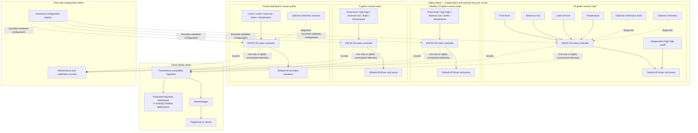

# Aquiloop Platform Roadmap

## Status and executive summary

**Status:** Proposed platform roadmap 
**Last reviewed:** 2026-08-11

Repository evidence shows a compiled Phase 0 sketch for an Espressif
ESP32-S3-DevKitC-1-N8R8, but physical validation remains pending. The current
experiment is limited to a protected SparkFun SST input, an external LED, and
serial reporting; it has no pump or production observability.

The recommendation is **one vessel first, fleet later**. Prove the dry bench
rig, then use the existing 20-gallon garage aquarium as the first supervised
integration target. That aquarium also contains hydroponically grown plants,
but this does not make it a pure hydroponic system or authorize dosing.

The intended end state is a collection of independent vessel controllers that
share schemas, telemetry, dashboards, maintenance workflows, and optional
central coordination without sharing a safety-critical control dependency.
The [aquarium auto-top-off design](aquarium-auto-top-off.md) remains
authoritative for detailed auto-top-off safety architecture, firmware behavior,
hardware phases, circuit constraints, calibration, and failure testing. This
document is the higher-level platform and product roadmap and references that
design instead of copying it. Its horizons do not replace the design's Phase 0,
Phase 1, Phase 2, or later phases. Where requirements overlap, the stricter
safety requirement controls.

## Current baseline

The [authoritative design](aquarium-auto-top-off.md) and practical
[SST + LED experiment](../../firmware/auto_top_off/experiments/sst_led/README.md)
define the current baseline. Phase 0 uses the ESP32-S3-DevKitC-1-N8R8 and a
SparkFun SST liquid-level sensor whose 5 V-class output reaches GPIO4 only
through the documented protected-input divider. GPIO5 drives an external LED;
the sketch reports initial state and changes over serial. Its objective is only
protected SST input, LED behavior, and serial reporting.

Compilation has passed, but the validation record contains no physical results:
wet/dry cycles, voltage checks, and hardware observations remain pending. The
20-gallon garage aquarium is the initial validation target after dry-bench
work. Other known vessels include a 5-gallon tank and at least one healthy
10-gallon candidate; a separate 10-gallon tank may be leaking and is gated
below.

The existing design already specifies the accepted safety direction for
bounded top-off. The repository does not currently provide production
telemetry, dashboards, multi-vessel control, water-quality automation, or
hydroponic dosing. The [duckweed scooper design](duckweed-scooper.md) and its
OpenSCAD source demonstrate the repository's existing parametric-CAD practice.

## Goals and non-goals

### Goals

- Safe automatic freshwater top-off with independent safety for every vessel.
- Water-level and reservoir visibility, leak and temperature monitoring, and
  pump-health and delivery diagnostics.
- Useful Grafana history and actionable alerts without making either part of
  control safety.
- Reusable firmware and CAD modules, plus low-cardinality multi-vessel
  telemetry.
- Staged expansion from the 20-gallon target to the 5-gallon and healthy
  10-gallon tanks.
- Future freshwater aquarium, saltwater aquarium, aquaponic, and hydroponic
  profiles.
- Reproducible calibration and maintenance records.

### Non-goals

- Immediately automating every tank, or automating the suspect leaking
  10-gallon tank.
- Making Wi-Fi, Prometheus, Grafana, or any remote service necessary to stop a
  pump.
- Remote unrestricted actuation or early automatic chemical dosing.
- Inferring individual minerals from conductivity or TDS, or treating consumer
  sensor readings as laboratory analysis.
- Shared pumps or reservoirs before isolation is proven.
- Replacing manual aquarium inspection or claiming medical, biological, or
  livestock guarantees.

## Design principles

1. Prove one tank before scaling.
2. The 20-gallon installation is the first supervised integration target, not
   permission to skip a dry bench rig or fault injection.
3. Each vessel has an independent, network-independent local safety plane.
4. Network, Prometheus, Grafana, Alertmanager, PagerDuty, and central services
   are optional for safe local behavior.
5. Pump and dosing actuators default off.
6. Every actuation is locally bounded by time, volume, retries, and rolling
   budgets.
7. A central fleet service cannot directly issue an unrestricted `pump on`.
8. A failure in one vessel must not create an actuator path into another.
9. Use one controller per vessel initially.
10. Use one source reservoir per vessel initially. Any later shared design must
    prove independent normally-closed isolation, backflow prevention,
    cross-flow containment, and single-fault safety.
11. Configuration is versioned and validated, with compile-time or
    firmware-enforced ceilings.
12. Printable structural parts remain parametric OpenSCAD; STL output is never
    the sole source.
13. Water-quality measurements remain diagnostic until repeatability,
    calibration, maintenance burden, and failure behavior are established.
14. “Mineral content” is not a directly measurable scalar: conductivity, EC,
    estimated TDS, salinity, hardness, alkalinity, and individual ions are
    distinct measurements.
15. Hydroponic nutrient dosing is a later, independently bounded subsystem, not
    a small extension of aquarium top-off.

## Platform architecture

The observability and fleet/configuration planes cannot bypass local actuator
limits. PagerDuty and similar notification systems are diagnostic and
operational only; they never participate in the local pump shutdown path.

## Vessel and fleet domain model

| Concept | Stable meaning |
| --- | --- |
| Installation | One managed site containing vessels and supporting services. |
| Controller | One physical control unit assigned to one vessel initially. |
| Vessel | A bounded aquarium or hydroponic body of water. |
| Vessel profile | A validated selection of modules, constraints, and semantics. |
| Reservoir | A source container assigned to a vessel and bounded by safe capacity. |
| Sensor | An identified input with role, validity, and calibration state. |
| Actuator | A normally-off output governed by local interlocks and budgets. |
| Calibration | Versioned evidence mapping observations or runtime to an estimate. |
| Maintenance event | A recorded inspection, cleaning, replacement, refill, or test. |
| Fault | A bounded condition that inhibits or diagnoses operation. |
| Dispense attempt | One bounded sequence of pulses and settling observations. |
| Delivery budget | Local per-attempt and rolling time/volume/retry ceilings. |
| Firmware version | Immutable identity of the controller software build. |
| Configuration version | Validated, auditable identity of applied settings. |

An **initial schema proposal**, not implemented API values, is the bounded
profile set `freshwater_aquarium`, `saltwater_aquarium`,
`aquaponic_aquarium`, `hydroponic_dwc`, and `hydroponic_reservoir`. A profile
selects only validated modules and constraints; it cannot disable universal
safety invariants.

## Per-vessel architecture

Recommended module boundaries are hardware abstraction and sensor adapters;
authoritative safety inputs; diagnostic inputs; a host-testable state machine;
the actuator driver; a persistent fault and delivery ledger; bounded
configuration; a telemetry encoder; local indicators and ARM/DISABLE control;
a firmware-update mechanism; and calibration and maintenance records.

One controller per vessel provides a smaller failure domain, simpler wiring,
independent power removal and maintenance, easier calibration, no central
network dependency, and safer staged rollout. Shared network ingestion,
configuration storage, parts, and dashboards may reduce operational work, but
shared control, power, or plumbing can correlate failures. Adopt shared
infrastructure only after its failure boundaries and maintenance tradeoffs are
measured; do not select it prematurely.

## Sensor roadmap

### Authoritative safety and control inputs

- Fixed normal-level point sensor and a diverse, independent high-high cutoff.
- Reservoir-low and leak detection.
- Local ARM/DISABLE state.
- Relay or hardware-enable feedback.
- Watchdog state and persistent fault state.

Only validated authoritative inputs may permit bounded actuation. Invalid,
missing, contradictory, or stale safety input inhibits delivery.

### High-value diagnostics

- Water temperature; ambient garage temperature and humidity.
- Continuous level or distance and reservoir weight.
- Pump current or electrical power and calibrated estimated flow.
- Pulse duration, level response time, controller uptime, and reset cause.
- Indicators of tube blockage or disconnection, inferred only after validation.

Temperature, leaks, reservoir state, and pump diagnostics precede broad
chemistry instrumentation.

### Water-quality diagnostics

| Measurement | Meaning and limitation |
| --- | --- |
| Conductivity / EC | Electrical conductance of the solution; it does not identify or exactly quantify every dissolved mineral. |
| Temperature-compensated EC | EC normalized using an explicit model and reference temperature, still composition-dependent. |
| Estimated TDS | Usually derived by inexpensive probes from EC with an assumed conversion factor; not direct gravimetric TDS. |
| Salinity | A composition- and scale-dependent derivation requiring the correct range, calibration standard, temperature compensation, and intended water type. |
| pH | Hydrogen-ion activity indication; probes require regular calibration, correct storage, cleaning, and replacement. |
| ORP | Oxidation-reduction potential, not a direct inventory of oxidants or water quality. |
| General hardness | Primarily a measure of multivalent hardness ions under the chosen test method. |
| Carbonate hardness / alkalinity | Acid-neutralizing capacity; not interchangeable with general hardness or TDS. |
| Dissolved oxygen | Oxygen availability requiring its own calibrated, maintained measurement method. |
| Individual nutrient or ion | Generally requires a specific probe, reagent method, colorimetry, or laboratory testing. |

Sensor fouling, drift, biofilm, bubbles, cable leakage, and expired calibration
must be represented as faults or explicit uncertainty. Early chemistry sensing
is advisory only. Automatic dosing requires independent limits, calibration
evidence, delivery verification, and fault injection before it can be proposed
for control authority.

## Observability architecture

Add a dedicated Aquiloop dashboard to the existing Grafana deployment. Do not
create a separate Grafana stack unless later scale or isolation justifies it.
Prometheus and Grafana remain outside the local safety path.

Dashboard views should cover:

1. Fleet overview.
2. Per-vessel current state.
3. Water-level and top-off history.
4. Reservoir inventory.
5. Pump runtime and estimated delivery.
6. Faults and safety-channel state.
7. Controller availability and reset history.
8. Temperature and environmental trends.
9. Optional water-quality trends.
10. Calibration and maintenance status.
11. Alert and acknowledgement history.

Retain metric names already proposed in the
[authoritative observability design](aquarium-auto-top-off.md#11-observability-and-alert-design),
including `aquiloop_state`, `aquiloop_sensor_wet`,
`aquiloop_pump_runtime_seconds_total`, and
`aquiloop_dispense_attempts_total`, rather than needlessly renaming them. The
only proposed fleet dimensions are bounded `vessel_id`, `controller_id`,
`profile`, `sensor`, `result`, and `reason` values selected from versioned
registries, never user-generated free text. Do not use display names, IP
addresses, arbitrary fault strings, or timestamps as labels.

Monotonic totals such as runtime, delivery, attempts, resets, and faults are
counters; current state, validity, temperature, level, and rolling-budget use
are gauges. Detailed events and human notes belong in an event log, not metric
labels. Controller-down detection should combine scrape availability with an
expected heartbeat; stale-data detection must distinguish an old valid sample
from a current invalid reading. Controllers should report clock quality, and
events should preserve both controller-relative and ingestion times when clocks
are uncertain. Retention must be chosen from operational and storage needs.
Dashboard annotations should mark calibration, maintenance, firmware rollout,
and hardware replacement without creating unbounded series.

## Alerts and response

| Severity | Examples |
| --- | --- |
| Critical | High-high cutoff; leak detected; pump commanded without valid enable; latched safety fault; daily delivery budget exhausted; controller state contradicts hardware feedback. |
| Warning | Reservoir low; repeated unsuccessful attempts; abnormal evaporation or top-off frequency; pump response drift; repeated resets; stale calibration; sensor disagreement; temperature outside configured vessel limits; diagnostic sensor invalid or fouled. |
| Informational | Successful maintenance test; firmware rollout; calibration completed; reservoir refilled. |

Every runbook path begins with local inspection and local DISABLE whenever
actuation safety is uncertain. No response recommends a remote unrestricted
pump command. A notification reports a local condition; it does not mitigate
that condition.

## Configuration and control contracts

These interfaces are future concepts, not implemented commitments.

### Telemetry

Telemetry contains read-only observations and events under a versioned schema
and bounded identities. Delivery tolerates offline buffering, reordering, and
duplicates; consumers use event identity and counter semantics accordingly.

### Configuration

Configuration is declarative, versioned, and checksummed or signed where
appropriate. A controller validates it against hard local ceilings, stages it,
supports safe rollback, and records who or what proposed and applied a change.
A remote change cannot raise ceilings beyond firmware-defined maxima.

### Commands

Commands are narrow and enumerated: request status, acknowledge a maintenance
reminder, enter maintenance mode, or request a bounded diagnostic. There is no
arbitrary actuator command, free-form shell, or firmware expression. Local
authorization, state, interlocks, and budgets still determine whether any
requested action occurs.

## Shared reservoir and plumbing policy

The baseline is an independent reservoir and pump for each vessel. A future
shared reservoir or manifold is unacceptable until it provides:

- One normally-closed isolation element per vessel.
- Prevention of gravity cross-flow, siphon, and backflow.
- Independent maximum-volume containment.
- Detection of stuck-open valves.
- Evidence that a single controller, valve, pump, tube, or power fault cannot
  fill the wrong vessel.
- Maintenance isolation, cleaning and contamination controls, and deliberate
  fault-injection evidence.

Shared plumbing saves components but creates a much larger correlated-failure
domain and therefore carries a higher proof burden.

## Firmware and rollout strategy

Future firmware should separate a host-testable state machine from hardware
adapters. Persistent state is versioned and migrated safely. Update artifacts
are signed or otherwise authenticated, with a tested rollback path. Do not
choose an OTA implementation until a future task inspects repository code and
hardware constraints.

Deploy first to a bench controller, second to the supervised 20-gallon system,
then to one additional healthy vessel as a fleet canary. Add remaining vessels
only after a measurable, recorded soak interval. Never make a simultaneous
fleet-wide first deployment.

## CAD and physical modularity

Follow the [authoritative OpenSCAD policy](aquarium-auto-top-off.md#cad-source-and-derived-mesh-policy).
Future parametric modules may cover vessel-specific rim adapters, sensor and
high-high holders, leak-sensor retainers, reservoir lids, tube clips, pump
mounts, controller enclosures, cable and drip-loop management, service labels,
and hydroponic reservoir mounts.

Commit editable `.scad` sources and shared parameter files, and make rendering
reproducible. Exclude generated STL files or publish them only as CI artifacts.
Validate materials and geometry in the expected wet, warm, humid environment.
No printed part may be the sole overflow or electrical-safety barrier.

## Suspect leaking 10-gallon tank gate

Do not install or commission Aquiloop on the suspect tank while its integrity
is uncertain. Empty, clean, visually inspect, and isolate it. Perform an
appropriately located and supervised leak test on level support; inspect seams,
frame, glass, support surface, and plumbing; and record the result. Repair or
retire the tank as appropriate. Only a tank with a completed integrity check
may enter the rollout sequence. Automation cannot mitigate a structurally
leaking tank, and this roadmap makes no aquarium-repair claim.

## Hydroponics evolution

Hydroponics is a future vessel profile built on the common platform. Shared
capabilities are reservoir level, leak detection, temperature, pump state,
telemetry, maintenance, alerting, and bounded actuation. Hydroponics-specific
capabilities may include EC, pH, nutrient-solution temperature, circulation or
aeration status, reservoir volume, nutrient dosing, pH adjustment, light-cycle
context, and crop-specific target bands.

Top-off water, nutrient concentrate, acid, base, and other additives require
separate safety channels. Each dosing channel must eventually have a separate
normally-off actuator, independently calibrated delivery, per-dose and rolling
budgets, minimum spacing, mixing delay, sensor plausibility checks,
cross-channel exclusion where required, local emergency disable, containment,
manual commissioning, and no single-probe closed-loop authority.

The first hydroponics milestone is monitoring only. Automated nutrient or pH
dosing requires a separate later design document.

## Roadmap horizons

### Horizon 0: finish the current Phase 0 experiment

**Entry:** Current repository baseline.

**Work:** Receive and inspect the SST sensor; use a known data-capable USB
cable; assemble the documented protected input and LED circuit; upload the
pinned sketch; complete documented wet/dry cycles and voltage checks; record
actual observations.

**Exit:** All existing Phase 0 exit criteria are recorded as passed. No physical
result is inferred from compilation alone.

### Horizon 1: supervised 20-gallon auto-top-off

**Work:** Implement only the existing Phase 1 scope; select and calibrate pump
and tubing; build parametric mounts and enclosure; exercise all supervised
fault cases; collect stable baseline evaporation and delivery data.

**Exit:** Satisfy the authoritative Phase 1 criteria, remain supervised, and do
not expand the fleet.

### Horizon 2: unattended-readiness safety layers

**Work:** Add independent high-high cutoff, reservoir-low sensing, leak
detection, hardware power removal, persistent faults, maintenance controls,
containment, and the full fault matrix.

**Exit:** Satisfy existing detailed safety criteria and independently review
the evidence. Unattended operation remains a deliberate decision, not an
automatic consequence.

### Horizon 3: observability

**Work:** Add bounded telemetry, Prometheus integration, the dedicated Aquiloop
Grafana dashboard, Alertmanager and PagerDuty routing, a runbook,
controller-down detection, and maintenance/calibration visibility.

**Exit:** Loss of observability does not alter local safety; deliberate tests
pass for alerts and runbooks; no secrets are committed.

### Horizon 4: first additional vessel

**Entry:** Stable 20-gallon operation over a documented soak period and a
candidate vessel that passes structural and leak checks.

**Work:** Choose one healthy 5-gallon or 10-gallon tank; deploy an independent
controller, reservoir, pump, and safety plane; introduce bounded identity and
profile configuration; compare calibration and evaporation behavior.

**Exit:** Both vessels operate independently, failure injection on either
cannot actuate the other, and the fleet dashboard clearly distinguishes them.

### Horizon 5: small fleet

**Work:** Add remaining healthy vessels one at a time; standardize wiring,
enclosures, connectors, configuration, calibration, spares, and maintenance;
stage firmware rollout; add fleet and maintenance views.

**Exit:** A repeatable installation checklist and replacement/calibration
intervals are documented, with no shared single point able to overfill several
vessels.

### Horizon 6: diagnostic water quality

**Work:** Add temperature first. Evaluate EC, pH, salinity, and other sensors
only for relevant profiles; run calibration and drift experiments; compare
against trusted references; show advisory trends.

**Exit:** Accuracy, drift, cleaning, replacement, and failure behavior are
quantified; invalid readings are detectable; no automatic dosing authority.

### Horizon 7: hydroponic monitoring profile

**Work:** Use a non-livestock test reservoir or dedicated hydroponic setup; add
hydroponic configuration and monitoring for EC, pH, solution temperature,
level, leaks, and circulation; add no nutrient or pH dosing.

**Exit:** The monitoring profile is stable and independently calibrated while
aquarium behavior remains unchanged.

### Horizon 8: bounded hydroponic dosing research

**Entry:** A separately approved dosing design, physical containment,
independent delivery calibration, a manual test reservoir, and complete fault
analysis.

**Exit:** Only after dedicated safety and validation criteria; no aquarium
deployment by default.

### Horizon 9: open-source platform hardening

**Work:** Installation guides, versioned schemas, reference hardware,
reproducible CAD, simulation and hardware-in-the-loop tests, example dashboards,
contribution guidance, and privacy/security review.

**Exit:** A new user can reproduce a safe supervised baseline without relying
on undocumented project knowledge.

## Decision log

| Decision | Rationale / constraint |
| --- | --- |
| 20-gallon first | Existing target; prove one supervised installation before scale. |
| One controller per vessel | Isolates failures, wiring, power, calibration, and maintenance. |
| Independent reservoirs initially | Avoids correlated plumbing and cross-flow hazards. |
| Local safety, remote observability | Network services diagnose but never provide shutdown. |
| Aquiloop dashboard in existing Grafana | Reuse the deployment unless scale or isolation later justifies separation. |
| Temperature and leaks before broad chemistry | Higher immediate value with a smaller calibration burden. |
| EC/TDS are proxies, not exact mineral analysis | They cannot identify or quantify individual dissolved constituents. |
| Hydroponics is a common-platform profile | Reuse bounded monitoring and maintenance foundations without weakening invariants. |
| Automated dosing gets a separate design | It adds distinct chemical, delivery, and interaction hazards. |
| Suspect leaking tank excluded | Structural integrity is a prerequisite for automation. |
| No central unrestricted actuator API | Every action remains locally authorized, interlocked, and bounded. |

## Risks and open questions

- Actual aquarium water types and livestock requirements.
- Measured evaporation rates and garage temperature/humidity extremes.
- Wi-Fi reliability and controller power/backup strategy.
- Safe reservoir placement and final pump/tube selection.
- Enclosure condensation, sensor fouling, and sustainable calibration burden.
- Data retention and controller identity provisioning.
- Firmware rollout, migration, and rollback behavior.
- Whether a shared metrics gateway is needed or the existing Prometheus
  deployment can scrape each controller directly.
- How many vessel label values remain operationally bounded.
- Whether the 5-gallon or a healthy 10-gallon is the second deployment.
- The disposition of the suspect leaking 10-gallon tank.
- Which hydroponic method is the first monitoring-only target.
- Which measurements justify their purchase and maintenance cost.
- Whether long-term salinity, EC, pH, hardness, alkalinity, or dissolved-oxygen
  sensing is appropriate for each profile.

## Near-term next actions

1. Complete and record Phase 0 physical validation.
2. Preserve the existing auto-top-off document as the implementation authority.
3. Capture actual tank, rim, reservoir, lift, freeboard, temperature, and
   evaporation measurements.
4. Design the supervised Phase 1 implementation.
5. Defer Grafana implementation until the controller has trustworthy states
   and metrics.
6. Select the second healthy vessel only after the 20-gallon system is stable.
7. Keep hydroponics monitoring and dosing as later gated work.
