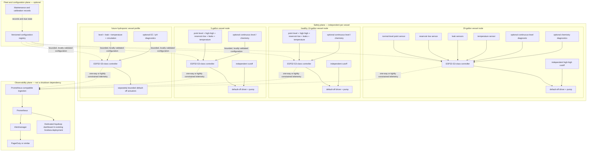

# Aquiloop platform roadmap

## Status and executive summary

**Status:** Proposed platform roadmap

**Last reviewed:** 2026-08-11

Repository evidence shows a compile-validated Phase 0 sketch for the
Espressif ESP32-S3-DevKitC-1-N8R8 and SparkFun SST liquid-level sensor, but all
physical Phase 0 validation remains pending. No wet/dry result or aquarium
installation is inferred from compilation.

The recommendation is **one vessel first, fleet later**. Prove the dry bench
rig, then use the existing 20-gallon garage aquarium—the aquarium also contains
hydroponically grown plants—as the first supervised integration target. That
target does not permit skipping dry-bench work or fault injection. Expand only
later, one healthy 5-gallon or 10-gallon vessel at a time. A separate 10-gallon
vessel suspected of leaking is excluded until it is repaired or retired and
passes the integrity gate below.

The intended end state is a collection of independent vessel controllers that
share schemas, telemetry, dashboards, maintenance workflows, and optional
central coordination without sharing a safety-critical control dependency.
Aquariums come first; aquaponic and pure-hydroponic profiles are later gated
uses of the same platform.

[`aquarium-auto-top-off.md`](aquarium-auto-top-off.md) remains authoritative for
the detailed auto-top-off safety architecture, firmware behavior, hardware
phases, circuit constraints, calibration, and failure testing. This document is
the higher-level platform and product roadmap. It uses **horizons** so it does
not redefine that design's Phase 0, Phase 1, Phase 2, or later phases, and it
references rather than repeats their circuit, BOM, state logic, and procedures.
Where the documents overlap, the stricter safety requirement controls.

## Current baseline

The current baseline is the [authoritative auto-top-off design](aquarium-auto-top-off.md)
and its [practical Phase 0 experiment](../../firmware/auto_top_off/experiments/sst_led/README.md):

- Controller: Espressif ESP32-S3-DevKitC-1-N8R8.
- Sensor: SparkFun SST binary liquid-level sensor through the documented
  protected, fault-conservative input concept; its raw output is not an ESP32
  input.
- Output: an external LED and change-only serial reporting. Phase 0 has no pump,
  network, enclosure, or aquarium installation.
- Evidence: firmware compilation has passed; the physical circuit, voltages,
  and repeated wet/dry cycles remain unrecorded and pending.
- First installation target: the 20-gallon garage aquarium, after bench
  validation and only under the authoritative supervised rollout criteria.
- Accepted direction: a default-off pump, bounded state machine, diverse
  high-high protection, local hardware cutoff, persistent faults, containment,
  and deliberate failure testing as progressively specified by the detailed
  design.

There is currently no production telemetry, dashboard, multi-vessel control,
water-quality automation, or hydroponic dosing in this repository. The
[parametric duckweed-scooper design](duckweed-scooper.md) also demonstrates the
project's editable OpenSCAD approach; it is not part of the control system.

## Design principles

1. Prove one tank before scaling.
2. The 20-gallon installation is the first supervised integration target, not
   permission to skip a dry bench rig or fault injection.
3. Each vessel has an independent local safety plane.
4. Network, Prometheus, Grafana, Alertmanager, PagerDuty, and central services
   are optional for safe local behavior.
5. Pump and dosing actuators default off.
6. Every actuation is locally bounded by time, volume, retries, and rolling
   budgets.
7. A central fleet service cannot directly issue an unrestricted `pump on`
   command.
8. A failure in one vessel must not create an actuator path into another vessel.
9. Use one controller per vessel initially.
10. Use one source reservoir per vessel initially. Any later shared-reservoir
    design must prove independent normally-closed isolation, backflow
    prevention, cross-flow containment, and single-fault safety.
11. Keep configuration versioned, validated, and constrained by compile-time or
    firmware-enforced ceilings.
12. Keep printable structural parts parametric in OpenSCAD; STL output is never
    the sole source.
13. Treat water-quality measurements as diagnostics until repeatability,
    calibration, maintenance burden, and failure behavior are established.
14. “Mineral content” is not a directly measurable scalar. Conductivity/EC,
    estimated TDS, salinity, hardness, alkalinity, and individual ions are
    different measurements.
15. Hydroponic nutrient dosing is a later, independently bounded subsystem, not
    a small extension of aquarium top-off.

## Goals and non-goals

### Goals

- Safe automatic freshwater top-off with independent vessel safety.
- Water-level and reservoir visibility; leak and temperature monitoring.
- Pump-health and delivery diagnostics, useful Grafana history, and actionable
  alerts.
- Reusable firmware and CAD modules with low-cardinality multi-vessel telemetry.
- Staged expansion to the 5-gallon and healthy 10-gallon tanks.
- Future freshwater-aquarium, saltwater-aquarium, aquaponic, and hydroponic
  profiles.
- Reproducible calibration and maintenance records.

### Non-goals

- Immediately automating every tank, or automating the suspect leaking
  10-gallon tank.
- Making Wi-Fi, Grafana, or any remote service necessary to stop a pump.
- Remote unrestricted actuation.
- Inferring individual minerals from a conductivity or TDS sensor.
- Early automatic chemical dosing.
- Shared pumps or reservoirs before isolation is proven.
- Replacing manual aquarium inspection.
- Claiming medical, biological, or livestock guarantees.
- Treating consumer sensor readings as laboratory analysis.

## Platform architecture

The boundaries below are conceptual. Each vessel node contains its own complete,
network-independent safety plane. Dashed links carry one-way telemetry or
narrow, locally validated future configuration/command requests.

The observability and fleet/configuration planes cannot bypass local actuator
limits. PagerDuty or similar notifications are diagnostic and operational only;
they are never part of the local pump shutdown path.

## Vessel and fleet domain model

These stable concepts separate physical identity, configuration, evidence, and
operations:

| Concept | Meaning |
| --- | --- |
| Installation | One managed Aquiloop site and its bounded vessel registry. |
| Controller | One physical computing unit assigned to one vessel initially. |
| Vessel | A bounded body of water with a stable, non-display identity and integrity record. |
| Vessel profile | A validated selection of modules, constraints, and telemetry appropriate to a use. |
| Reservoir | A source liquid container assigned to a vessel and having its own capacity and low state. |
| Sensor | An input with role, calibration state, validity, and authoritative or diagnostic classification. |
| Actuator | A default-off output governed by local interlocks and budgets. |
| Calibration | Versioned evidence tying a sensor or delivery path to references, conditions, and expiry. |
| Maintenance event | A timestamped record of inspection, cleaning, test, refill, repair, or replacement. |
| Fault | A bounded code, severity, latch state, source, and local clearing requirement. |
| Dispense attempt | One locally authorized request with start/end state, duration, estimated volume, and result. |
| Delivery budget | Local per-attempt and rolling time/volume/retry ceilings. |
| Firmware version | Immutable build identity used for compatibility, rollout, and rollback. |
| Configuration version | Validated, checksummed revision applied subject to firmware ceilings. |

An **initial schema proposal**, not implemented API values, bounds `profile` to
`freshwater_aquarium`, `saltwater_aquarium`, `aquaponic_aquarium`,
`hydroponic_dwc`, and `hydroponic_reservoir`. A profile selects only validated
modules and tighter constraints. It never disables universal default-off,
interlock, containment, budget, or local-disable invariants.

## Per-vessel architecture

Recommended firmware/domain boundaries are hardware abstraction and sensor
adapters; authoritative safety inputs; diagnostic inputs; a host-testable state
machine; actuator driver; persistent fault and delivery ledger; bounded
configuration; telemetry encoder; local indicators and ARM/DISABLE control;
firmware update mechanism; and calibration and maintenance records.

One controller per vessel is preferred initially because it gives a smaller
failure domain, simpler wiring, independent power removal and maintenance,
easier calibration, no central network dependency, and a safer staged rollout.
Shared ingestion, dashboarding, configuration storage, component designs, and
operational conventions can reduce duplication without sharing actuator paths.
Shared controllers, pumps, power, or plumbing might reduce component count, but
they increase correlated-failure analysis and wiring complexity; this roadmap
does not select them prematurely.

## Sensor roadmap

A sensor's classification determines authority. Adding a diagnostic sensor does
not make it a safety control input.

### Authoritative safety and control inputs

- Fixed normal-level point sensor.
- Diverse, independent high-high cutoff.
- Reservoir-low detection and leak detection.
- Local ARM/DISABLE state.
- Relay or hardware-enable feedback.
- Watchdog state and persistent fault state.

These inputs must fail conservatively as specified and validated in the
authoritative auto-top-off design.

### High-value diagnostics

Prioritize water temperature; ambient garage temperature and humidity;
continuous level or distance; reservoir weight; pump current or electrical
power; calibrated estimated flow; pulse duration and response time; controller
uptime and reset cause; and tube blockage or disconnection indicators. These
measurements help explain delivery without replacing independent cutoff and
containment.

### Water-quality diagnostics

| Measurement | What it can and cannot establish |
| --- | --- |
| Conductivity / EC | Measures electrical conductivity, not the identity or exact quantity of every dissolved mineral. |
| Temperature-compensated EC | Normalizes EC using a documented model/reference temperature; it remains conductivity, with model uncertainty. |
| Estimated TDS | Inexpensive probes normally derive an estimate from EC using an assumed conversion factor; it is not direct constituent analysis. |
| Salinity | A derivation requiring the correct range, calibration standard, temperature compensation, and intended water type. |
| pH | Acidity/alkalinity activity measurement; probes require regular calibration, correct storage, cleaning, and replacement. |
| ORP | Oxidation-reduction potential, influenced by multiple species; not a specific oxidizer concentration. |
| General hardness (GH) | Primarily a measure associated with multivalent ions such as calcium and magnesium; not interchangeable with TDS. |
| Carbonate hardness / alkalinity | Acid-neutralizing/buffering capacity concepts measured by an appropriate method; not interchangeable with GH or TDS. |
| Dissolved oxygen | Oxygen availability measured by a dedicated method with its own calibration and fouling behavior. |
| Individual nutrients or ions | Generally require ion-specific probes, reagents, colorimetry, or laboratory testing; EC cannot identify them. |

Sensor fouling, drift, biofilm, bubbles, cable leakage, and calibration expiration
must appear as explicit fault or uncertainty state rather than plausible-looking
truth. Early chemistry sensing is advisory only. Automatic dosing requires a
separate design with independent limits, calibration evidence, delivery
verification, and fault injection. Temperature, leaks, reservoir state, and
pump diagnostics come before broad chemistry instrumentation.

## Observability architecture

Add a dedicated Aquiloop dashboard to the **existing Grafana deployment**. Do
not create a separate Grafana stack unless later scale or isolation evidence
justifies it. Prometheus and Grafana remain outside the local safety path.

Dashboard views should cover:

1. Fleet overview.
2. Per-vessel current state.
3. Water-level and top-off history.
4. Reservoir inventory.
5. Pump runtime and estimated delivery.
6. Faults and safety-channel state.
7. Controller availability and reset history.
8. Temperature and environmental trends.
9. Optional water-quality trends.
10. Calibration and maintenance status.
11. Alert and acknowledgement history.

Retain the metric names already proposed in the [auto-top-off observability
section](aquarium-auto-top-off.md#11-observability-and-alert-design) rather than
needlessly renaming them. Multi-vessel extension should add only bounded labels
such as `vessel_id`, `controller_id`, `profile`, `sensor`, `result`, and
`reason`. Every value comes from a bounded registry—not display names, IP
addresses, arbitrary fault strings, user free text, or timestamps.

Use counters for monotonic totals such as attempts, faults, resets, and delivered
volume where reset semantics are explicit. Use gauges for current state,
temperature, level, budget remaining, and last-success time. Detailed events,
operator notes, stack traces, and variable descriptions belong in an event log
or record store, not metric labels. Detect controller-down separately from stale
sensor samples; both require noise-tolerant thresholds. Preserve source time and
receipt time so clock uncertainty is visible, and do not imply ordering when an
offline controller reconnects with an uncertain clock. Set retention from
storage capacity and operational/calibration needs. Add dashboard annotations
for calibration, maintenance, firmware rollout, and hardware replacement so
trend discontinuities remain explainable.

## Alerts and response

| Severity | Examples |
| --- | --- |
| Critical | High-high cutoff; leak detected; pump commanded without valid enable; latched safety fault; daily delivery budget exhausted; controller state contradicts hardware feedback. |
| Warning | Reservoir low; repeated unsuccessful top-off attempts; abnormal evaporation or top-off frequency; pump response drift; repeated resets; stale calibration; sensor disagreement; temperature outside configured vessel limits; invalid or fouled diagnostic sensor. |
| Informational | Successful maintenance test; firmware rollout; calibration completed; reservoir refilled. |

Every runbook begins with local inspection and, whenever actuation safety is
uncertain, local **DISABLE**. No response recommends an unrestricted remote pump
command. Remote notification failure can delay diagnosis but cannot prevent a
local shutdown.

## Configuration and control contracts

These interfaces are future concepts, not implemented commitments.

### Telemetry

Telemetry contains read-only observations and events, uses a versioned schema
and bounded identities, and tolerates offline buffering and duplicate delivery.
Consumers must handle replay and missing intervals.

### Configuration

Configuration is declarative, versioned, validated, and checksummed or signed
where appropriate. Application is staged and rollback-capable, records who or
what proposed and applied the change, and is rejected if incompatible. A remote
revision cannot raise a safety ceiling above compile-time or firmware-enforced
maxima.

### Commands

Commands are narrow and enumerated: request status, acknowledge a maintenance
reminder, enter maintenance mode, or request a bounded diagnostic. There is no
arbitrary actuator command, free-form shell, or firmware expression. Local
authorization, physical state, interlocks, ceilings, and budgets still determine
whether an enumerated action occurs.

## Shared reservoir and plumbing policy

The baseline is one independent reservoir and pump per vessel. A future shared
reservoir or manifold is unacceptable until its design and evidence include:

- One normally-closed isolation element per vessel.
- Prevention of gravity cross-flow, siphon, and backflow.
- Independent maximum-volume containment.
- Detection of stuck-open valves.
- Proof that one controller, valve, pump, tube, or power fault cannot fill the
  wrong vessel.
- Maintenance isolation plus cleaning and contamination controls.
- Deliberate fault-injection evidence.

Shared plumbing can save components, but creates a much larger
correlated-failure and contamination domain.

## Firmware and rollout strategy

Future firmware should keep a host-testable state machine behind hardware-adapter
boundaries, with versioned persistent state and safe migration. Update artifacts
must be signed or otherwise authenticated, have a rollback strategy, and be
staged. The order is bench controller first, supervised 20-gallon rollout
second, one additional healthy tank as the fleet canary, then remaining vessels
only after a measurable and recorded soak period. Never make the first release
a simultaneous fleet-wide deployment.

This roadmap deliberately does not specify an OTA implementation. Repository
code, boot/update support, storage, power-loss behavior, and final hardware
constraints require inspection in a future design task.

## CAD and physical modularity

Follow the existing [CAD source and derived-mesh
policy](aquarium-auto-top-off.md#cad-source-and-derived-mesh-policy). Future
parametric modules may include vessel-specific rim adapters, sensor holders,
high-high mounts, leak-sensor retainers, reservoir lids, tube clips, pump mounts,
controller enclosures, cable and drip-loop management, service labels, and
hydroponic reservoir mounts.

Commit editable `.scad` sources and shared parameter files with reproducible
rendering. Exclude generated STL meshes from source control or treat them as CI
artifacts. Validate materials and parts in their actual wet, thermal, UV,
mechanical, and cleaning environment. No printed part may be the sole overflow
or electrical-safety barrier.

## Suspect leaking 10-gallon tank gate

Do not install or commission Aquiloop on the suspect tank while its integrity is
uncertain. Empty, clean, visually inspect, and isolate it. Perform an
appropriately located, supervised leak test on level support; inspect its seams,
frame, glass, support surface, and plumbing; and record the result. Repair or
retire the vessel as appropriate. Only a vessel with a completed integrity check
may enter the rollout sequence. Automation cannot mitigate a structurally
leaking tank, and this roadmap makes no aquarium-repair claim.

## Hydroponics evolution

Hydroponics is a future vessel profile built on common reservoir-level, leak,
temperature, pump-state, telemetry, maintenance, alerting, and bounded-actuation
capabilities. Hydroponics-specific candidates include EC, pH, nutrient-solution
temperature, circulation or aeration state, reservoir volume, nutrient dosing,
pH adjustment, light-cycle context, and crop-specific target bands.

Top-off water, nutrient concentrate, acid, base, and other additives require
physical and control separation. Each future dosing channel requires a separate
normally-off actuator, independently calibrated delivery, per-dose and rolling
budgets, minimum spacing, mixing delay, sensor plausibility checks, cross-channel
exclusion where required, local emergency disable, containment, manual
commissioning, and no single-probe closed-loop authority.

The first hydroponics milestone is monitoring only. Automatic nutrient or pH
dosing belongs in a separate later design document and is not authorized by this
roadmap.

## Roadmap horizons

### Horizon 0: finish the current Phase 0 experiment

**Entry:** Current repository baseline.

**Work:** Receive and inspect the SST sensor; use a known data-capable USB cable;
assemble the documented protected input and LED circuit; upload the pinned
sketch; complete the documented wet/dry cycles and voltage checks; record actual
observations.

**Exit:** Every existing Phase 0 exit criterion is recorded as passed. No
physical result is inferred from compilation alone.

### Horizon 1: supervised 20-gallon auto-top-off

**Work:** Implement only the existing Phase 1 scope; select and calibrate pump
and tubing; build parametric mounts and enclosure; exercise every supervised
fault case; collect stable baseline evaporation and delivery data.

**Exit:** The authoritative Phase 1 criteria are satisfied; operation remains
supervised; fleet expansion has not begun.

### Horizon 2: unattended-readiness safety layers

**Work:** Add independent high-high cutoff, reservoir-low sensing, leak
detection, hardware power removal, persistent faults, maintenance controls,
containment, and the complete fault matrix. Add the minimum safety observability
required by the authoritative exit criteria: bounded safety and controller-health
telemetry, Prometheus ingestion, Alertmanager and PagerDuty test routing, and a
runbook with deliberate alarm and controller-down drills.

**Exit:** Existing detailed safety criteria are satisfied and evidence receives
independent review. Unattended operation remains a deliberate decision, not an
automatic consequence.

### Horizon 3: observability

**Work:** Expand the safety telemetry established in Horizon 2 with the
dedicated Aquiloop Grafana dashboard, operational alert routing, richer trend
views, and maintenance/calibration visibility.

**Exit:** Loss of observability does not alter local safety; alerts and runbooks
pass deliberate tests; no secrets are committed.

### Horizon 4: first additional vessel

**Entry:** Stable 20-gallon operation over a documented soak period; candidate
vessel passes structural and leak checks.

**Work:** Choose one healthy 5-gallon or 10-gallon tank; deploy its independent
controller, reservoir, pump, and safety plane; introduce bounded vessel identity
and profile configuration; compare calibration and evaporation behavior.

**Exit:** Both vessels operate independently; fault injection on either cannot
actuate the other; the fleet dashboard clearly distinguishes them.

### Horizon 5: small fleet

**Work:** Add remaining healthy vessels one at a time; standardize wiring,
enclosures, connectors, configuration, calibration, spares, and maintenance;
stage firmware rollout; add fleet dashboard and maintenance views.

**Exit:** Installation has a repeatable checklist and documented replacement and
calibration intervals; no shared single point can overfill several vessels.

### Horizon 6: diagnostic water quality

**Work:** Add temperature first. Evaluate EC, pH, salinity, and other sensors
only for relevant profiles; run calibration/drift experiments; compare with
trusted references; display advisory trends.

**Exit:** Accuracy, drift, cleaning, replacement, and failure behavior are
quantified; invalid readings are detectable; no reading has automatic dosing
authority.

### Horizon 7: hydroponic monitoring profile

**Work:** Use a non-livestock test reservoir or dedicated hydroponic setup; add
hydroponic configuration and monitoring for EC, pH, solution temperature, level,
leaks, and circulation; add no nutrient or pH dosing.

**Exit:** Monitoring is stable and independently calibrated; aquarium behavior
remains unchanged.

### Horizon 8: bounded hydroponic dosing research

**Entry:** A separate approved dosing design, physical containment, independent
delivery calibration, a manual test reservoir, and complete fault analysis.

**Exit:** Only the dedicated design's safety and validation criteria authorize
progress; aquarium deployment is excluded by default.

### Horizon 9: open-source platform hardening

**Work:** Add installation guides, versioned schemas, reference hardware,
reproducible CAD, simulation and hardware-in-the-loop tests, example dashboards,
contribution guidance, and privacy/security review.

**Exit:** A new user can reproduce a safe supervised baseline without relying on
undocumented project knowledge.

## Decision log

| Decision | Rationale / constraint |
| --- | --- |
| 20-gallon first | Existing target; prove one supervised installation before scaling. |
| One controller per vessel | Contains failures and permits independent power removal and rollout. |
| Independent reservoirs initially | Avoids shared fluid and actuator failure paths. |
| Local safety, remote observability | Network and central services never become shutdown dependencies. |
| Dedicated Aquiloop dashboard in existing Grafana | Reuses deployment; a separate stack needs later scale/isolation justification. |
| Temperature and leaks before broad chemistry | Higher immediate operational value with lower interpretation burden. |
| EC/TDS are proxies, not exact mineral analysis | Conductivity cannot identify individual dissolved constituents. |
| Hydroponics is a platform profile | Reuses safe primitives without equating aquarium top-off and dosing. |
| Automated dosing deferred | Requires a separate design, isolation, evidence, and fault testing. |
| Suspect leaking tank excluded | Structural integrity is a prerequisite automation cannot supply. |
| No central unrestricted actuator API | Every action remains narrow, local, interlocked, and budgeted. |

## Risks and open questions

The following remain questions for measurement or later design, not assumed
facts:

- Actual aquarium water types and livestock requirements.
- Measured evaporation rates and garage temperature/humidity extremes.
- Wi-Fi reliability; controller power and backup strategy.
- Safe reservoir placement; final pump and tube selection; enclosure
  condensation.
- Sensor fouling and calibration burden.
- Data retention and controller identity provisioning.
- Firmware rollout and rollback behavior.
- Whether a shared metrics gateway is needed, or the existing Prometheus
  deployment can scrape each controller directly.
- How many vessel-label values remain operationally bounded.
- Whether the 5-gallon or a healthy 10-gallon is the second deployment.
- Disposition of the suspect leaking 10-gallon vessel.
- Which hydroponic method is the first monitoring-only target.
- Which measurements justify their calibration and maintenance cost.
- Whether long-term salinity, EC, pH, hardness, alkalinity, or dissolved-oxygen
  sensing is appropriate for each profile.

## Near-term next actions

1. Complete and record Phase 0 physical validation.
2. Preserve the existing auto-top-off document as the implementation authority.
3. Capture actual tank, rim, reservoir, lift, freeboard, temperature, and
   evaporation measurements.
4. Design the supervised Phase 1 implementation.
5. Defer Grafana implementation until the controller has trustworthy states and
   metrics.
6. Select the second healthy vessel only after the 20-gallon system is stable.
7. Keep hydroponics monitoring and dosing as later gated work.
