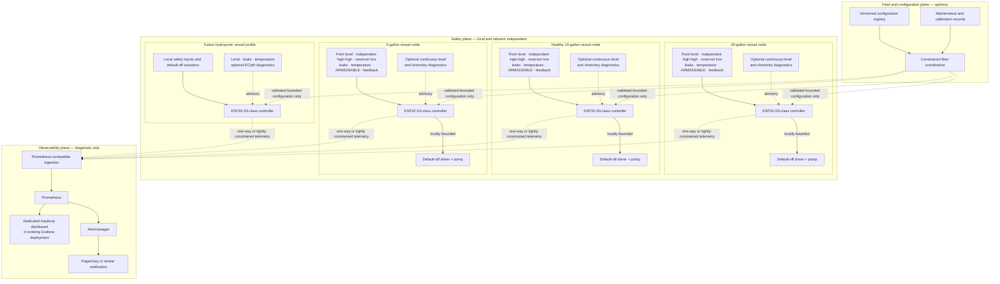

# Aquiloop Platform Roadmap

## Status and executive summary

**Status:** Proposed platform roadmap

**Last reviewed:** 2026-08-11

**Current physical state:** Repository evidence shows that the Phase 0 sketch
compiles, but all physical Phase 0 validation remains pending. No physical
result is inferred from compilation.

This document is the higher-level platform and product roadmap. The
[aquarium auto-top-off design](aquarium-auto-top-off.md) remains authoritative
for detailed auto-top-off safety architecture, firmware behavior, hardware
phases, circuit constraints, calibration, and failure testing. This roadmap
references that design rather than reproducing its circuit, BOM, safety logic,
or Phase 0 procedure. It uses **horizons** so that its sequencing does not
conflict with the implementation design's Phase 0, Phase 1, Phase 2, and later
phases. Where the documents overlap, the stricter safety requirement controls.

The recommendation is **one vessel first, fleet later**. Prove the existing
20-gallon garage aquarium under supervision before adding the 5-gallon or a
healthy 10-gallon aquarium. The 20-gallon aquarium also contains
hydroponically grown plants, but that does not make it a pure hydroponic system
or authorize chemical dosing.

The intended end state is a collection of independent vessel controllers that
share schemas, telemetry, dashboards, maintenance workflows, and optional
central coordination without sharing a safety-critical control dependency.
Aquiloop can then support several aquariums and, after separate validation,
pure hydroponic systems.

### Governing design principles

1. Prove one tank before scaling.
2. The 20-gallon installation is the first supervised integration target, not
   permission to skip a dry bench rig or fault injection.
3. Each vessel has an independent, network-independent local safety plane.
4. Network, Prometheus, Grafana, Alertmanager, PagerDuty, and central services
   are optional for safe local behavior.
5. Pump and dosing actuators default off.
6. Every actuation is locally bounded by time, volume, retries, and rolling
   budgets.
7. A central fleet service cannot directly issue an unrestricted `pump on`
   command.
8. A failure in one vessel must not create an actuator path into another.
9. Use one controller per vessel initially.
10. Use one source reservoir per vessel initially. Any later shared reservoir
    must prove independent normally-closed isolation, backflow prevention,
    cross-flow containment, and single-fault safety.
11. Configuration is versioned, validated, and constrained by compile-time or
    firmware-enforced ceilings.
12. Printable structural parts remain parametric in OpenSCAD; STL output is
    never the sole source.
13. Water-quality measurements remain diagnostic until their repeatability,
    calibration, maintenance burden, and failure behavior are established.
14. “Mineral content” is not a directly measurable scalar. Conductivity (EC),
    estimated total dissolved solids (TDS), salinity, hardness, alkalinity, and
    individual ions are different measurements.
15. Hydroponic nutrient dosing is a later, independently bounded subsystem,
    not a small extension of aquarium top-off.

## Current baseline

The current controller is an Espressif ESP32-S3-DevKitC-1-N8R8. Phase 0 uses a
SparkFun SST liquid-level sensor through the documented protected-input
voltage-divider concept, plus an external LED and change-only serial reporting.
Its scope contains no pump or network service. The
[Phase 0 experiment](../../firmware/auto_top_off/experiments/sst_led/README.md)
is the practical entry point; the [authoritative design](aquarium-auto-top-off.md)
governs the circuit and validation procedure. Both report compile validation
but pending physical validation as of this review.

The first integration target is the 20-gallon garage aquarium. The accepted
auto-top-off design already specifies local default-off behavior, bounded
delivery, independent later safety layers, and supervised rollout. Aquiloop
does not currently have production telemetry, dashboards, multi-vessel
control, water-quality automation, or hydroponic dosing. The existing
[duckweed scooper design](duckweed-scooper.md) demonstrates the repository's
parametric OpenSCAD approach but is not an automation component.

## Goals and non-goals

### Goals

- Safe automatic freshwater top-off with independent vessel safety.
- Water-level and reservoir visibility; leak and temperature monitoring.
- Pump-health and delivery diagnostics.
- Useful Grafana history and actionable alerts.
- Reusable firmware and CAD modules without shared safety dependencies.
- Low-cardinality multi-vessel telemetry.
- Staged expansion to the 5-gallon and healthy 10-gallon tanks.
- Future freshwater aquarium, saltwater aquarium, aquaponic, and hydroponic
  profiles.
- Reproducible calibration and maintenance records.

### Non-goals

- Immediately automating every tank, or automating the suspect leaking
  10-gallon tank.
- Making Wi-Fi, Grafana, or any remote system necessary to stop a pump.
- Remote unrestricted actuation.
- Inferring individual minerals from a conductivity or TDS sensor.
- Early automatic chemical dosing.
- Shared pumps or reservoirs before independent isolation is proven.
- Replacing manual aquarium inspection.
- Claiming medical, biological, or livestock guarantees.
- Treating consumer sensor readings as laboratory analysis.

## Platform architecture

Each node contains all inputs and authority needed to stop its actuator without
a network. Observability and fleet/configuration planes cannot bypass local
actuator limits. PagerDuty or similar notification is diagnostic and
operational; it is never in the local pump shutdown path.

## Vessel and fleet domain model

| Concept | Stable meaning |
| --- | --- |
| Installation | One managed Aquiloop site and its bounded vessel registry. |
| Controller | One physical compute and I/O unit assigned to one vessel initially. |
| Vessel | A bounded body of water with an integrity record and local safety plane. |
| Vessel profile | A validated selection of applicable modules, constraints, and diagnostics. |
| Reservoir | A source volume assigned to a vessel and constrained by containment and delivery budgets. |
| Sensor | A typed input with authority class, identity, validity, and calibration needs. |
| Actuator | A normally-off output governed by local invariants and budgets. |
| Calibration | Versioned evidence connecting readings or runtime to a reference and expiration. |
| Maintenance event | A recorded inspection, cleaning, refill, replacement, or deliberate test. |
| Fault | A bounded reason code and persistent safety/diagnostic state, with detail in an event log. |
| Dispense attempt | One bounded series of pulses and settling observations. |
| Delivery budget | Local time and volume allowances per pulse, attempt, retry window, and rolling period. |
| Firmware version | Immutable identifier for the executing firmware artifact. |
| Configuration version | Validated, checksummed identity for locally accepted settings. |

An **initial schema proposal**, not implemented API values, is:
`freshwater_aquarium`, `saltwater_aquarium`, `aquaponic_aquarium`,
`hydroponic_dwc`, and `hydroponic_reservoir`. A profile selects validated
modules and constraints. It never disables universal default-off, cutoff,
budget, persistence, authorization, or fault-handling invariants.

## Per-vessel architecture

Recommended module boundaries are:

- hardware abstraction and sensor adapters;
- authoritative safety inputs and separately classified diagnostic inputs;
- host-testable state machine;
- default-off actuator driver;
- persistent fault and delivery ledger;
- bounded configuration and telemetry encoder;
- local indicators and maintained ARM/DISABLE control;
- firmware update mechanism, without prematurely selecting an OTA method;
- calibration record and maintenance record.

One controller per vessel produces a smaller failure domain, simpler wiring,
independent power removal and maintenance, easier calibration, no central
network dependency, and a safer staged rollout. Shared networking, metrics
ingestion, schema tooling, spares, or power distribution might reduce cost and
maintenance, but each can also correlate failures. Select shared
infrastructure only after its isolation and failure behavior are understood;
do not let convenience create a cross-vessel actuator path.

## Sensor roadmap

### Authoritative safety and control inputs

- Fixed normal-level point sensor.
- Diverse, independent high-high cutoff.
- Reservoir-low detection and leak detection.
- Local ARM/DISABLE state.
- Relay or hardware-enable feedback.
- Watchdog state and persistent fault state.

These inputs inhibit delivery on missing, stale, invalid, or contradictory
state according to the authoritative auto-top-off design.

### High-value diagnostics

- Water temperature, then ambient garage temperature and humidity.
- Continuous level or distance and reservoir weight.
- Pump current or electrical power and calibrated estimated flow.
- Pulse duration, observed level response time, controller uptime, and reset
  cause.
- Indicators of tube blockage or disconnection, validated before being used
  for conclusions.

Temperature, leaks, reservoir state, and pump diagnostics take priority over
broad chemistry instrumentation.

### Water-quality diagnostics

| Measurement | Interpretation and limitation |
| --- | --- |
| Conductivity / EC | Electrical conduction of the solution; it does not identify or exactly quantify every dissolved mineral. |
| Temperature-compensated EC | EC normalized using a documented temperature model; model and reference temperature remain part of the result. |
| Estimated TDS | Usually an EC-derived estimate from inexpensive probes using an assumed conversion factor, not direct constituent analysis. |
| Salinity | A water-type- and range-specific derivation requiring the correct calibration standard and temperature compensation. |
| pH | Acidity/activity measurement whose probes require regular calibration, correct storage, cleaning, and replacement. |
| Oxidation-reduction potential (ORP) | A system-level electrochemical potential, not a concentration of a particular oxidant or nutrient. |
| General hardness (GH) | Primarily a measure associated with divalent ions such as calcium and magnesium; not interchangeable with TDS. |
| Carbonate hardness / alkalinity (KH) | Acid-neutralizing capacity or related operational measure; terminology and method must be recorded and it is not interchangeable with TDS or GH. |
| Dissolved oxygen | Oxygen availability requiring its own probe method, compensation, calibration, and maintenance. |
| Individual nutrient or ion | Generally requires a specific probe, reagent test, colorimetry, or laboratory analysis for that analyte. |

There is no single direct “mineral content” reading. Sensor fouling, drift,
biofilm, bubbles, cable leakage, and calibration expiration must appear as
faults or explicit uncertainty rather than plausible-looking values. Early
chemistry sensing is advisory only. Automatic dosing must wait for independent
limits, calibration evidence, delivery verification, and fault injection; a
single chemistry probe cannot receive closed-loop authority.

## Observability architecture

Add a dedicated **Aquiloop dashboard to the existing Grafana deployment**. Do
not create another Grafana stack unless later scale or isolation justifies it.
Prometheus and Grafana remain outside the local safety path.

Dashboard views should cover:

1. Fleet overview.
2. Per-vessel current state.
3. Water-level and top-off history.
4. Reservoir inventory.
5. Pump runtime and estimated delivery.
6. Faults and safety-channel state.
7. Controller availability and reset history.
8. Temperature and environmental trends.
9. Optional water-quality trends.
10. Calibration and maintenance status.
11. Alert and acknowledgement history.

Retain the metric names proposed in the
[authoritative design's observability section](aquarium-auto-top-off.md#11-observability-and-alert-design),
including `aquiloop_state`, `aquiloop_sensor_wet`,
`aquiloop_pump_runtime_seconds_total`, and
`aquiloop_dispense_attempts_total`, rather than renaming them. Multi-vessel
support adds only necessary fixed labels such as `vessel_id`, `controller_id`,
`profile`, `sensor`, `result`, and `reason`. Values come from bounded registries
and enums, never user-generated free text. Display names, IP addresses,
arbitrary fault strings, and timestamps do not belong in labels.

Monotonic totals such as attempts, runtime, resets, and delivery use counters;
current state, validity, temperature, level, and rolling-budget consumption use
gauges. Detailed transitions, human notes, and arbitrary context belong in
bounded event records or logs, not metric labels. Detect controller-down state
from scrape/heartbeat absence and detect stale data independently from the last
valid sample age. Preserve source clock quality and monotonic context because
offline buffering, reboot, and uncertain wall clocks can reorder apparent
events. Define retention from operational needs and storage cost rather than
keeping raw samples indefinitely. Dashboard annotations should mark
calibration, maintenance, firmware rollout, and hardware replacement so trends
are interpretable.

## Alerts and response

| Severity | Examples |
| --- | --- |
| Critical | High-high cutoff; leak detected; pump commanded without valid enable; latched safety fault; daily delivery budget exhausted; controller state contradicts hardware feedback. |
| Warning | Reservoir low; repeated unsuccessful attempts; abnormal evaporation or top-off frequency; pump response drift; repeated resets; stale calibration; sensor disagreement; temperature outside configured vessel limits; invalid or fouled diagnostic sensor. |
| Informational | Successful maintenance test; firmware rollout; completed calibration; reservoir refill. |

Every runbook path begins with local inspection and local **DISABLE** whenever
actuation safety is uncertain. Electrical isolation follows when wet equipment
may be involved. No alert response recommends a remote unrestricted pump
command. A notification reports a condition; local hardware and firmware must
already have acted safely.

## Configuration and control contracts

These interfaces are future concepts, not implemented commitments.

### Telemetry

- Read-only observations and events with a versioned schema and bounded
  identities.
- Tolerant of offline buffering, duplicate delivery, and later reconciliation.

### Configuration

- Declarative, versioned, and checksummed or signed where appropriate.
- Validated against hard local ceilings, staged, and rollback-capable.
- Cannot remotely raise safety ceilings beyond firmware-defined maxima.
- Records who or what proposed and applied each change.

### Commands

- Narrow and enumerated: request status, acknowledge a maintenance reminder,
  enter maintenance mode, or request a bounded diagnostic.
- No arbitrary actuator command and no free-form shell or firmware expression.
- Local authorization, safety state, budgets, and physical controls still
  decide whether any requested action occurs.

## Shared reservoir and plumbing policy

The baseline is one independent reservoir and pump per vessel. Shared plumbing
may save components, but it creates a much larger correlated-failure and
contamination domain. A shared reservoir or manifold is unacceptable until a
separate design and evidence provide:

- one normally-closed isolation element per vessel;
- prevention of gravity cross-flow, siphon, and backflow;
- independent maximum-volume containment;
- stuck-open valve detection;
- proof that one controller, valve, pump, tube, or power fault cannot fill the
  wrong vessel;
- maintenance isolation plus cleaning and contamination controls; and
- deliberate fault-injection evidence.

## Firmware and rollout strategy

Future firmware should preserve a host-testable state machine behind
hardware-adapter boundaries, version persistent state, migrate it safely, and
fail closed on incompatible or corrupt state. Update artifacts should be signed
or otherwise authenticated, with a tested rollback strategy and staged
deployment. The order is bench controller, supervised 20-gallon rollout, one
additional healthy tank as fleet canary, then remaining vessels one at a time
after measurable soak periods. There is no simultaneous fleet-wide first
deployment.

This roadmap deliberately does not specify an OTA implementation. Repository
code, boot behavior, flash layout, hardware constraints, recovery access, and
threats must be inspected in a future implementation task before selecting one.

## CAD and physical modularity

Follow the repository's existing OpenSCAD policy and the pattern demonstrated
by the [duckweed scooper](duckweed-scooper.md). Potential parametric modules
include vessel-specific rim adapters, sensor holders, high-high mounts,
leak-sensor retainers, reservoir lids, tube clips, pump mounts, controller
enclosures, cable and drip-loop management, service labels, and hydroponic
reservoir mounts.

Every printable module requires editable `.scad` sources, shared parameter
files where appropriate, and reproducible rendering. Generated STL files stay
excluded or become CI artifacts rather than authoritative sources. Materials
and finished parts require environmental, fit, and service validation. No
printed part may be the sole overflow-containment or electrical-safety barrier.

## Suspect leaking 10-gallon tank gate

Do not install or commission Aquiloop on the suspect 10-gallon tank while its
integrity is uncertain. Automation cannot mitigate a structural leak.

1. Empty, clean, visually inspect, isolate, and clearly identify the tank.
2. On a level support, perform an appropriately located and supervised leak
   test where leakage can be safely contained and observed.
3. Inspect seams, frame, glass, support surface, and any plumbing.
4. Record the method and result.
5. Repair or retire the tank as appropriate; this roadmap makes no unsupported
   repair claim.
6. Admit only a tank with a completed integrity check to the Aquiloop rollout
   sequence.

## Hydroponics evolution

Hydroponics is a future vessel profile on the common platform. Reservoir level,
leak detection, temperature, pump state, telemetry, maintenance, alerting, and
bounded actuation are shared capabilities. Relevant hydroponic capabilities may
later add EC, pH, nutrient-solution temperature, circulation or aeration
status, reservoir volume, light-cycle context, crop-specific target bands,
nutrient dosing, and pH adjustment.

Top-off water, nutrient concentrate, acid, base, and other additives require
physical and control separation. Every future dosing channel needs a separate
normally-off actuator, independently calibrated delivery, per-dose and rolling
budgets, minimum spacing, mixing delay, sensor plausibility checks,
cross-channel exclusion where required, local emergency disable, containment,
manual commissioning, and no single-probe closed-loop authority.

The first hydroponics milestone is monitoring only. Automated nutrient or pH
dosing requires a separate later design document and approval; it is not a
minor extension of aquarium top-off.

## Roadmap horizons

### Horizon 0: finish the current Phase 0 experiment

**Entry:** Current repository baseline.

**Work:** Receive and inspect the SST sensor; use a known data-capable USB
cable; assemble the documented protected input and LED circuit; upload the
pinned sketch; complete the documented wet/dry cycles and voltage checks; and
record actual observations.

**Exit:** All existing Phase 0 exit criteria are recorded as passed. No
physical result is inferred from compilation alone.

### Horizon 1: supervised 20-gallon auto-top-off

**Work:** Implement only the authoritative Phase 1 scope; select and calibrate
pump and tubing; build parametric mounts and enclosure; exercise all supervised
fault cases; collect stable baseline evaporation and delivery data.

**Exit:** Authoritative Phase 1 criteria are satisfied. Operation remains
supervised, with no fleet expansion yet.

### Horizon 2: unattended-readiness safety layers

**Work:** Add independent high-high cutoff, reservoir-low sensing, leak
detection, hardware power removal, persistent faults, maintenance controls,
containment, and the full fault matrix.

**Exit:** Existing detailed safety criteria are satisfied and evidence is
independently reviewed. Unattended operation remains a deliberate decision,
not an automatic consequence.

### Horizon 3: observability

**Work:** Add bounded telemetry, Prometheus integration, the dedicated Aquiloop
Grafana dashboard, Alertmanager and PagerDuty routing, runbooks,
controller-down detection, and calibration/maintenance visibility.

**Exit:** Loss of observability does not alter local safety; alerts and runbooks
pass deliberate tests; no secrets are committed.

### Horizon 4: first additional vessel

**Entry:** Stable 20-gallon operation over a documented soak period; candidate
vessel passes structural and leak checks.

**Work:** Choose one healthy 5-gallon or 10-gallon tank; deploy an independent
controller, reservoir, pump, and safety plane; introduce bounded vessel
identity and profile configuration; compare calibration and evaporation.

**Exit:** Both vessels operate independently, fault injection on either cannot
actuate the other, and the fleet dashboard clearly distinguishes them.

### Horizon 5: small fleet

**Work:** Add remaining healthy vessels one at a time; standardize wiring,
enclosures, connectors, configuration, calibration, spares, and maintenance;
stage firmware rollouts; add fleet dashboard and maintenance views.

**Exit:** A repeatable installation checklist and replacement/calibration
intervals are documented, with no shared point capable of overfilling several
vessels.

### Horizon 6: diagnostic water quality

**Work:** Add temperature first. Evaluate EC, pH, salinity, and other sensors
only for relevant profiles; run calibration and drift experiments; compare with
trusted references; show advisory trends.

**Exit:** Accuracy, drift, cleaning, replacement, and failure behavior are
quantified; invalid readings are detectable; no automatic dosing authority
exists.

### Horizon 7: hydroponic monitoring profile

**Work:** Use a non-livestock test reservoir or dedicated hydroponic setup; add
hydroponic configuration plus EC, pH, solution temperature, level, leaks, and
circulation visibility; perform no nutrient or pH dosing.

**Exit:** The monitoring profile is stable and independently calibrated while
aquarium behavior remains unchanged.

### Horizon 8: bounded hydroponic dosing research

**Entry:** Separate approved dosing design, physical containment, independent
delivery calibration, manual test reservoir, and complete fault analysis.

**Work:** Conduct only the experiments authorized by that separate design.

**Exit:** Dedicated safety and validation criteria pass. Aquarium deployment is
not enabled by default.

### Horizon 9: open-source platform hardening

**Work:** Publish installation guides, versioned schemas, reference hardware,
reproducible CAD, simulation and hardware-in-the-loop tests, example
dashboards, contribution guidance, and privacy/security review.

**Exit:** A new user can reproduce a safe supervised baseline without relying
on undocumented project knowledge.

## Decision log

| Decision | Rationale / constraint |
| --- | --- |
| 20-gallon first | Existing target; learn under supervision before scaling. |
| One controller per vessel | Limits failures, wiring, maintenance, and power removal to one vessel. |
| Independent reservoirs initially | Avoids correlated fill and cross-flow paths. |
| Local safety, remote observability | Network loss or compromise cannot defeat shutdown. |
| Dedicated Aquiloop dashboard in existing Grafana | Reuse existing operations while keeping Grafana non-safety-critical. |
| Temperature and leaks before broad chemistry | Higher immediate operational value with lower interpretation burden. |
| EC/TDS are proxies, not exact mineral analysis | Their methods cannot identify every ion or exact constituent quantity. |
| Hydroponics is a common-platform profile | Reuse bounded telemetry and safety patterns without equating use cases. |
| Automated dosing gets a separate design | Chemical delivery needs independent analysis, limits, and evidence. |
| Suspect leaking tank excluded until validated | Automation does not resolve structural integrity. |
| No unrestricted central actuator API | Every action remains locally authorized and bounded. |

## Risks and open questions

- What are the actual water types and livestock requirements for each aquarium?
- What are measured evaporation rates and garage temperature/humidity extremes?
- How reliable is Wi-Fi, and what controller power and backup strategy is safe?
- Where can each reservoir be placed safely, with what lift and containment?
- What final pump and tube meet measured lift, delivery, and compatibility needs?
- How will enclosure condensation and wet-area cable routing be controlled?
- What are sensor fouling rates and the sustainable calibration burden?
- What retention is useful and affordable?
- How are controller identities provisioned and replaced?
- What firmware rollout and rollback mechanisms fit the eventual platform?
- Is a shared metrics gateway needed, or can existing Prometheus scrape each
  controller directly?
- How many vessel and other registry values remain operationally bounded?
- Should the 5-gallon or a healthy 10-gallon be the second deployment?
- Will the suspect leaking 10-gallon be repaired and validated or retired?
- Which hydroponic method is the first monitoring-only target?
- Which measurements justify their acquisition and maintenance cost?
- For each profile, is long-term salinity, EC, pH, hardness, alkalinity, or
  dissolved-oxygen sensing appropriate and maintainable?

These are deliberately unresolved pending physical measurement, profile needs,
and controlled experiments.

## Near-term next actions

1. Complete and record Phase 0 physical validation.
2. Preserve the existing auto-top-off document as the implementation authority.
3. Capture actual tank, rim, reservoir, lift, freeboard, temperature, and
   evaporation measurements.
4. Design the supervised Phase 1 implementation.
5. Defer Grafana implementation until the controller has trustworthy states
   and metrics.
6. Select the second healthy vessel only after the 20-gallon system is stable.
7. Keep hydroponics monitoring and dosing as later gated work.
